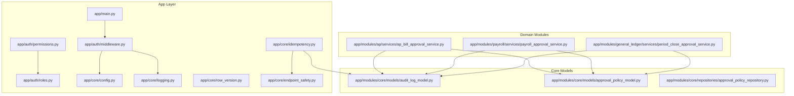
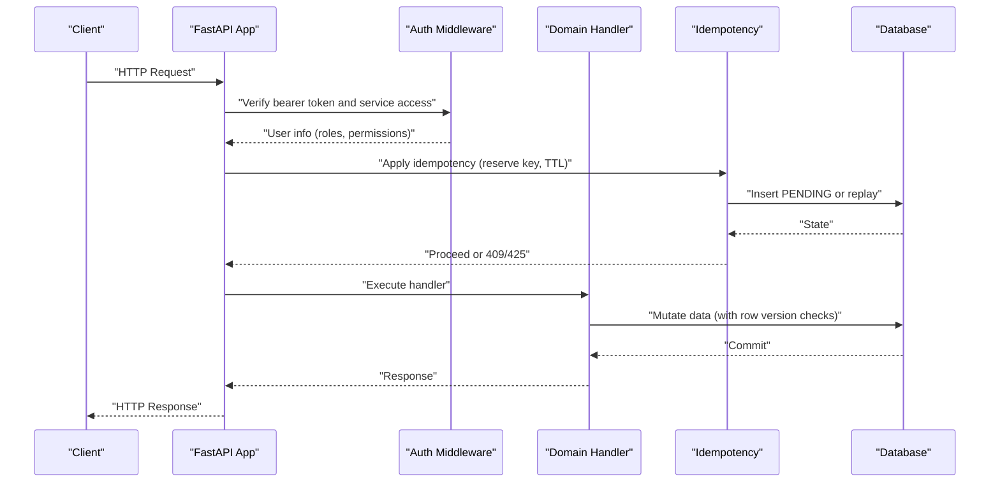
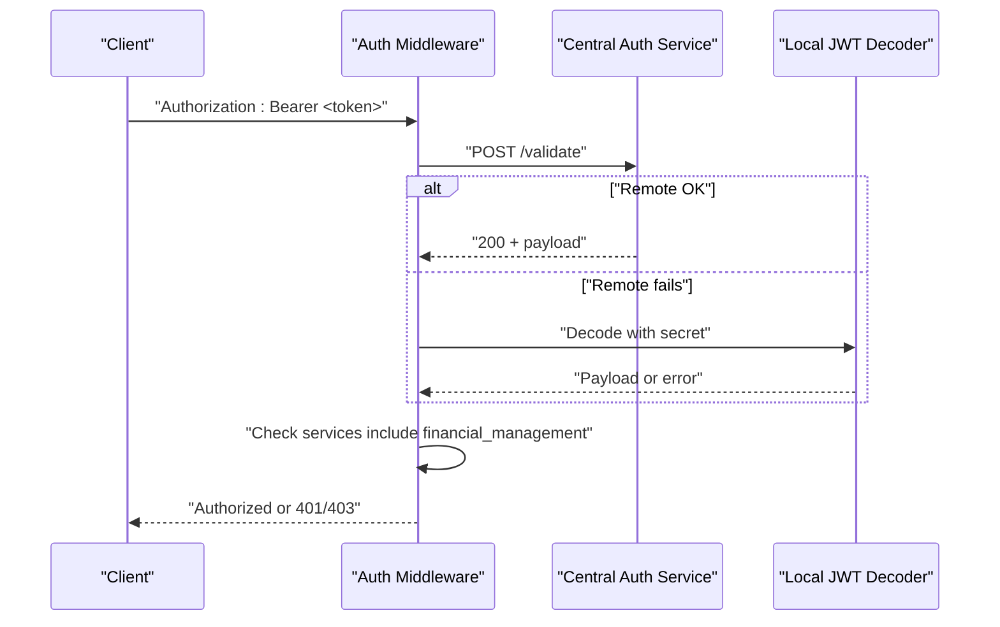
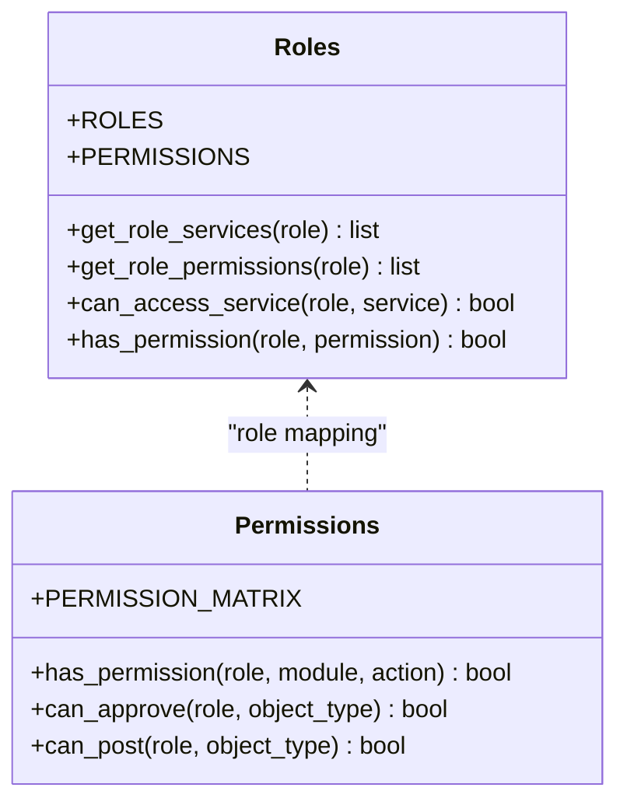
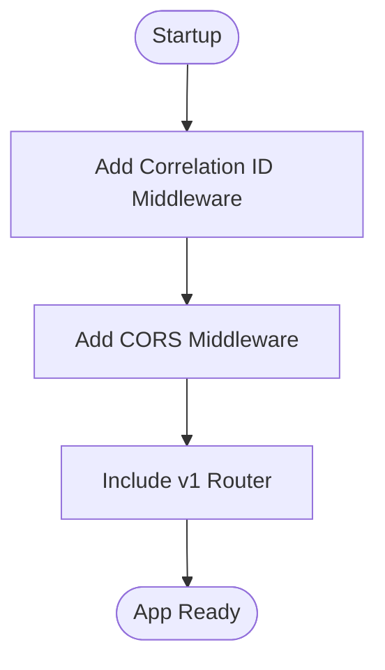
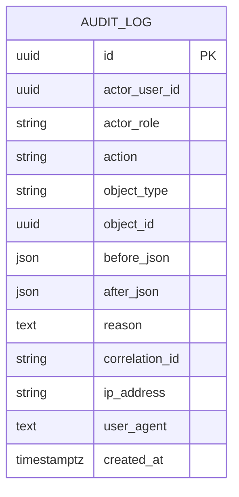
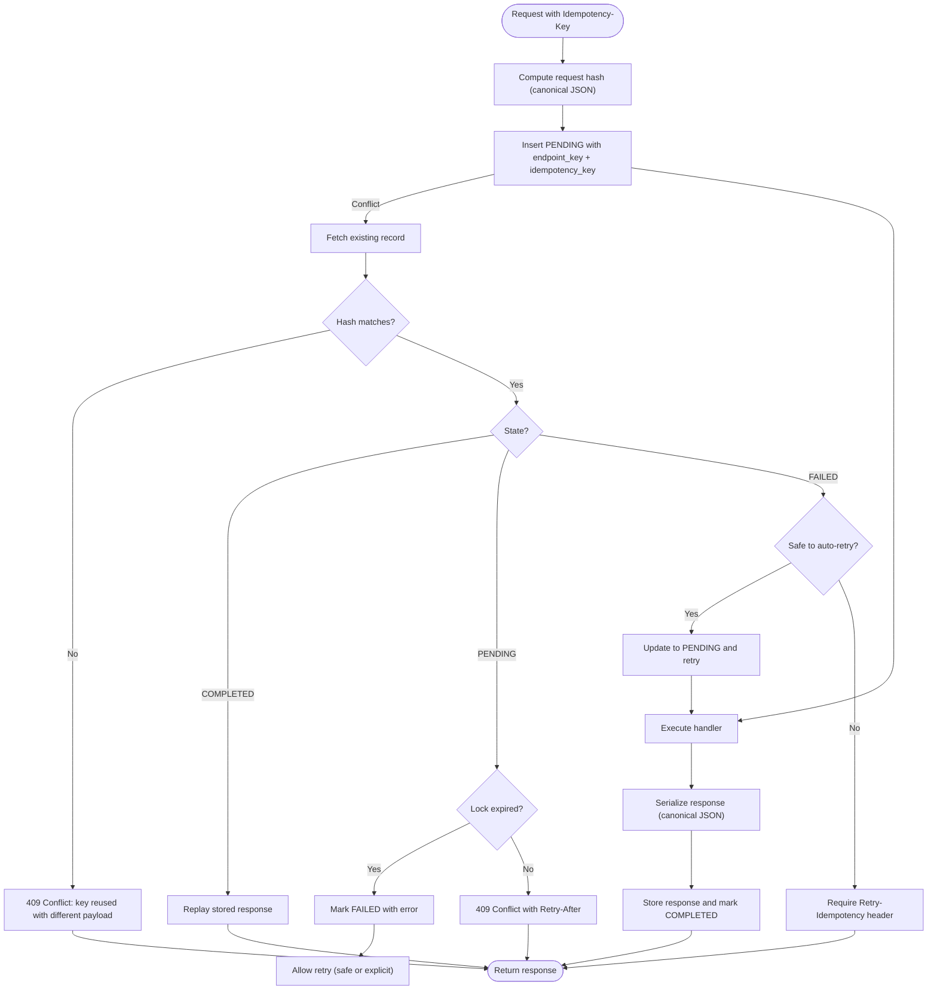
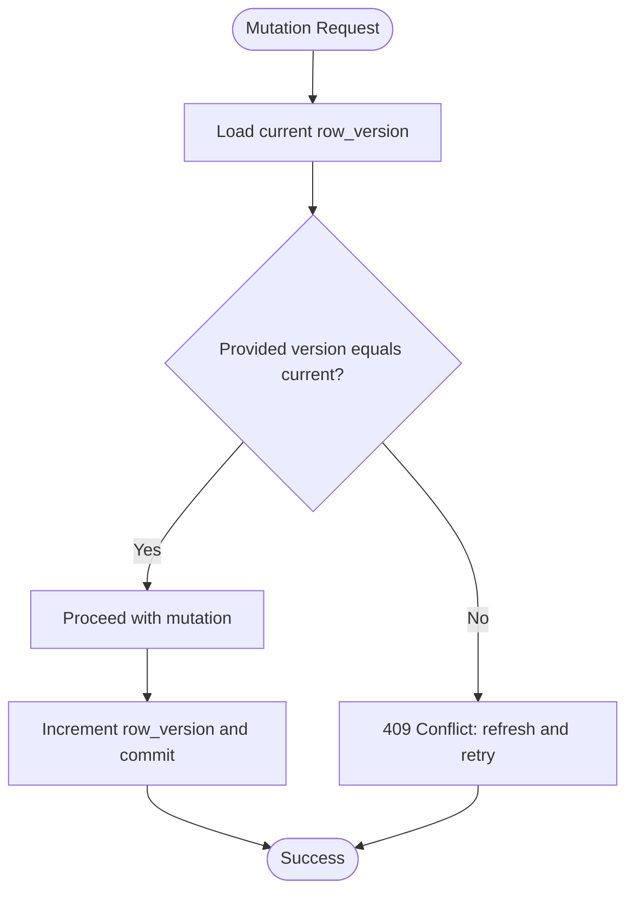

# Security and Compliance

<cite>
**Referenced Files in This Document**
- [app/main.py](file://app/main.py)
- [app/auth/middleware.py](file://app/auth/middleware.py)
- [app/auth/permissions.py](file://app/auth/permissions.py)
- [app/auth/roles.py](file://app/auth/roles.py)
- [app/core/config.py](file://app/core/config.py)
- [app/core/logging.py](file://app/core/logging.py)
- [app/core/idempotency.py](file://app/core/idempotency.py)
- [app/core/row_version.py](file://app/core/row_version.py)
- [app/core/endpoint_safety.py](file://app/core/endpoint_safety.py)
- [app/modules/core/models/audit_log_model.py](file://app/modules/core/models/audit_log_model.py)
- [app/modules/core/models/approval_policy_model.py](file://app/modules/core/models/approval_policy_model.py)
- [app/modules/core/repositories/approval_policy_repository.py](file://app/modules/core/repositories/approval_policy_repository.py)
- [app/modules/ap/services/ap_bill_approval_service.py](file://app/modules/ap/services/ap_bill_approval_service.py)
- [app/modules/payroll/services/payroll_approval_service.py](file://app/modules/payroll/services/payroll_approval_service.py)
- [app/modules/general_ledger/services/period_close_approval_service.py](file://app/modules/general_ledger/services/period_close_approval_service.py)
</cite>

## Table of Contents
1. [Introduction](#introduction)
2. [Project Structure](#project-structure)
3. [Core Components](#core-components)
4. [Architecture Overview](#architecture-overview)
5. [Detailed Component Analysis](#detailed-component-analysis)
6. [Dependency Analysis](#dependency-analysis)
7. [Performance Considerations](#performance-considerations)
8. [Troubleshooting Guide](#troubleshooting-guide)
9. [Conclusion](#conclusion)
10. [Appendices](#appendices)

## Introduction
This document provides comprehensive security and compliance documentation for the TrueVow Financial Management system. It covers JWT token management, role-based access control (RBAC), permission matrices, security middleware, audit logging, compliance monitoring, regulatory reporting capabilities, idempotency patterns for safe API reprocessing, optimistic locking via row version checks, and approval workflows. It also outlines data protection measures, encryption standards, privacy controls, security best practices, vulnerability mitigation strategies, and alignment with compliance frameworks.

## Project Structure
The security and compliance features are implemented across several modules:
- Authentication and authorization middleware under app/auth
- Core infrastructure for idempotency, row versioning, and endpoint safety under app/core
- Audit logging models and repositories under app/modules/core
- Approval workflow services under domain modules (AP, Payroll, General Ledger)
- Centralized configuration and logging under app/core



**Diagram sources**
- [app/main.py](file://app/main.py#L1-L54)
- [app/auth/middleware.py](file://app/auth/middleware.py#L1-L140)
- [app/auth/permissions.py](file://app/auth/permissions.py#L1-L127)
- [app/auth/roles.py](file://app/auth/roles.py#L1-L119)
- [app/core/config.py](file://app/core/config.py#L1-L74)
- [app/core/logging.py](file://app/core/logging.py#L1-L34)
- [app/core/idempotency.py](file://app/core/idempotency.py#L1-L482)
- [app/core/row_version.py](file://app/core/row_version.py#L1-L31)
- [app/core/endpoint_safety.py](file://app/core/endpoint_safety.py#L1-L118)
- [app/modules/core/models/audit_log_model.py](file://app/modules/core/models/audit_log_model.py#L1-L43)
- [app/modules/core/models/approval_policy_model.py](file://app/modules/core/models/approval_policy_model.py#L1-L36)
- [app/modules/core/repositories/approval_policy_repository.py](file://app/modules/core/repositories/approval_policy_repository.py#L1-L36)
- [app/modules/ap/services/ap_bill_approval_service.py](file://app/modules/ap/services/ap_bill_approval_service.py#L1-L229)
- [app/modules/payroll/services/payroll_approval_service.py](file://app/modules/payroll/services/payroll_approval_service.py#L1-L253)
- [app/modules/general_ledger/services/period_close_approval_service.py](file://app/modules/general_ledger/services/period_close_approval_service.py#L1-L207)

**Section sources**
- [app/main.py](file://app/main.py#L1-L54)

## Core Components
- JWT token validation and user extraction: Validates tokens against a central auth service or locally using configured secrets, enforces service access, and extracts user identity and permissions.
- RBAC and permission matrix: Defines roles, services, and granular permissions per module and action, with helper functions to check approvals and posting rights.
- Idempotency infrastructure: Provides deterministic request replay, conflict detection, race-condition handling, and safe retry semantics with TTL-based locks.
- Row versioning: Enforces optimistic concurrency control to prevent lost-update conflicts.
- Audit logging: Captures actor, role, action, object, before/after snapshots, reason, correlation ID, IP, and user agent.
- Approval workflows: Domain-specific services enforce state transitions, separation of duties (SoD), and policy-driven approval gating.

**Section sources**
- [app/auth/middleware.py](file://app/auth/middleware.py#L17-L140)
- [app/auth/permissions.py](file://app/auth/permissions.py#L7-L127)
- [app/auth/roles.py](file://app/auth/roles.py#L6-L119)
- [app/core/idempotency.py](file://app/core/idempotency.py#L23-L482)
- [app/core/row_version.py](file://app/core/row_version.py#L8-L31)
- [app/modules/core/models/audit_log_model.py](file://app/modules/core/models/audit_log_model.py#L9-L43)
- [app/modules/core/models/approval_policy_model.py](file://app/modules/core/models/approval_policy_model.py#L9-L36)
- [app/modules/core/repositories/approval_policy_repository.py](file://app/modules/core/repositories/approval_policy_repository.py#L10-L36)

## Architecture Overview
The system integrates security and compliance at the application boundary and within domain services:
- Authentication middleware validates tokens and restricts access to the financial management service.
- Authorization checks use RBAC and permission matrices to gate actions.
- Idempotency middleware coordinates safe retries and prevents duplicate side effects.
- Row version checks protect concurrent modifications.
- Audit logs capture all significant actions for compliance and monitoring.
- Approval services embed policy and SoD checks into state transitions.



**Diagram sources**
- [app/auth/middleware.py](file://app/auth/middleware.py#L59-L106)
- [app/core/idempotency.py](file://app/core/idempotency.py#L219-L482)
- [app/core/row_version.py](file://app/core/row_version.py#L8-L31)
- [app/main.py](file://app/main.py#L1-L54)

## Detailed Component Analysis

### JWT Token Management and Service Access Control
- Centralized token validation supports remote validation against a central auth service and local decoding using a configured secret.
- Service access is enforced by checking that the token payload includes the financial management service.
- User identity and permissions are extracted for downstream authorization checks.



**Diagram sources**
- [app/auth/middleware.py](file://app/auth/middleware.py#L17-L86)
- [app/core/config.py](file://app/core/config.py#L37-L48)

**Section sources**
- [app/auth/middleware.py](file://app/auth/middleware.py#L17-L86)
- [app/core/config.py](file://app/core/config.py#L37-L48)

### Role-Based Access Control (RBAC) and Permission Matrix
- Roles define services and permission levels (read, write, admin).
- A permission matrix maps roles to allowed actions per module.
- Helper functions determine approval and posting rights based on role and object type.



**Diagram sources**
- [app/auth/roles.py](file://app/auth/roles.py#L6-L119)
- [app/auth/permissions.py](file://app/auth/permissions.py#L7-L127)

**Section sources**
- [app/auth/roles.py](file://app/auth/roles.py#L6-L119)
- [app/auth/permissions.py](file://app/auth/permissions.py#L7-L127)

### Security Middleware Integration
- The FastAPI application registers correlation ID middleware and CORS.
- Authentication middleware is applied at the route level to extract user context and enforce service access.



**Diagram sources**
- [app/main.py](file://app/main.py#L17-L30)

**Section sources**
- [app/main.py](file://app/main.py#L1-L54)

### Audit Log Implementation
- The audit log model captures actor, role, action, object type and ID, before/after JSON snapshots, reason, correlation ID, IP address, user agent, and timestamps.
- Approval services log actions to the audit log, enabling compliance monitoring and regulatory reporting.



**Diagram sources**
- [app/modules/core/models/audit_log_model.py](file://app/modules/core/models/audit_log_model.py#L9-L43)

**Section sources**
- [app/modules/core/models/audit_log_model.py](file://app/modules/core/models/audit_log_model.py#L9-L43)
- [app/modules/ap/services/ap_bill_approval_service.py](file://app/modules/ap/services/ap_bill_approval_service.py#L206-L229)
- [app/modules/payroll/services/payroll_approval_service.py](file://app/modules/payroll/services/payroll_approval_service.py#L230-L253)
- [app/modules/general_ledger/services/period_close_approval_service.py](file://app/modules/general_ledger/services/period_close_approval_service.py#L185-L207)

### Compliance Monitoring and Regulatory Reporting
- Audit logs include correlation IDs, IP addresses, and user agents to support forensic analysis and audit trails.
- Policies and SoD validations ensure segregation of duties and reduce risk of fraud.
- Idempotency and row versioning prevent duplicate processing and lost updates, supporting accurate financial records.

[No sources needed since this section synthesizes previously cited components]

### Idempotency Patterns for Safe API Reprocessing
- Canonical JSON encoding ensures stable hashing across heterogeneous inputs.
- Idempotency keys are normalized to endpoint paths with placeholders for dynamic segments.
- The system reserves keys with a PENDING state, handles retries with TTL-based locks, and safely replays stored responses when hashes match.
- Safe-to-retry policies and endpoint-specific TTLs govern retry behavior and lock lifetimes.



**Diagram sources**
- [app/core/idempotency.py](file://app/core/idempotency.py#L219-L482)
- [app/core/endpoint_safety.py](file://app/core/endpoint_safety.py#L68-L118)

**Section sources**
- [app/core/idempotency.py](file://app/core/idempotency.py#L23-L217)
- [app/core/endpoint_safety.py](file://app/core/endpoint_safety.py#L21-L118)

### Row Version Implementation for Optimistic Locking
- Before mutating an object, handlers check the current row version against the provided version.
- A mismatch triggers a 409 Conflict with guidance to refresh and retry.



**Diagram sources**
- [app/core/row_version.py](file://app/core/row_version.py#L8-L31)

**Section sources**
- [app/core/row_version.py](file://app/core/row_version.py#L8-L31)

### Approval Workflow Systems
- Approval policies configure whether approvals are required per legal entity and object type.
- Services enforce state transitions, SoD checks, and audit logging for each workflow.

```mermaid
sequenceDiagram
participant Actor as "Actor"
participant Service as "Approval Service"
participant Policy as "ApprovalPolicyRepository"
participant DB as "Database"
participant Audit as "AuditLog"
Actor->>Service : "Submit for approval"
Service->>Policy : "Check approval_required"
Policy-->>Service : "Boolean"
Service->>DB : "Set status and increment row_version"
DB-->>Service : "Commit"
Service->>Audit : "Log SUBMIT_FOR_APPROVAL"
Audit-->>Service : "Flush"
Service-->>Actor : "Updated object"
```

**Diagram sources**
- [app/modules/core/repositories/approval_policy_repository.py](file://app/modules/core/repositories/approval_policy_repository.py#L13-L36)
- [app/modules/ap/services/ap_bill_approval_service.py](file://app/modules/ap/services/ap_bill_approval_service.py#L34-L95)
- [app/modules/payroll/services/payroll_approval_service.py](file://app/modules/payroll/services/payroll_approval_service.py#L34-L96)
- [app/modules/general_ledger/services/period_close_approval_service.py](file://app/modules/general_ledger/services/period_close_approval_service.py#L39-L109)

**Section sources**
- [app/modules/core/models/approval_policy_model.py](file://app/modules/core/models/approval_policy_model.py#L9-L36)
- [app/modules/core/repositories/approval_policy_repository.py](file://app/modules/core/repositories/approval_policy_repository.py#L13-L36)
- [app/modules/ap/services/ap_bill_approval_service.py](file://app/modules/ap/services/ap_bill_approval_service.py#L34-L229)
- [app/modules/payroll/services/payroll_approval_service.py](file://app/modules/payroll/services/payroll_approval_service.py#L34-L253)
- [app/modules/general_ledger/services/period_close_approval_service.py](file://app/modules/general_ledger/services/period_close_approval_service.py#L39-L207)

## Dependency Analysis
- Authentication depends on configuration for JWT secrets and algorithms, and on logging for audit events.
- Idempotency depends on endpoint safety constants and TTLs, and on audit logging for correlation.
- Approval services depend on approval policies and SoD validators, and on audit logging for compliance.

```mermaid
graph TB
CONF["app/core/config.py"]
LOG["app/core/logging.py"]
AUTH["app/auth/middleware.py"]
IDEM["app/core/idempotency.py"]
SAFETY["app/core/endpoint_safety.py"]
ROW["app/core/row_version.py"]
AUDIT["app/modules/core/models/audit_log_model.py"]
POLICY["app/modules/core/models/approval_policy_model.py"]
REPO["app/modules/core/repositories/approval_policy_repository.py"]
AP_SVC["app/modules/ap/services/ap_bill_approval_service.py"]
PAY_SVC["app/modules/payroll/services/payroll_approval_service.py"]
GL_SVC["app/modules/general_ledger/services/period_close_approval_service.py"]
AUTH --> CONF
AUTH --> LOG
IDEM --> SAFETY
IDEM --> AUDIT
AP_SVC --> POLICY
PAY_SVC --> POLICY
GL_SVC --> POLICY
AP_SVC --> AUDIT
PAY_SVC --> AUDIT
GL_SVC --> AUDIT
AP_SVC --> ROW
PAY_SVC --> ROW
GL_SVC --> ROW
```



**Diagram sources**
- [app/core/config.py](file://app/core/config.py#L37-L51)
- [app/core/logging.py](file://app/core/logging.py#L1-L34)
- [app/auth/middleware.py](file://app/auth/middleware.py#L17-L86)
- [app/core/idempotency.py](file://app/core/idempotency.py#L219-L482)
- [app/core/endpoint_safety.py](file://app/core/endpoint_safety.py#L68-L118)
- [app/core/row_version.py](file://app/core/row_version.py#L8-L31)
- [app/modules/core/models/audit_log_model.py](file://app/modules/core/models/audit_log_model.py#L9-L43)
- [app/modules/core/models/approval_policy_model.py](file://app/modules/core/models/approval_policy_model.py#L18-L36)
- [app/modules/core/repositories/approval_policy_repository.py](file://app/modules/core/repositories/approval_policy_repository.py#L13-L36)
- [app/modules/ap/services/ap_bill_approval_service.py](file://app/modules/ap/services/ap_bill_approval_service.py#L34-L229)
- [app/modules/payroll/services/payroll_approval_service.py](file://app/modules/payroll/services/payroll_approval_service.py#L34-L253)
- [app/modules/general_ledger/services/period_close_approval_service.py](file://app/modules/general_ledger/services/period_close_approval_service.py#L39-L207)

**Section sources**
- [app/core/config.py](file://app/core/config.py#L37-L51)
- [app/core/logging.py](file://app/core/logging.py#L1-L34)
- [app/auth/middleware.py](file://app/auth/middleware.py#L17-L86)
- [app/core/idempotency.py](file://app/core/idempotency.py#L219-L482)
- [app/core/endpoint_safety.py](file://app/core/endpoint_safety.py#L68-L118)
- [app/core/row_version.py](file://app/core/row_version.py#L8-L31)
- [app/modules/core/models/audit_log_model.py](file://app/modules/core/models/audit_log_model.py#L9-L43)
- [app/modules/core/models/approval_policy_model.py](file://app/modules/core/models/approval_policy_model.py#L18-L36)
- [app/modules/core/repositories/approval_policy_repository.py](file://app/modules/core/repositories/approval_policy_repository.py#L13-L36)
- [app/modules/ap/services/ap_bill_approval_service.py](file://app/modules/ap/services/ap_bill_approval_service.py#L34-L229)
- [app/modules/payroll/services/payroll_approval_service.py](file://app/modules/payroll/services/payroll_approval_service.py#L34-L253)
- [app/modules/general_ledger/services/period_close_approval_service.py](file://app/modules/general_ledger/services/period_close_approval_service.py#L39-L207)

## Performance Considerations
- Idempotency reservations and state transitions are optimized with database-level uniqueness constraints and minimal round-trips.
- Canonical JSON serialization and hashing are deterministic and efficient for stable request comparison.
- Logging is configured to avoid overhead in development while capturing structured logs in production.

[No sources needed since this section provides general guidance]

## Troubleshooting Guide
- Authentication failures: Verify JWT secret configuration and remote auth service availability; check logs for decode or service errors.
- Authorization denials: Confirm user roles and permissions align with the permission matrix; ensure service access includes financial_management.
- Idempotency conflicts: Review 409 Conflict messages indicating key reuse with different payloads; ensure consistent request bodies and headers.
- Stale locks: When encountering 409 Conflict with in-progress status, wait up to the returned Retry-After seconds or explicitly retry if safe.
- Row version mismatches: Refresh data and resend with the latest row_version to avoid 409 Conflict errors.
- Audit gaps: Confirm audit log writes occur during approval actions and that correlation IDs are propagated.

**Section sources**
- [app/auth/middleware.py](file://app/auth/middleware.py#L48-L56)
- [app/core/idempotency.py](file://app/core/idempotency.py#L297-L377)
- [app/core/row_version.py](file://app/core/row_version.py#L24-L30)
- [app/modules/ap/services/ap_bill_approval_service.py](file://app/modules/ap/services/ap_bill_approval_service.py#L206-L229)
- [app/modules/payroll/services/payroll_approval_service.py](file://app/modules/payroll/services/payroll_approval_service.py#L230-L253)
- [app/modules/general_ledger/services/period_close_approval_service.py](file://app/modules/general_ledger/services/period_close_approval_service.py#L185-L207)

## Conclusion
TrueVow’s security and compliance framework combines robust authentication and RBAC, deterministic idempotency, optimistic locking, comprehensive audit logging, and policy-driven approval workflows. These mechanisms collectively mitigate risks, ensure data integrity, and support compliance monitoring and regulatory reporting.

[No sources needed since this section summarizes without analyzing specific files]

## Appendices

### Security Best Practices
- Rotate JWT secrets regularly and restrict their scope.
- Enforce HTTPS and secure headers in production deployments.
- Limit CORS origins and headers to trusted domains.
- Monitor and alert on authentication failures and audit anomalies.
- Regularly review and update roles, permissions, and approval policies.

[No sources needed since this section provides general guidance]

### Vulnerability Mitigation
- Input normalization and canonical JSON hashing prevent subtle differences in request payloads from bypassing idempotency.
- Row versioning prevents lost-update conflicts in concurrent environments.
- SoD checks in approval workflows reduce single points of failure and fraud risks.
- Idempotency TTLs bound resource contention and prevent indefinite lockups.

[No sources needed since this section provides general guidance]

### Compliance Framework Alignment
- Audit logs capture sufficient context for SOX, Sarbanes-Oxley, and similar regulatory requirements.
- Idempotency and row versioning support accurate financial reporting and change tracking.
- Approval policies and SoD enforcement align with internal control frameworks.

[No sources needed since this section provides general guidance]