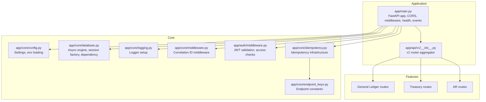
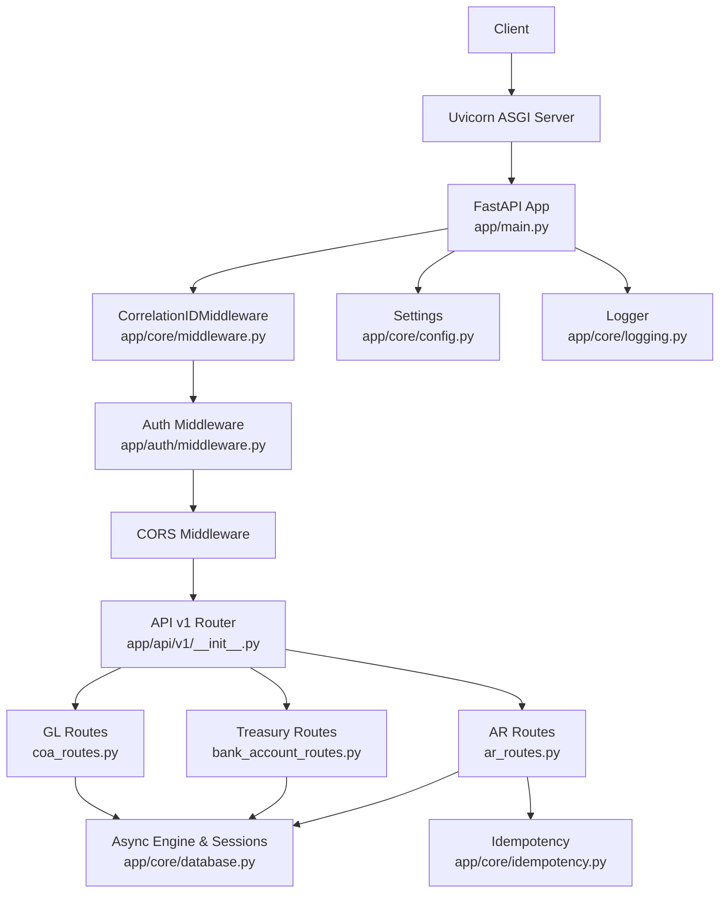
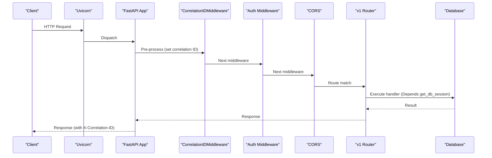
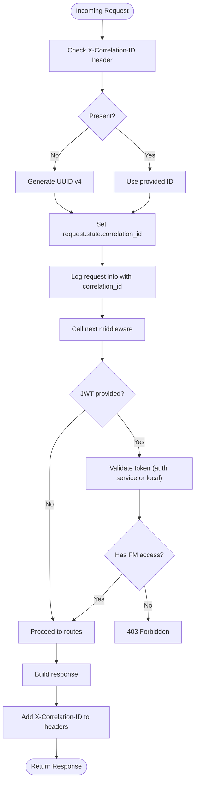
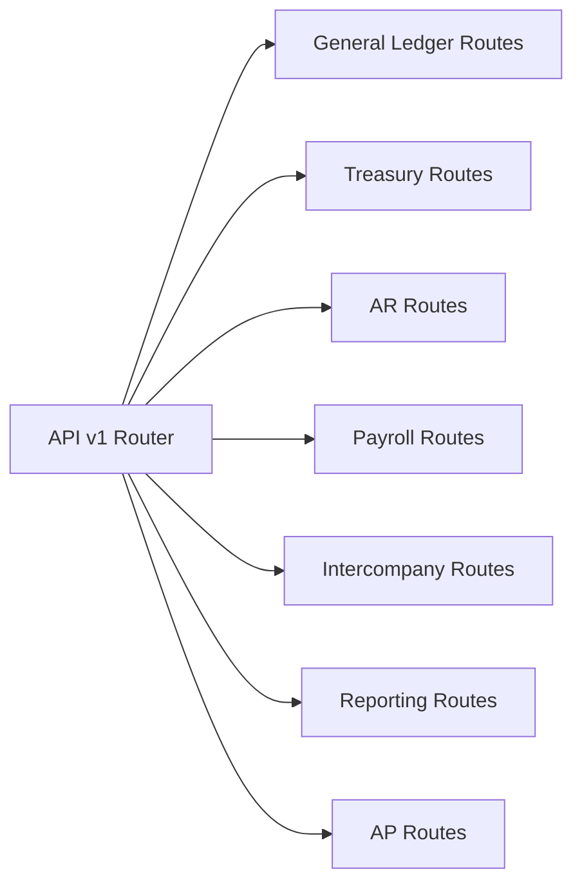
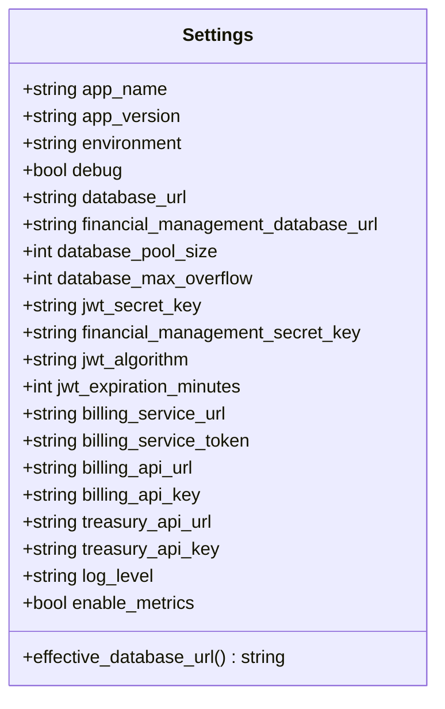
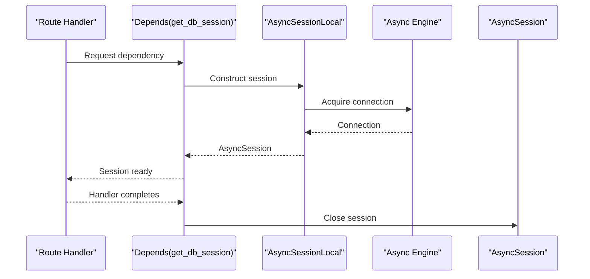
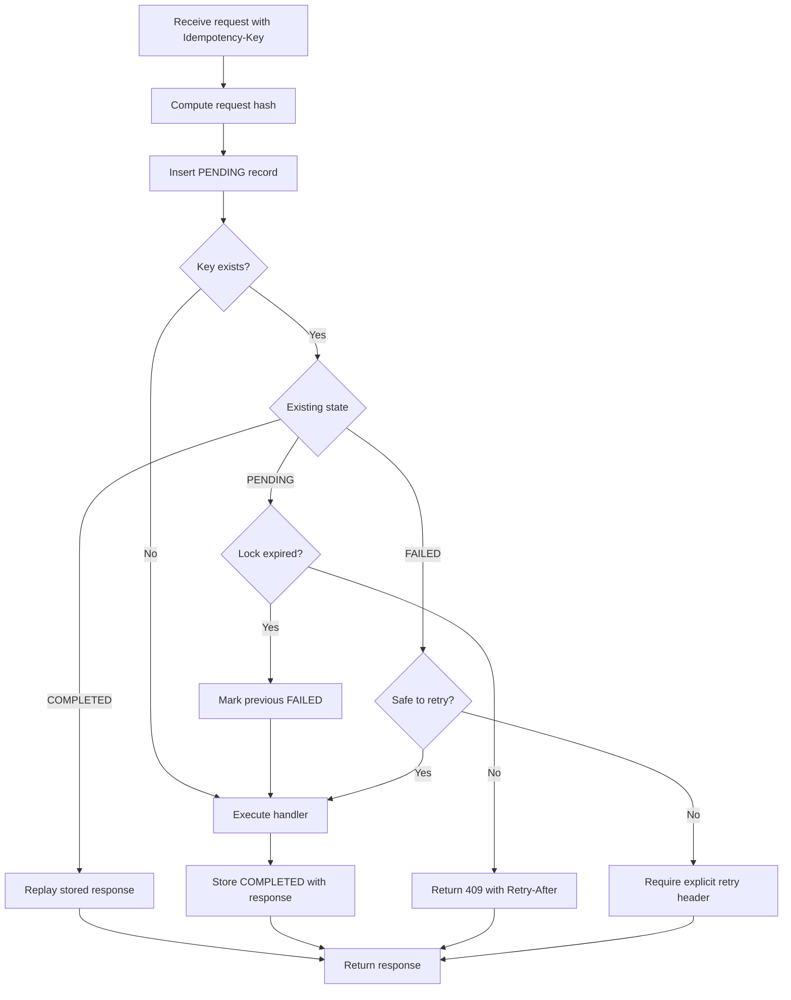
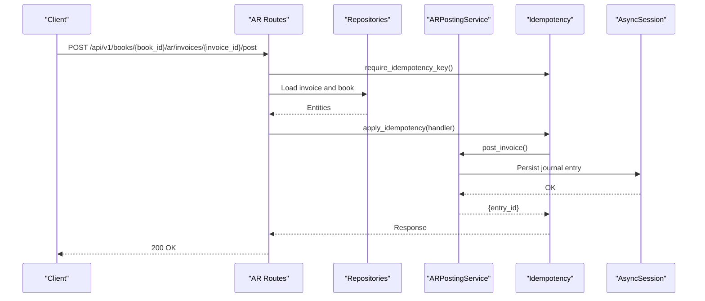
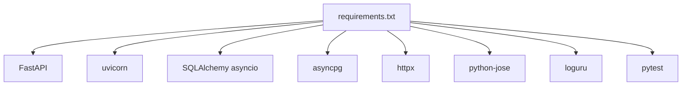

# Backend Architecture

<cite>
**Referenced Files in This Document**
- [app/main.py](file://app/main.py)
- [app/api/v1/__init__.py](file://app/api/v1/__init__.py)
- [app/core/config.py](file://app/core/config.py)
- [app/core/database.py](file://app/core/database.py)
- [app/core/middleware.py](file://app/core/middleware.py)
- [app/auth/middleware.py](file://app/auth/middleware.py)
- [app/core/logging.py](file://app/core/logging.py)
- [app/core/idempotency.py](file://app/core/idempotency.py)
- [app/core/endpoint_keys.py](file://app/core/endpoint_keys.py)
- [app/modules/general_ledger/api/routes/coa_routes.py](file://app/modules/general_ledger/api/routes/coa_routes.py)
- [app/modules/treasury/api/routes/bank_account_routes.py](file://app/modules/treasury/api/routes/bank_account_routes.py)
- [app/modules/ar/api/routes/ar_routes.py](file://app/modules/ar/api/routes/ar_routes.py)
- [requirements.txt](file://requirements.txt)
</cite>

## Table of Contents
1. [Introduction](#introduction)
2. [Project Structure](#project-structure)
3. [Core Components](#core-components)
4. [Architecture Overview](#architecture-overview)
5. [Detailed Component Analysis](#detailed-component-analysis)
6. [Dependency Analysis](#dependency-analysis)
7. [Performance Considerations](#performance-considerations)
8. [Troubleshooting Guide](#troubleshooting-guide)
9. [Conclusion](#conclusion)

## Introduction
This document describes the backend architecture of the TrueVow Financial Management system built with FastAPI. It explains the application entry point, middleware stack, CORS configuration, health checks, API versioning via a v1 router aggregator, configuration management, database connection pooling, dependency injection patterns, cross-cutting concerns (idempotency, logging, authentication), and startup/shutdown events.

## Project Structure
The backend is organized around a modular FastAPI application:
- Application entry point initializes the ASGI app, registers middleware, and mounts the v1 API router under /api/v1.
- API versioning is implemented by aggregating feature-specific routers into a single v1 APIRouter.
- Core modules encapsulate configuration, database setup, logging, middleware, idempotency, and endpoint safety constants.
- Feature modules (general ledger, treasury, AR/AP/payroll, intercompany, reporting) define domain-specific routes, services, repositories, and schemas.

**Diagram sources**
- [app/main.py](file://app/main.py#L1-L54)
- [app/api/v1/__init__.py](file://app/api/v1/__init__.py#L1-L72)
- [app/core/config.py](file://app/core/config.py#L1-L74)
- [app/core/database.py](file://app/core/database.py#L1-L113)
- [app/core/middleware.py](file://app/core/middleware.py#L1-L35)
- [app/auth/middleware.py](file://app/auth/middleware.py#L1-L140)
- [app/core/idempotency.py](file://app/core/idempotency.py#L1-L482)
- [app/core/endpoint_keys.py](file://app/core/endpoint_keys.py#L1-L43)

**Section sources**
- [app/main.py](file://app/main.py#L1-L54)
- [app/api/v1/__init__.py](file://app/api/v1/__init__.py#L1-L72)

## Core Components
- Application entry point and lifecycle:
  - Creates the FastAPI app with metadata and docs endpoints.
  - Registers middleware in order: correlation ID tracking, CORS, and feature routes.
  - Defines a /health endpoint returning service status and version.
  - Emits startup and shutdown events for initialization and cleanup.
- Configuration management:
  - Centralized settings class with environment-driven defaults and validation.
  - Database URL selection logic and JWT secret resolution.
  - Logging level and metrics toggle.
- Database connection pooling:
  - Async SQLAlchemy engine configured with pool size and overflow.
  - Session factory with explicit configuration and dependency provider.
- Logging:
  - Unified logger using loguru when available, with fallback to stdlib logging.
  - Environment-aware file logging in production.
- Middleware stack:
  - Correlation ID middleware adds X-Correlation-ID to requests/responses and logs request metadata.
  - Authentication middleware validates JWT tokens against a central auth service or local secret, enforces service access, and extracts current user claims.
- Idempotency:
  - Canonical JSON serialization for stable hashing.
  - Endpoint constants ensure stable identification across path changes.
  - Reservation-based idempotency with PENDING/COMPLETED/FAILED states and TTL-based lock handling.
- Endpoint safety:
  - Endpoint TTLs and retry policies for failed idempotent operations.

**Section sources**
- [app/main.py](file://app/main.py#L1-L54)
- [app/core/config.py](file://app/core/config.py#L1-L74)
- [app/core/database.py](file://app/core/database.py#L1-L113)
- [app/core/logging.py](file://app/core/logging.py#L1-L34)
- [app/core/middleware.py](file://app/core/middleware.py#L1-L35)
- [app/auth/middleware.py](file://app/auth/middleware.py#L1-L140)
- [app/core/idempotency.py](file://app/core/idempotency.py#L1-L482)
- [app/core/endpoint_keys.py](file://app/core/endpoint_keys.py#L1-L43)

## Architecture Overview
The system follows a layered architecture:
- Presentation layer: FastAPI routes grouped under v1.
- Domain services: Feature-specific services orchestrate business logic.
- Persistence: Async SQLAlchemy sessions injected via dependency.
- Cross-cutting concerns: Logging, correlation IDs, authentication, idempotency, and configuration.

**Diagram sources**
- [app/main.py](file://app/main.py#L1-L54)
- [app/api/v1/__init__.py](file://app/api/v1/__init__.py#L1-L72)
- [app/core/middleware.py](file://app/core/middleware.py#L1-L35)
- [app/auth/middleware.py](file://app/auth/middleware.py#L1-L140)
- [app/core/database.py](file://app/core/database.py#L1-L113)
- [app/core/config.py](file://app/core/config.py#L1-L74)
- [app/core/logging.py](file://app/core/logging.py#L1-L34)
- [app/core/idempotency.py](file://app/core/idempotency.py#L1-L482)
- [app/modules/general_ledger/api/routes/coa_routes.py](file://app/modules/general_ledger/api/routes/coa_routes.py#L1-L123)
- [app/modules/treasury/api/routes/bank_account_routes.py](file://app/modules/treasury/api/routes/bank_account_routes.py#L1-L88)
- [app/modules/ar/api/routes/ar_routes.py](file://app/modules/ar/api/routes/ar_routes.py#L1-L178)

## Detailed Component Analysis

### Application Entry Point and Lifecycle
- Initializes FastAPI with metadata and docs endpoints.
- Registers correlation ID middleware first to capture all requests.
- Adds CORS middleware with permissive defaults suitable for development.
- Includes the v1 router under /api/v1.
- Provides a /health endpoint returning service name, status, and version.
- Emits startup and shutdown events for logging and cleanup.

**Diagram sources**
- [app/main.py](file://app/main.py#L1-L54)
- [app/core/middleware.py](file://app/core/middleware.py#L1-L35)
- [app/auth/middleware.py](file://app/auth/middleware.py#L1-L140)
- [app/api/v1/__init__.py](file://app/api/v1/__init__.py#L1-L72)
- [app/core/database.py](file://app/core/database.py#L106-L113)

**Section sources**
- [app/main.py](file://app/main.py#L1-L54)

### Middleware Stack
- Correlation ID middleware:
  - Extracts or generates a correlation ID from headers or UUID.
  - Stores it in request.state and logs request metadata.
  - Propagates correlation ID in response headers.
- Authentication middleware:
  - Validates bearer tokens against a central auth service or locally if secret is present.
  - Enforces access to the financial management service.
  - Provides current user extraction for downstream handlers.

**Diagram sources**
- [app/core/middleware.py](file://app/core/middleware.py#L1-L35)
- [app/auth/middleware.py](file://app/auth/middleware.py#L1-L140)

**Section sources**
- [app/core/middleware.py](file://app/core/middleware.py#L1-L35)
- [app/auth/middleware.py](file://app/auth/middleware.py#L1-L140)

### API Versioning Strategy (v1 Aggregation)
- The v1 router aggregates feature-specific routers from modules:
  - General ledger, treasury, AR/AP/payroll, intercompany, and reporting.
- Each feature defines its own APIRouter with prefixed endpoints and tags.
- The v1 aggregator includes all feature routers, enabling clean separation of concerns while exposing a unified API surface.

**Diagram sources**
- [app/api/v1/__init__.py](file://app/api/v1/__init__.py#L1-L72)

**Section sources**
- [app/api/v1/__init__.py](file://app/api/v1/__init__.py#L1-L72)

### Configuration Management Patterns
- Settings class encapsulates environment-driven configuration:
  - Application metadata, environment, debug flag.
  - Database URL selection with fallback and asyncpg normalization.
  - JWT secret resolution and algorithm/expiration defaults.
  - Integration endpoints for billing and treasury.
  - Logging level and metrics toggle.
- Environment loading prioritizes .env and .env.local with case-insensitive keys and extra field handling.

**Diagram sources**
- [app/core/config.py](file://app/core/config.py#L1-L74)

**Section sources**
- [app/core/config.py](file://app/core/config.py#L1-L74)

### Database Connection Pooling and Dependency Injection
- Async engine creation with configurable pool size and overflow.
- Session factory with explicit class, expiration, autocommit/autoflush toggles.
- get_db_session dependency yields a scoped AsyncSession and ensures closure.

**Diagram sources**
- [app/core/database.py](file://app/core/database.py#L88-L113)

**Section sources**
- [app/core/database.py](file://app/core/database.py#L1-L113)

### Cross-Cutting Concerns: Idempotency
- Canonical JSON encoding ensures stable hashing across equivalent requests.
- Endpoint constants provide stable identifiers independent of path parameters.
- Reservation pattern with PENDING/COMPLETED/FAILED states prevents race conditions.
- TTL-based lock handling allows stale locks to fail over to retries.
- Response size capped to prevent storage bloat.

**Diagram sources**
- [app/core/idempotency.py](file://app/core/idempotency.py#L207-L482)
- [app/core/endpoint_keys.py](file://app/core/endpoint_keys.py#L1-L43)

**Section sources**
- [app/core/idempotency.py](file://app/core/idempotency.py#L1-L482)
- [app/core/endpoint_keys.py](file://app/core/endpoint_keys.py#L1-L43)

### Example Route Handlers and DI Usage
- General Ledger Chart of Accounts routes demonstrate:
  - Router with prefix and tags.
  - Dependency injection of AsyncSession via get_db_session.
  - Service orchestration and exception mapping to HTTP status codes.
- Treasury Bank Accounts routes mirror the same pattern.
- AR routes show idempotency integration via require_idempotency_key and apply_idempotency.

**Diagram sources**
- [app/modules/ar/api/routes/ar_routes.py](file://app/modules/ar/api/routes/ar_routes.py#L1-L178)
- [app/core/idempotency.py](file://app/core/idempotency.py#L219-L482)

**Section sources**
- [app/modules/general_ledger/api/routes/coa_routes.py](file://app/modules/general_ledger/api/routes/coa_routes.py#L1-L123)
- [app/modules/treasury/api/routes/bank_account_routes.py](file://app/modules/treasury/api/routes/bank_account_routes.py#L1-L88)
- [app/modules/ar/api/routes/ar_routes.py](file://app/modules/ar/api/routes/ar_routes.py#L1-L178)

## Dependency Analysis
- External dependencies pinned in requirements.txt include FastAPI, uvicorn, SQLAlchemy asyncio, asyncpg, httpx, python-jose, loguru, and testing libraries.
- Internal dependencies:
  - app/main.py depends on settings, logging, middleware, and v1 router.
  - v1 aggregator depends on feature routers.
  - Feature routes depend on database sessions, services, schemas, and exceptions.
  - Idempotency relies on endpoint keys and SQLAlchemy ORM models.

**Diagram sources**
- [requirements.txt](file://requirements.txt#L1-L53)

**Section sources**
- [requirements.txt](file://requirements.txt#L1-L53)

## Performance Considerations
- Database pooling:
  - Tune database_pool_size and database_max_overflow according to workload and RDS limits.
  - Monitor connection usage and adjust based on concurrency patterns.
- Logging overhead:
  - Production logging writes to rotating files; ensure disk I/O does not bottleneck.
- Idempotency storage:
  - Responses exceeding the cap are truncated; monitor logs for truncated responses.
- Middleware order:
  - Keep correlation ID middleware first to minimize downstream processing cost.
- Async I/O:
  - Ensure database queries and external HTTP calls remain async to avoid blocking.

## Troubleshooting Guide
- Health endpoint:
  - Verify /health returns healthy status and correct version.
- CORS issues:
  - Adjust allow_origins, allow_methods, and allow_headers for production environments.
- Authentication failures:
  - Confirm JWT secret availability in settings and that the auth service is reachable.
  - Check that tokens include the financial_management service claim.
- Database connectivity:
  - Validate effective_database_url and pool settings; confirm asyncpg format for PostgreSQL URLs.
- Idempotency conflicts:
  - For 409 Conflict, ensure the same Idempotency-Key is not reused with different payloads.
  - For 425/409 during PENDING state, wait up to the reported Retry-After seconds.
- Logging:
  - Ensure stdout formatter is active; in production, verify log file rotation and retention.

**Section sources**
- [app/main.py](file://app/main.py#L33-L40)
- [app/auth/middleware.py](file://app/auth/middleware.py#L30-L56)
- [app/core/config.py](file://app/core/config.py#L23-L35)
- [app/core/idempotency.py](file://app/core/idempotency.py#L297-L355)

## Conclusion
The TrueVow Financial Management backend leverages FastAPI’s modern async capabilities with a clean modular structure. The v1 router aggregation provides a scalable API surface, while robust configuration, database pooling, logging, correlation IDs, authentication, and idempotency ensure reliability and observability. Startup/shutdown events and dependency injection patterns support maintainable lifecycle management and cross-cutting concern enforcement.