# Data Flow Patterns

<cite>
**Referenced Files in This Document**
- [app/main.py](file://app/main.py)
- [app/api/v1/__init__.py](file://app/api/v1/__init__.py)
- [app/core/middleware.py](file://app/core/middleware.py)
- [app/core/config.py](file://app/core/config.py)
- [app/core/database.py](file://app/core/database.py)
- [app/shared/models/base_model.py](file://app/shared/models/base_model.py)
- [app/shared/repositories/base_repository.py](file://app/shared/repositories/base_repository.py)
- [app/modules/general_ledger/models/journal_entry_model.py](file://app/modules/general_ledger/models/journal_entry_model.py)
- [app/modules/general_ledger/repositories/journal_entry_repository.py](file://app/modules/general_ledger/repositories/journal_entry_repository.py)
- [app/modules/general_ledger/services/journal_entry_service.py](file://app/modules/general_ledger/services/journal_entry_service.py)
- [app/modules/general_ledger/api/routes/journal_entry_routes.py](file://app/modules/general_ledger/api/routes/journal_entry_routes.py)
- [app/modules/general_ledger/schemas/journal_entry_schemas.py](file://app/modules/general_ledger/schemas/journal_entry_schemas.py)
- [app/modules/core/models/idempotency_model.py](file://app/modules/core/models/idempotency_model.py)
- [app/core/idempotency.py](file://app/core/idempotency.py)
- [app/core/row_version.py](file://app/core/row_version.py)
- [app/modules/core/models/audit_log_model.py](file://app/modules/core/models/audit_log_model.py)
- [app/core/exceptions.py](file://app/core/exceptions.py)
</cite>

## Table of Contents
1. [Introduction](#introduction)
2. [Project Structure](#project-structure)
3. [Core Components](#core-components)
4. [Architecture Overview](#architecture-overview)
5. [Detailed Component Analysis](#detailed-component-analysis)
6. [Dependency Analysis](#dependency-analysis)
7. [Performance Considerations](#performance-considerations)
8. [Troubleshooting Guide](#troubleshooting-guide)
9. [Conclusion](#conclusion)

## Introduction
This document explains the system’s data flow patterns and persistence architecture. It covers:
- Repository pattern implementation and ORM integration with SQLAlchemy (async)
- Database connection management and session lifecycle
- Request-response flow from frontend to backend, including API routing, service layer operations, and database interactions
- Idempotency patterns for safe API reprocessing
- Optimistic locking and row version conflict handling
- Concurrent access handling via idempotency locks and database constraints
- Data validation flows and error propagation
- Audit trail generation
- Caching strategies, batch processing patterns, and data synchronization mechanisms

## Project Structure
The application follows a modular, feature-based structure under app/modules with shared infrastructure in app/shared and app/core. API routes are grouped by domain (e.g., general ledger, treasury, payroll) and exposed under a single v1 router.

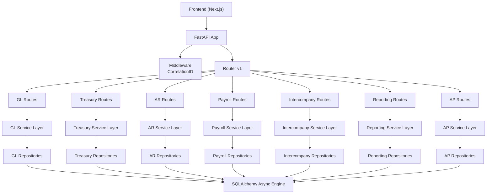

**Diagram sources**
- [app/api/v1/__init__.py](file://app/api/v1/__init__.py#L1-L72)
- [app/modules/general_ledger/api/routes/journal_entry_routes.py](file://app/modules/general_ledger/api/routes/journal_entry_routes.py#L1-L377)

**Section sources**
- [app/api/v1/__init__.py](file://app/api/v1/__init__.py#L1-L72)

## Core Components
- Application entrypoint initializes FastAPI, middleware, and registers routers.
- Middleware injects correlation IDs for observability.
- Configuration centralizes environment-driven settings including database URLs and pool sizing.
- Database module creates an async SQLAlchemy engine and session factory, importing all models for metadata.
- Shared base model and repository provide common fields and CRUD operations.
- Domain modules encapsulate models, repositories, services, schemas, and routes.

**Section sources**
- [app/main.py](file://app/main.py#L1-L54)
- [app/core/middleware.py](file://app/core/middleware.py#L1-L35)
- [app/core/config.py](file://app/core/config.py#L1-L74)
- [app/core/database.py](file://app/core/database.py#L1-L113)
- [app/shared/models/base_model.py](file://app/shared/models/base_model.py#L1-L18)
- [app/shared/repositories/base_repository.py](file://app/shared/repositories/base_repository.py#L1-L54)

## Architecture Overview
The system uses an async-first architecture with SQLAlchemy for ORM and PostgreSQL as the datastore. Requests traverse middleware, API routes, service layer, repositories, and the database. Idempotency ensures safe retries for write operations, while optimistic locking and row version checks protect against concurrent modifications.

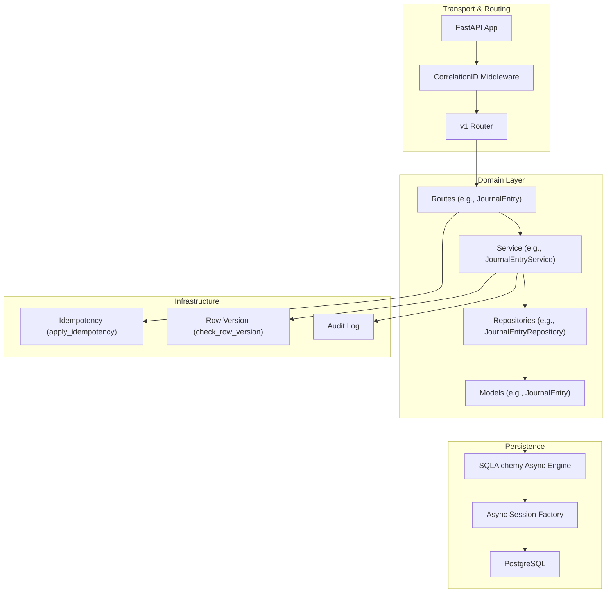

**Diagram sources**
- [app/main.py](file://app/main.py#L1-L54)
- [app/core/middleware.py](file://app/core/middleware.py#L1-L35)
- [app/api/v1/__init__.py](file://app/api/v1/__init__.py#L1-L72)
- [app/modules/general_ledger/api/routes/journal_entry_routes.py](file://app/modules/general_ledger/api/routes/journal_entry_routes.py#L1-L377)
- [app/modules/general_ledger/services/journal_entry_service.py](file://app/modules/general_ledger/services/journal_entry_service.py#L1-L635)
- [app/modules/general_ledger/repositories/journal_entry_repository.py](file://app/modules/general_ledger/repositories/journal_entry_repository.py#L1-L119)
- [app/modules/general_ledger/models/journal_entry_model.py](file://app/modules/general_ledger/models/journal_entry_model.py#L1-L128)
- [app/core/database.py](file://app/core/database.py#L1-L113)
- [app/core/idempotency.py](file://app/core/idempotency.py#L1-L482)
- [app/core/row_version.py](file://app/core/row_version.py#L1-L31)
- [app/modules/core/models/audit_log_model.py](file://app/modules/core/models/audit_log_model.py#L1-L43)

## Detailed Component Analysis

### Database Connection Management and ORM Integration
- Async engine and session factory are configured with pool sizes and echo based on settings.
- All domain models are imported at startup to populate metadata for Alembic and runtime reflection.
- Sessions are dependency-injected into routes and closed automatically via a context manager.

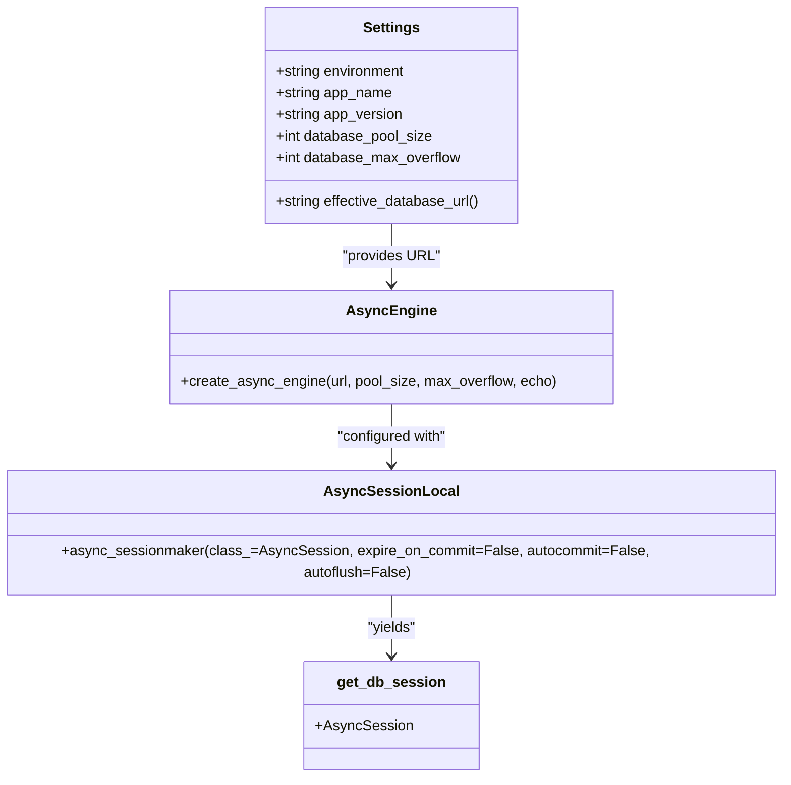

**Diagram sources**
- [app/core/config.py](file://app/core/config.py#L1-L74)
- [app/core/database.py](file://app/core/database.py#L1-L113)

**Section sources**
- [app/core/config.py](file://app/core/config.py#L1-L74)
- [app/core/database.py](file://app/core/database.py#L1-L113)

### Repository Pattern Implementation
- Base repository provides generic CRUD operations with async sessions.
- Domain repositories extend the base to add domain-specific queries and aggregates.
- Example: JournalEntryRepository supports listing by book, fetching by entry number or idempotency key, and verifying balances.

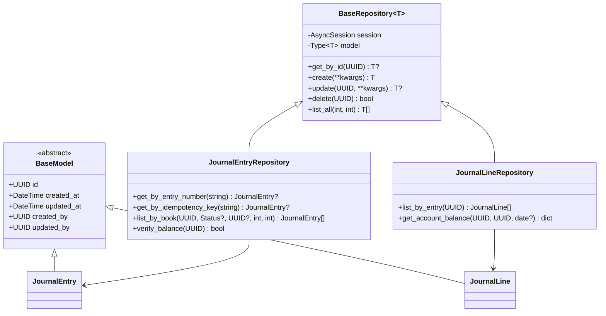

**Diagram sources**
- [app/shared/models/base_model.py](file://app/shared/models/base_model.py#L1-L18)
- [app/shared/repositories/base_repository.py](file://app/shared/repositories/base_repository.py#L1-L54)
- [app/modules/general_ledger/models/journal_entry_model.py](file://app/modules/general_ledger/models/journal_entry_model.py#L1-L128)
- [app/modules/general_ledger/repositories/journal_entry_repository.py](file://app/modules/general_ledger/repositories/journal_entry_repository.py#L1-L119)

**Section sources**
- [app/shared/repositories/base_repository.py](file://app/shared/repositories/base_repository.py#L1-L54)
- [app/modules/general_ledger/repositories/journal_entry_repository.py](file://app/modules/general_ledger/repositories/journal_entry_repository.py#L1-L119)

### Service Layer Operations and Validation
- Services orchestrate business logic, coordinate repositories, enforce domain rules, and handle transactions.
- Example: JournalEntryService validates periods, balances, and dimensions; posts entries; reverses entries; and supports bulk upserts with per-row error reporting.

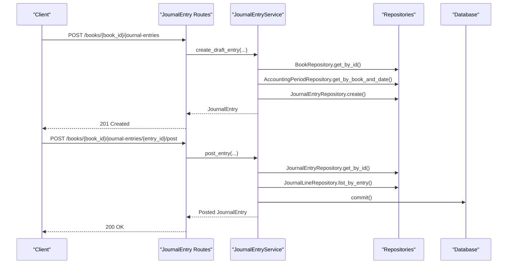

**Diagram sources**
- [app/modules/general_ledger/api/routes/journal_entry_routes.py](file://app/modules/general_ledger/api/routes/journal_entry_routes.py#L1-L377)
- [app/modules/general_ledger/services/journal_entry_service.py](file://app/modules/general_ledger/services/journal_entry_service.py#L1-L635)
- [app/modules/general_ledger/repositories/journal_entry_repository.py](file://app/modules/general_ledger/repositories/journal_entry_repository.py#L1-L119)

**Section sources**
- [app/modules/general_ledger/services/journal_entry_service.py](file://app/modules/general_ledger/services/journal_entry_service.py#L1-L635)
- [app/modules/general_ledger/api/routes/journal_entry_routes.py](file://app/modules/general_ledger/api/routes/journal_entry_routes.py#L1-L377)

### Request-Response Flow: Idempotency, Validation, and Error Propagation
- Idempotency ensures idempotent writes by reserving a key, preventing races, and storing responses for replay.
- Row version checks enforce optimistic concurrency for updates.
- Validation occurs in schemas and services; exceptions propagate to routes as HTTP errors.
- Audit logging captures mutations and critical actions.

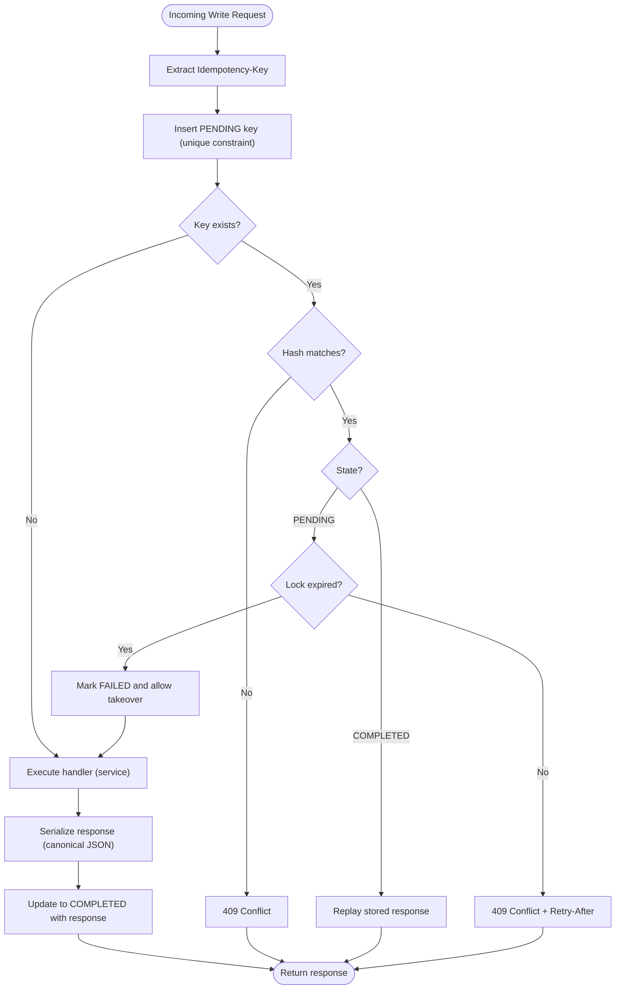

**Diagram sources**
- [app/core/idempotency.py](file://app/core/idempotency.py#L1-L482)
- [app/modules/core/models/idempotency_model.py](file://app/modules/core/models/idempotency_model.py#L1-L54)

**Section sources**
- [app/core/idempotency.py](file://app/core/idempotency.py#L1-L482)
- [app/modules/core/models/idempotency_model.py](file://app/modules/core/models/idempotency_model.py#L1-L54)
- [app/core/row_version.py](file://app/core/row_version.py#L1-L31)
- [app/core/exceptions.py](file://app/core/exceptions.py#L1-L43)
- [app/modules/core/models/audit_log_model.py](file://app/modules/core/models/audit_log_model.py#L1-L43)

### Data Validation Flows
- Pydantic schemas define request/response contracts and basic validations.
- Service-level validations enforce business rules (e.g., balancing, period locks, dimension requirements).
- Errors are raised as typed exceptions and mapped to HTTP status codes in routes.

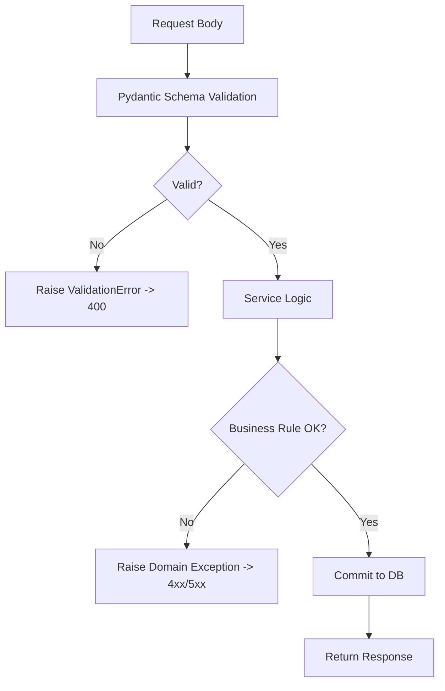

**Diagram sources**
- [app/modules/general_ledger/schemas/journal_entry_schemas.py](file://app/modules/general_ledger/schemas/journal_entry_schemas.py#L1-L136)
- [app/modules/general_ledger/services/journal_entry_service.py](file://app/modules/general_ledger/services/journal_entry_service.py#L1-L635)
- [app/core/exceptions.py](file://app/core/exceptions.py#L1-L43)

**Section sources**
- [app/modules/general_ledger/schemas/journal_entry_schemas.py](file://app/modules/general_ledger/schemas/journal_entry_schemas.py#L1-L136)
- [app/modules/general_ledger/services/journal_entry_service.py](file://app/modules/general_ledger/services/journal_entry_service.py#L1-L635)
- [app/core/exceptions.py](file://app/core/exceptions.py#L1-L43)

### Audit Trail Generation
- AuditLog captures actor, action, object type/id, JSON diffs, reason, correlation ID, IP, and timestamps.
- Services can emit audit events around critical mutations.

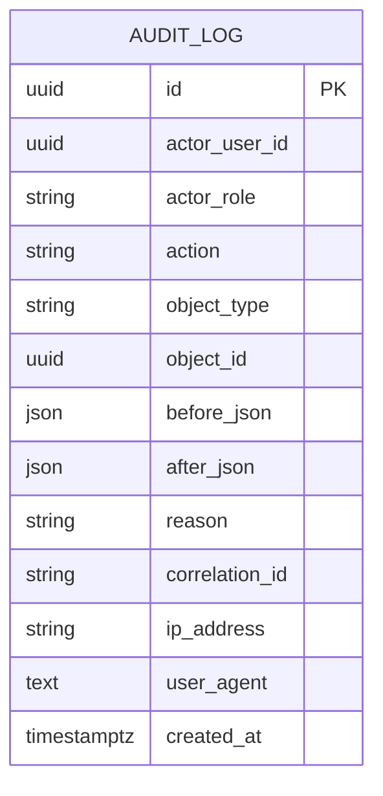

**Diagram sources**
- [app/modules/core/models/audit_log_model.py](file://app/modules/core/models/audit_log_model.py#L1-L43)

**Section sources**
- [app/modules/core/models/audit_log_model.py](file://app/modules/core/models/audit_log_model.py#L1-L43)

### Concurrency Control and Safety Mechanisms
- Idempotency keys are unique-scoped by legal entity, book, and endpoint to prevent duplicate writes.
- PENDING state and lock timestamps prevent overlapping executions; stale locks are auto-transitioned.
- Database constraints (e.g., unique source_key on journal entries) prevent duplicate postings.
- Row version checks raise conflicts when clients attempt to update stale records.

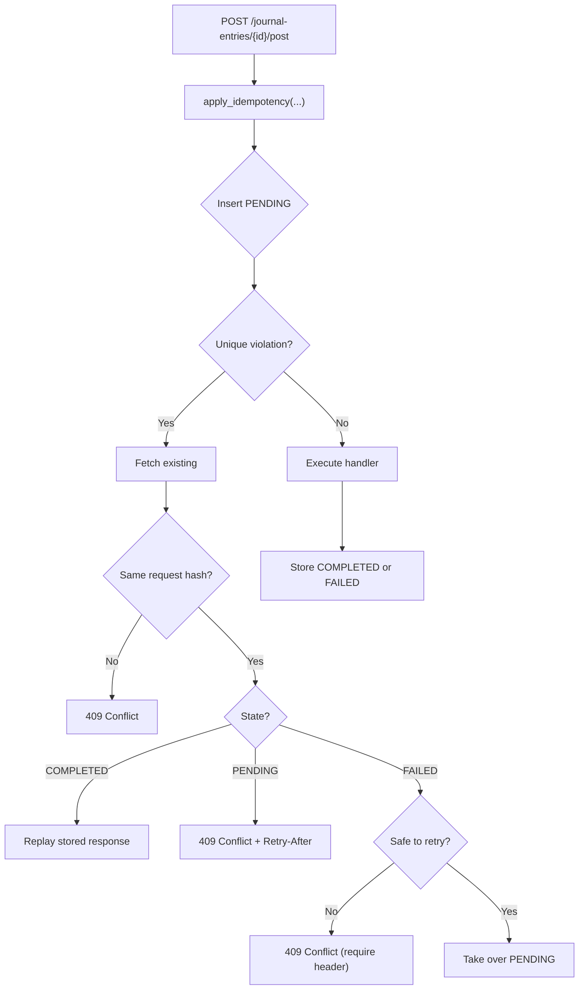

**Diagram sources**
- [app/core/idempotency.py](file://app/core/idempotency.py#L1-L482)
- [app/modules/general_ledger/models/journal_entry_model.py](file://app/modules/general_ledger/models/journal_entry_model.py#L1-L128)
- [app/core/row_version.py](file://app/core/row_version.py#L1-L31)

**Section sources**
- [app/core/idempotency.py](file://app/core/idempotency.py#L1-L482)
- [app/modules/general_ledger/models/journal_entry_model.py](file://app/modules/general_ledger/models/journal_entry_model.py#L1-L128)
- [app/core/row_version.py](file://app/core/row_version.py#L1-L31)

### Batch Processing and Synchronization
- Bulk upsert endpoints support creating/updating/deleting lines in a single operation with per-row error reporting.
- Idempotency metadata can carry correlation data (e.g., batch_id, cursors) for sync operations.

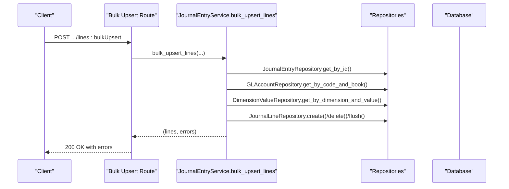

**Diagram sources**
- [app/modules/general_ledger/api/routes/journal_entry_routes.py](file://app/modules/general_ledger/api/routes/journal_entry_routes.py#L309-L377)
- [app/modules/general_ledger/services/journal_entry_service.py](file://app/modules/general_ledger/services/journal_entry_service.py#L410-L635)

**Section sources**
- [app/modules/general_ledger/api/routes/journal_entry_routes.py](file://app/modules/general_ledger/api/routes/journal_entry_routes.py#L309-L377)
- [app/modules/general_ledger/services/journal_entry_service.py](file://app/modules/general_ledger/services/journal_entry_service.py#L410-L635)

## Dependency Analysis
The following diagram highlights key dependencies among modules and layers.

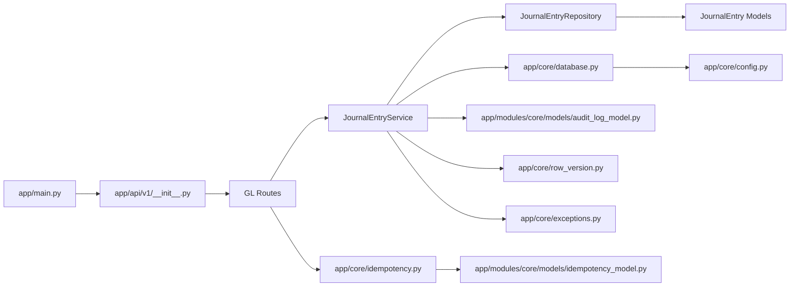

**Diagram sources**
- [app/main.py](file://app/main.py#L1-L54)
- [app/api/v1/__init__.py](file://app/api/v1/__init__.py#L1-L72)
- [app/modules/general_ledger/api/routes/journal_entry_routes.py](file://app/modules/general_ledger/api/routes/journal_entry_routes.py#L1-L377)
- [app/modules/general_ledger/services/journal_entry_service.py](file://app/modules/general_ledger/services/journal_entry_service.py#L1-L635)
- [app/modules/general_ledger/repositories/journal_entry_repository.py](file://app/modules/general_ledger/repositories/journal_entry_repository.py#L1-L119)
- [app/modules/general_ledger/models/journal_entry_model.py](file://app/modules/general_ledger/models/journal_entry_model.py#L1-L128)
- [app/core/database.py](file://app/core/database.py#L1-L113)
- [app/core/config.py](file://app/core/config.py#L1-L74)
- [app/core/idempotency.py](file://app/core/idempotency.py#L1-L482)
- [app/modules/core/models/idempotency_model.py](file://app/modules/core/models/idempotency_model.py#L1-L54)
- [app/modules/core/models/audit_log_model.py](file://app/modules/core/models/audit_log_model.py#L1-L43)
- [app/core/row_version.py](file://app/core/row_version.py#L1-L31)
- [app/core/exceptions.py](file://app/core/exceptions.py#L1-L43)

**Section sources**
- [app/main.py](file://app/main.py#L1-L54)
- [app/api/v1/__init__.py](file://app/api/v1/__init__.py#L1-L72)
- [app/core/database.py](file://app/core/database.py#L1-L113)

## Performance Considerations
- Asynchronous I/O: Use async SQLAlchemy to minimize blocking during I/O-bound operations.
- Connection pooling: Tune pool_size and max_overflow according to workload and database capacity.
- Pagination: Repositories support limit/offset to avoid large result sets.
- Canonical JSON serialization: Idempotency uses canonical encoding to stabilize hashes and reduce collisions.
- Constraint enforcement: Database constraints prevent invalid states and reduce application-level checks.
- Audit indexing: AuditLog indexes improve query performance for actor, object, and action filters.

[No sources needed since this section provides general guidance]

## Troubleshooting Guide
Common issues and resolutions:
- 409 Conflict on idempotency: Occurs when the same key is reused with a different request payload. Ensure stable idempotency keys and identical payloads.
- 409 Conflict on row version: Indicates concurrent modification. Clients should refresh data and retry.
- Period locked: Posting attempted in a closed period. Open the period or schedule posting for a valid period.
- Unbalanced journal entry: Debits must equal credits; fix line amounts or remove duplicates.
- Duplicate posting prevention: JournalEntry source_key uniqueness prevents double posting; adjust source_key or use idempotency.

**Section sources**
- [app/core/idempotency.py](file://app/core/idempotency.py#L1-L482)
- [app/core/row_version.py](file://app/core/row_version.py#L1-L31)
- [app/modules/general_ledger/services/journal_entry_service.py](file://app/modules/general_ledger/services/journal_entry_service.py#L171-L242)
- [app/modules/general_ledger/models/journal_entry_model.py](file://app/modules/general_ledger/models/journal_entry_model.py#L51-L54)
- [app/core/exceptions.py](file://app/core/exceptions.py#L1-L43)

## Conclusion
The system employs a clean separation of concerns with async SQLAlchemy, a robust repository pattern, and strong safety mechanisms. Idempotency, optimistic locking, and audit trails ensure reliable, observable, and resilient financial data operations. The modular structure supports scalable extension across domains like treasury, AR/AP, payroll, and intercompany.