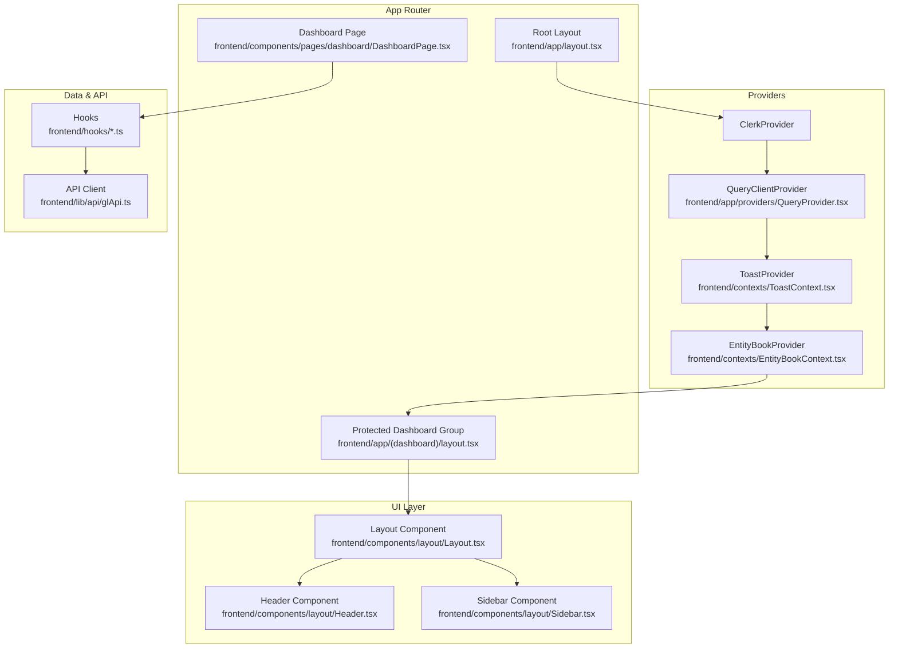
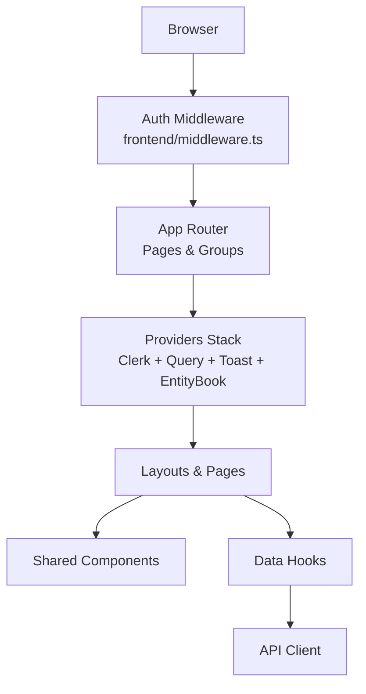
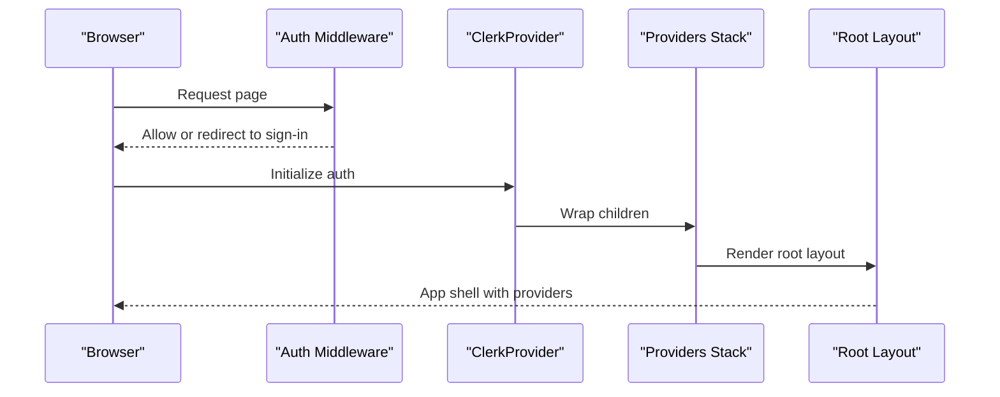
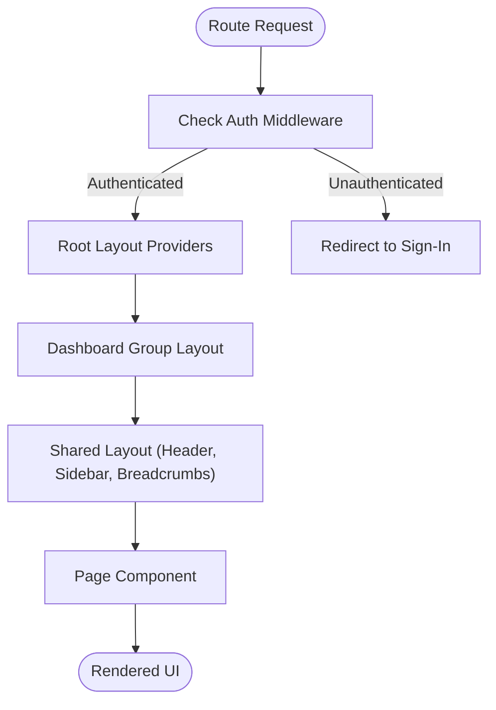
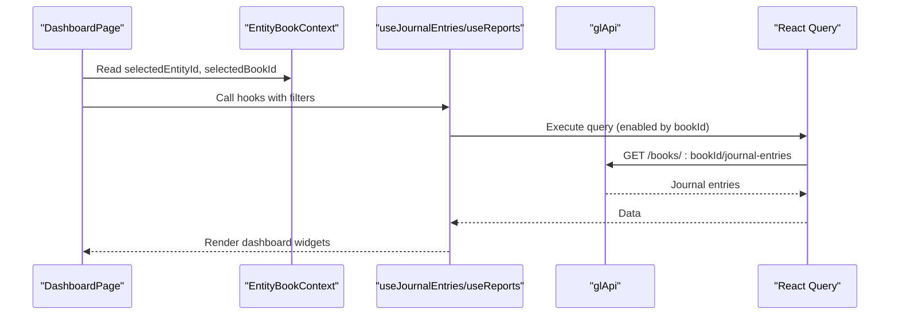
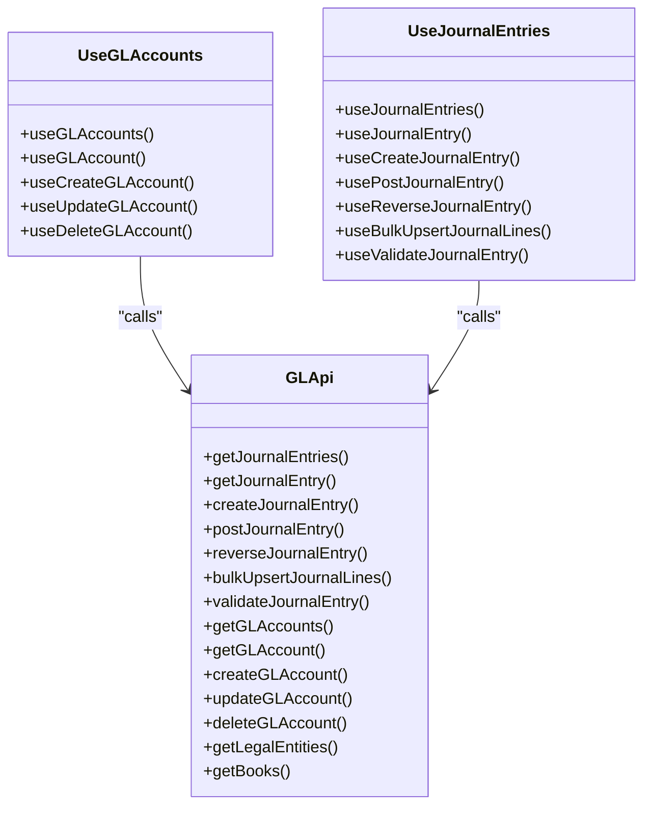
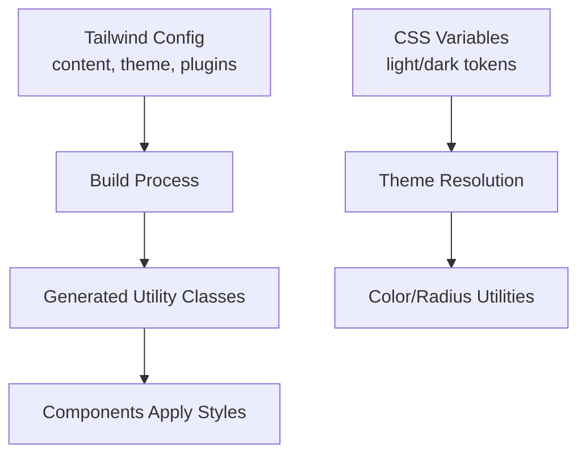
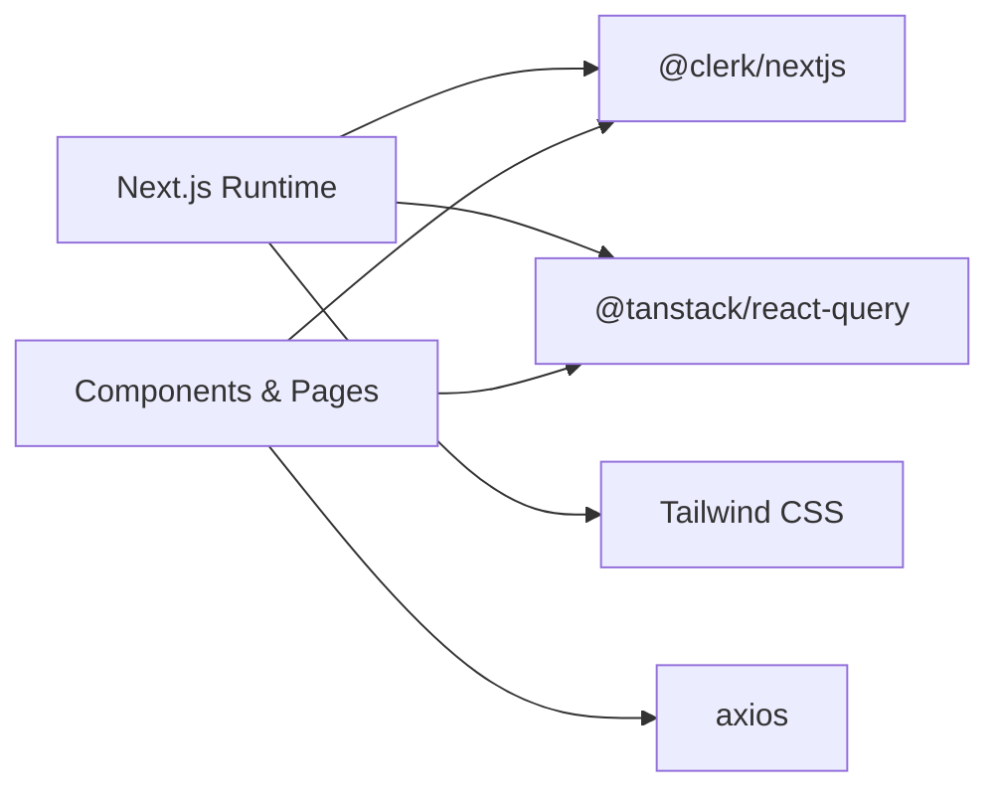

# Frontend Architecture

<cite>
**Referenced Files in This Document**
- [frontend/app/layout.tsx](file://frontend/app/layout.tsx)
- [frontend/app/globals.css](file://frontend/app/globals.css)
- [frontend/middleware.ts](file://frontend/middleware.ts)
- [frontend/next.config.js](file://frontend/next.config.js)
- [frontend/tailwind.config.js](file://frontend/tailwind.config.js)
- [frontend/package.json](file://frontend/package.json)
- [frontend/app/providers/QueryProvider.tsx](file://frontend/app/providers/QueryProvider.tsx)
- [frontend/contexts/ToastContext.tsx](file://frontend/contexts/ToastContext.tsx)
- [frontend/contexts/EntityBookContext.tsx](file://frontend/contexts/EntityBookContext.tsx)
- [frontend/components/layout/Layout.tsx](file://frontend/components/layout/Layout.tsx)
- [frontend/components/layout/Header.tsx](file://frontend/components/layout/Header.tsx)
- [frontend/components/layout/Sidebar.tsx](file://frontend/components/layout/Sidebar.tsx)
- [frontend/app/(dashboard)/layout.tsx](file://frontend/app/(dashboard)/layout.tsx)
- [frontend/components/pages/dashboard/DashboardPage.tsx](file://frontend/components/pages/dashboard/DashboardPage.tsx)
- [frontend/lib/api/glApi.ts](file://frontend/lib/api/glApi.ts)
- [frontend/hooks/useGLAccounts.ts](file://frontend/hooks/useGLAccounts.ts)
- [frontend/hooks/useJournalEntries.ts](file://frontend/hooks/useJournalEntries.ts)
</cite>

## Table of Contents
1. [Introduction](#introduction)
2. [Project Structure](#project-structure)
3. [Core Components](#core-components)
4. [Architecture Overview](#architecture-overview)
5. [Detailed Component Analysis](#detailed-component-analysis)
6. [Dependency Analysis](#dependency-analysis)
7. [Performance Considerations](#performance-considerations)
8. [Troubleshooting Guide](#troubleshooting-guide)
9. [Conclusion](#conclusion)
10. [Appendices](#appendices)

## Introduction
This document describes the frontend architecture of the Next.js application powering the TrueVow Financial Management platform. It explains the app router structure, layout hierarchy, and page-based routing system. It documents the global styling approach using Tailwind CSS, middleware configuration for authentication, and the provider hierarchy for state management. It also details the component architecture, build configuration, environment setup, deployment considerations, client-side routing patterns, data fetching strategies, and integration with the backend API.

## Project Structure
The frontend is organized under the frontend directory with a Next.js app directory structure. Key areas:
- app: Next.js App Router pages and layouts, including a protected dashboard group and authentication routes.
- components: Shared UI components grouped by common, layout, pages, and ui.
- contexts: Application-wide state providers for toasts and entity/book selection.
- hooks: TanStack Query-based hooks for data fetching and mutations.
- lib/api: Backend API client and typed models for financial domain entities.
- Styles and configuration: Tailwind CSS, PostCSS, Next.js configuration, and Clerk middleware.

**Diagram sources**
- [frontend/app/layout.tsx](file://frontend/app/layout.tsx#L1-L37)
- [frontend/app/providers/QueryProvider.tsx](file://frontend/app/providers/QueryProvider.tsx#L1-L26)
- [frontend/contexts/ToastContext.tsx](file://frontend/contexts/ToastContext.tsx#L1-L86)
- [frontend/contexts/EntityBookContext.tsx](file://frontend/contexts/EntityBookContext.tsx#L1-L158)
- [frontend/app/(dashboard)/layout.tsx](file://frontend/app/(dashboard)/layout.tsx#L1-L18)
- [frontend/components/layout/Layout.tsx](file://frontend/components/layout/Layout.tsx#L1-L51)
- [frontend/components/layout/Header.tsx](file://frontend/components/layout/Header.tsx#L1-L43)
- [frontend/components/layout/Sidebar.tsx](file://frontend/components/layout/Sidebar.tsx#L1-L58)
- [frontend/components/pages/dashboard/DashboardPage.tsx](file://frontend/components/pages/dashboard/DashboardPage.tsx#L1-L181)
- [frontend/hooks/useJournalEntries.ts](file://frontend/hooks/useJournalEntries.ts#L1-L202)
- [frontend/lib/api/glApi.ts](file://frontend/lib/api/glApi.ts#L1-L320)

**Section sources**
- [frontend/app/layout.tsx](file://frontend/app/layout.tsx#L1-L37)
- [frontend/app/(dashboard)/layout.tsx](file://frontend/app/(dashboard)/layout.tsx#L1-L18)
- [frontend/components/layout/Layout.tsx](file://frontend/components/layout/Layout.tsx#L1-L51)
- [frontend/components/layout/Header.tsx](file://frontend/components/layout/Header.tsx#L1-L43)
- [frontend/components/layout/Sidebar.tsx](file://frontend/components/layout/Sidebar.tsx#L1-L58)

## Core Components
- Root layout and providers: Establishes the global provider stack (Clerk, React Query, Toast, Entity/Book) and metadata.
- Dashboard group layout: Enforces authentication via Clerk and wraps content in the shared Layout component.
- Shared layout components: Header, Sidebar, and Layout provide navigation, breadcrumbs, and responsive structure.
- State providers:
  - QueryClientProvider: Centralizes TanStack Query configuration with caching and retry policies.
  - ToastProvider: Manages toast notifications with typed messages and auto-dismiss.
  - EntityBookProvider: Loads legal entities and books, persists selections, and exposes helpers.
- API and hooks: Typed API client for general ledger operations; hooks encapsulate queries and mutations with optimistic updates and cache invalidation.
- Styling: Tailwind CSS with CSS variables for light/dark themes and layered base styles.

**Section sources**
- [frontend/app/layout.tsx](file://frontend/app/layout.tsx#L1-L37)
- [frontend/app/providers/QueryProvider.tsx](file://frontend/app/providers/QueryProvider.tsx#L1-L26)
- [frontend/contexts/ToastContext.tsx](file://frontend/contexts/ToastContext.tsx#L1-L86)
- [frontend/contexts/EntityBookContext.tsx](file://frontend/contexts/EntityBookContext.tsx#L1-L158)
- [frontend/lib/api/glApi.ts](file://frontend/lib/api/glApi.ts#L1-L320)
- [frontend/hooks/useGLAccounts.ts](file://frontend/hooks/useGLAccounts.ts#L1-L129)
- [frontend/hooks/useJournalEntries.ts](file://frontend/hooks/useJournalEntries.ts#L1-L202)
- [frontend/app/globals.css](file://frontend/app/globals.css#L1-L52)
- [frontend/tailwind.config.js](file://frontend/tailwind.config.js#L1-L59)

## Architecture Overview
The frontend follows a layered architecture:
- Provider layer: Authentication (Clerk), state management (React Query, Contexts), and UI composition.
- Routing layer: App Router groups and pages with middleware enforcing authentication.
- UI layer: Shared components and page-specific implementations.
- Data layer: Hooks and API client integrate with backend endpoints.

**Diagram sources**
- [frontend/middleware.ts](file://frontend/middleware.ts#L1-L10)
- [frontend/app/layout.tsx](file://frontend/app/layout.tsx#L1-L37)
- [frontend/app/(dashboard)/layout.tsx](file://frontend/app/(dashboard)/layout.tsx#L1-L18)
- [frontend/components/layout/Layout.tsx](file://frontend/components/layout/Layout.tsx#L1-L51)
- [frontend/hooks/useJournalEntries.ts](file://frontend/hooks/useJournalEntries.ts#L1-L202)
- [frontend/lib/api/glApi.ts](file://frontend/lib/api/glApi.ts#L1-L320)

## Detailed Component Analysis

### Provider Hierarchy and Authentication
- ClerkProvider wraps the entire app for authentication.
- QueryClientProvider centralizes caching and retries.
- ToastProvider manages notifications and renders a container.
- EntityBookProvider loads legal entities and books, persists selections, and exposes helpers.
- Middleware enforces public routes for sign-in/sign-up and protects other paths.

**Diagram sources**
- [frontend/middleware.ts](file://frontend/middleware.ts#L1-L10)
- [frontend/app/layout.tsx](file://frontend/app/layout.tsx#L1-L37)
- [frontend/app/providers/QueryProvider.tsx](file://frontend/app/providers/QueryProvider.tsx#L1-L26)
- [frontend/contexts/ToastContext.tsx](file://frontend/contexts/ToastContext.tsx#L1-L86)
- [frontend/contexts/EntityBookContext.tsx](file://frontend/contexts/EntityBookContext.tsx#L1-L158)

**Section sources**
- [frontend/middleware.ts](file://frontend/middleware.ts#L1-L10)
- [frontend/app/layout.tsx](file://frontend/app/layout.tsx#L1-L37)
- [frontend/app/providers/QueryProvider.tsx](file://frontend/app/providers/QueryProvider.tsx#L1-L26)
- [frontend/contexts/ToastContext.tsx](file://frontend/contexts/ToastContext.tsx#L1-L86)
- [frontend/contexts/EntityBookContext.tsx](file://frontend/contexts/EntityBookContext.tsx#L1-L158)

### Routing and Layout Hierarchy
- Root layout defines metadata and composes providers.
- Dashboard group layout enforces authentication and wraps content in the shared Layout component.
- Layout component provides sidebar navigation, header with user controls and entity/book selector, breadcrumbs, and main content area.
- Sidebar uses Next.js navigation to highlight active routes.

**Diagram sources**
- [frontend/middleware.ts](file://frontend/middleware.ts#L1-L10)
- [frontend/app/layout.tsx](file://frontend/app/layout.tsx#L1-L37)
- [frontend/app/(dashboard)/layout.tsx](file://frontend/app/(dashboard)/layout.tsx#L1-L18)
- [frontend/components/layout/Layout.tsx](file://frontend/components/layout/Layout.tsx#L1-L51)
- [frontend/components/layout/Header.tsx](file://frontend/components/layout/Header.tsx#L1-L43)
- [frontend/components/layout/Sidebar.tsx](file://frontend/components/layout/Sidebar.tsx#L1-L58)

**Section sources**
- [frontend/app/layout.tsx](file://frontend/app/layout.tsx#L1-L37)
- [frontend/app/(dashboard)/layout.tsx](file://frontend/app/(dashboard)/layout.tsx#L1-L18)
- [frontend/components/layout/Layout.tsx](file://frontend/components/layout/Layout.tsx#L1-L51)
- [frontend/components/layout/Header.tsx](file://frontend/components/layout/Header.tsx#L1-L43)
- [frontend/components/layout/Sidebar.tsx](file://frontend/components/layout/Sidebar.tsx#L1-L58)

### Dashboard Page and Data Fetching
- DashboardPage uses EntityBook context to filter reports and journal entries by selected legal entity and book.
- Uses hooks for journal entries and reports to fetch data with TanStack Query.
- Renders summary cards, recent entries, quick actions, and account summary.

**Diagram sources**
- [frontend/components/pages/dashboard/DashboardPage.tsx](file://frontend/components/pages/dashboard/DashboardPage.tsx#L1-L181)
- [frontend/contexts/EntityBookContext.tsx](file://frontend/contexts/EntityBookContext.tsx#L1-L158)
- [frontend/hooks/useJournalEntries.ts](file://frontend/hooks/useJournalEntries.ts#L1-L202)
- [frontend/lib/api/glApi.ts](file://frontend/lib/api/glApi.ts#L1-L320)

**Section sources**
- [frontend/components/pages/dashboard/DashboardPage.tsx](file://frontend/components/pages/dashboard/DashboardPage.tsx#L1-L181)
- [frontend/hooks/useJournalEntries.ts](file://frontend/hooks/useJournalEntries.ts#L1-L202)
- [frontend/lib/api/glApi.ts](file://frontend/lib/api/glApi.ts#L1-L320)

### API Client and Hooks
- glApi defines typed requests and responses for general ledger operations (journal entries, chart of accounts, periods, dimensions, entities, books).
- useGLAccounts and useJournalEntries encapsulate TanStack Query queries and mutations with optimistic updates and cache invalidation.

**Diagram sources**
- [frontend/lib/api/glApi.ts](file://frontend/lib/api/glApi.ts#L1-L320)
- [frontend/hooks/useGLAccounts.ts](file://frontend/hooks/useGLAccounts.ts#L1-L129)
- [frontend/hooks/useJournalEntries.ts](file://frontend/hooks/useJournalEntries.ts#L1-L202)

**Section sources**
- [frontend/lib/api/glApi.ts](file://frontend/lib/api/glApi.ts#L1-L320)
- [frontend/hooks/useGLAccounts.ts](file://frontend/hooks/useGLAccounts.ts#L1-L129)
- [frontend/hooks/useJournalEntries.ts](file://frontend/hooks/useJournalEntries.ts#L1-L202)

### Styling with Tailwind CSS
- Tailwind is configured with a content array scanning pages, components, app, and src.
- CSS variables define light and dark theme tokens mapped to Tailwind color scales.
- Base layer applies border and text/background utilities globally.

**Diagram sources**
- [frontend/tailwind.config.js](file://frontend/tailwind.config.js#L1-L59)
- [frontend/app/globals.css](file://frontend/app/globals.css#L1-L52)

**Section sources**
- [frontend/tailwind.config.js](file://frontend/tailwind.config.js#L1-L59)
- [frontend/app/globals.css](file://frontend/app/globals.css#L1-L52)

## Dependency Analysis
- Next.js runtime and strict mode are configured.
- Clerk integrates authentication and user management.
- TanStack Query provides caching, invalidation, and optimistic updates.
- Tailwind CSS and PostCSS enable utility-first styling.
- Axios is used by the API client for HTTP requests.

**Diagram sources**
- [frontend/package.json](file://frontend/package.json#L1-L55)
- [frontend/next.config.js](file://frontend/next.config.js#L1-L7)

**Section sources**
- [frontend/package.json](file://frontend/package.json#L1-L55)
- [frontend/next.config.js](file://frontend/next.config.js#L1-L7)

## Performance Considerations
- React Query default options disable window focus refetch and apply retry with a 5-minute stale threshold; adjust as needed for real-time needs.
- Hooks implement optimistic updates and targeted cache invalidation to reduce server round-trips.
- Tailwind’s purge/content configuration ensures minimal CSS output.
- Clerk middleware restricts protected routes to improve security and reduce unnecessary rendering.

[No sources needed since this section provides general guidance]

## Troubleshooting Guide
- Authentication redirects: Verify middleware public routes and Clerk configuration.
- Provider order: Ensure ClerkProvider is outermost, followed by QueryClientProvider, ToastProvider, and EntityBookProvider.
- Entity/Book selection: Confirm local storage keys and context initialization; check network errors for entity/book fetch failures.
- Toast visibility: Ensure ToastContainer is rendered by the provider and that toasts are dismissed after duration.
- Data fetching: Confirm selected book ID is present before enabling queries; handle missing IDs gracefully in hooks.

**Section sources**
- [frontend/middleware.ts](file://frontend/middleware.ts#L1-L10)
- [frontend/app/layout.tsx](file://frontend/app/layout.tsx#L1-L37)
- [frontend/contexts/EntityBookContext.tsx](file://frontend/contexts/EntityBookContext.tsx#L1-L158)
- [frontend/contexts/ToastContext.tsx](file://frontend/contexts/ToastContext.tsx#L1-L86)
- [frontend/hooks/useJournalEntries.ts](file://frontend/hooks/useJournalEntries.ts#L1-L202)

## Conclusion
The frontend leverages Next.js App Router, Clerk authentication, TanStack Query for data management, and Tailwind CSS for styling. The provider stack ensures consistent state and UX across pages, while hooks encapsulate API interactions with optimistic updates. The shared layout components deliver a cohesive navigation experience, and the middleware enforces secure routing.

[No sources needed since this section summarizes without analyzing specific files]

## Appendices

### Build and Environment Setup
- Scripts include development, production build, start, linting, type checking, and testing.
- Next.js configuration enables strict mode.
- Tailwind and PostCSS are configured for utility-first styling.

**Section sources**
- [frontend/package.json](file://frontend/package.json#L1-L55)
- [frontend/next.config.js](file://frontend/next.config.js#L1-L7)
- [frontend/tailwind.config.js](file://frontend/tailwind.config.js#L1-L59)

### Deployment Considerations
- Build artifacts are produced by Next.js; ensure environment variables for Clerk and backend API endpoints are configured in the deployment environment.
- Middleware matcher targets static assets and API routes appropriately.

**Section sources**
- [frontend/middleware.ts](file://frontend/middleware.ts#L1-L10)
- [frontend/package.json](file://frontend/package.json#L1-L55)