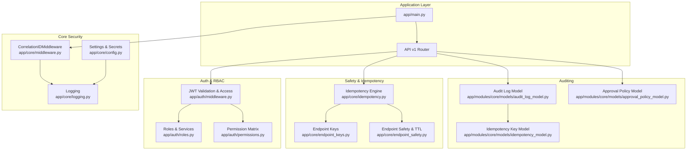
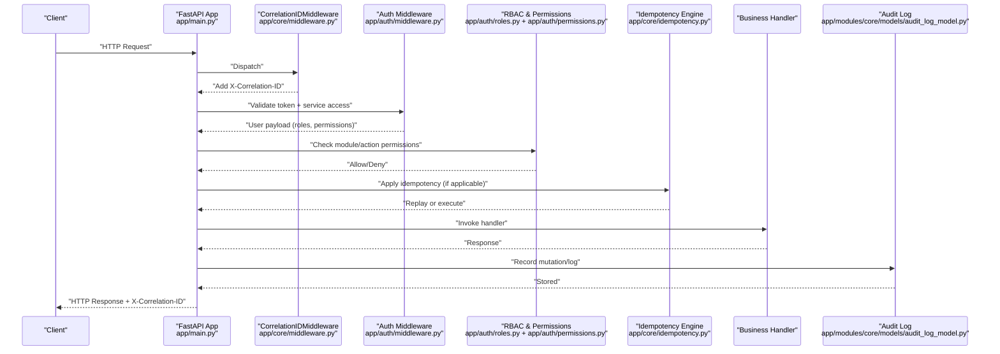
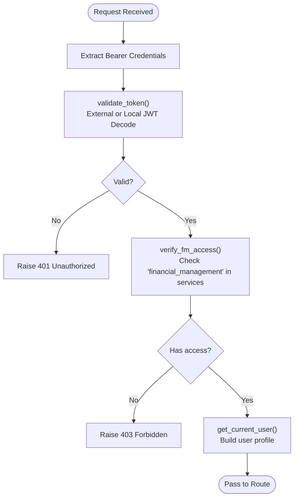
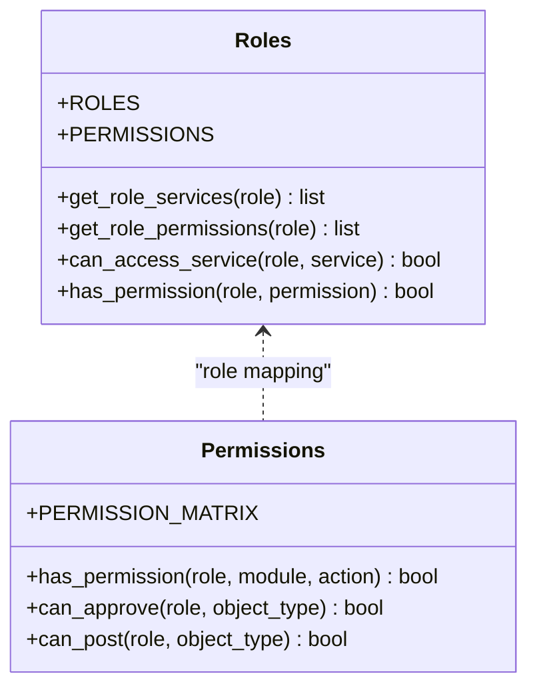
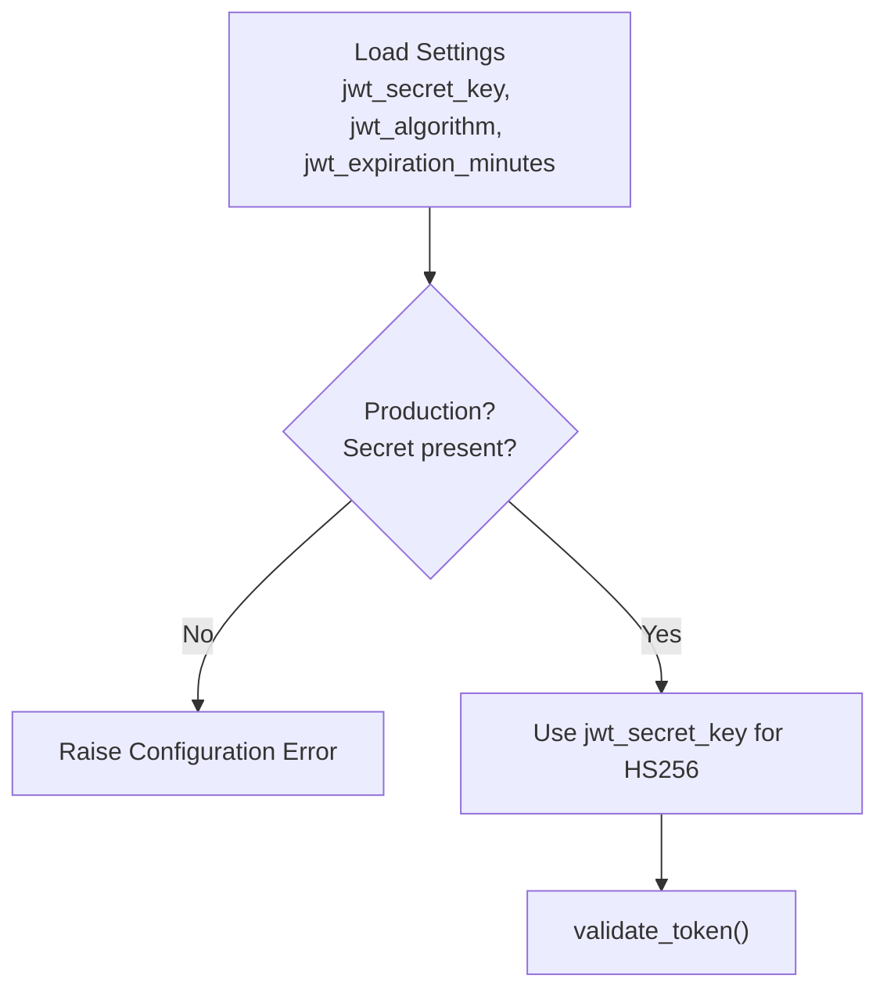
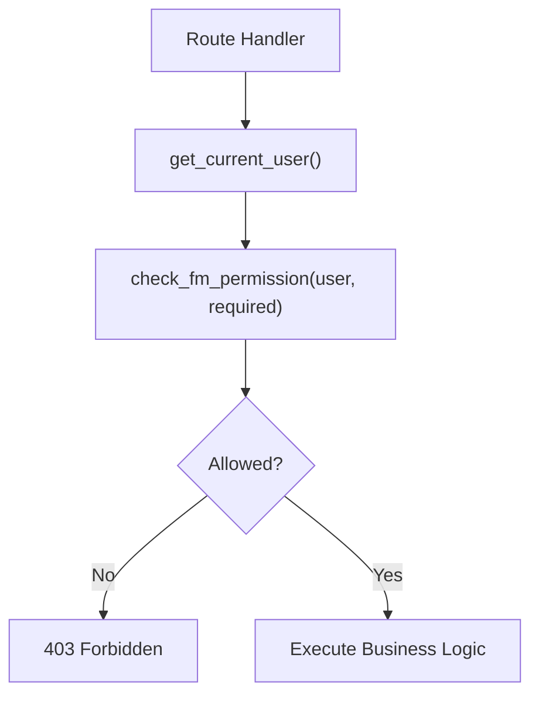
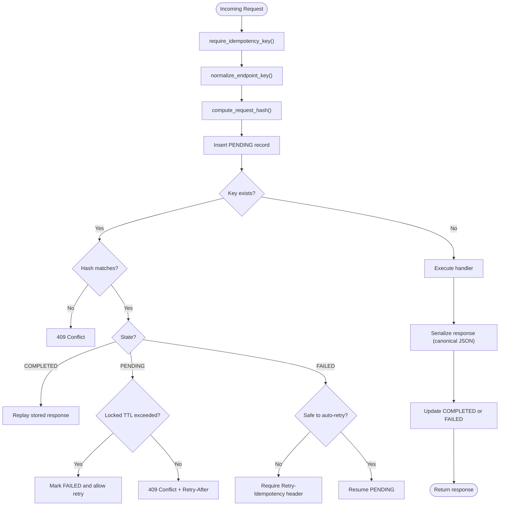
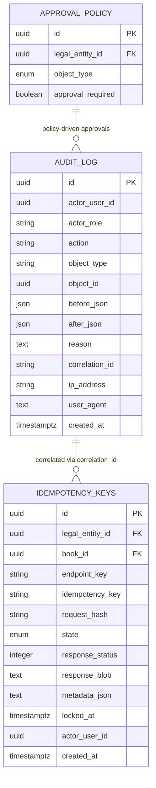
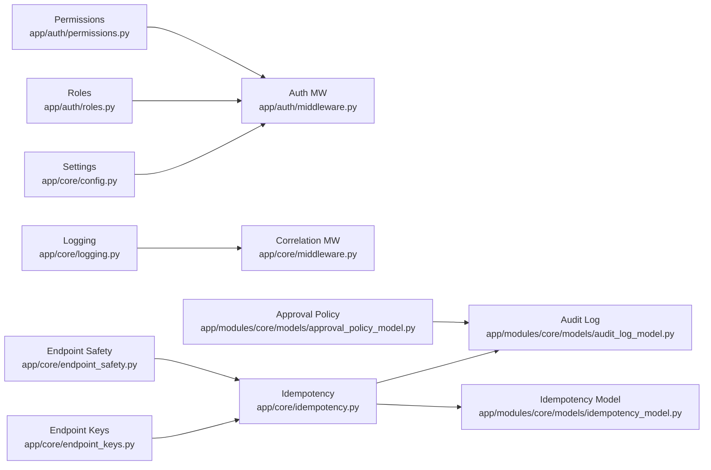

# Security Architecture

<cite>
**Referenced Files in This Document**
- [app/main.py](file://app/main.py)
- [app/core/middleware.py](file://app/core/middleware.py)
- [app/core/logging.py](file://app/core/logging.py)
- [app/core/config.py](file://app/core/config.py)
- [app/core/idempotency.py](file://app/core/idempotency.py)
- [app/core/endpoint_keys.py](file://app/core/endpoint_keys.py)
- [app/core/endpoint_safety.py](file://app/core/endpoint_safety.py)
- [app/auth/middleware.py](file://app/auth/middleware.py)
- [app/auth/permissions.py](file://app/auth/permissions.py)
- [app/auth/roles.py](file://app/auth/roles.py)
- [app/modules/core/models/audit_log_model.py](file://app/modules/core/models/audit_log_model.py)
- [app/modules/core/models/idempotency_model.py](file://app/modules/core/models/idempotency_model.py)
- [app/modules/core/models/approval_policy_model.py](file://app/modules/core/models/approval_policy_model.py)
- [.env.example](file://.env.example)
</cite>

## Table of Contents
1. [Introduction](#introduction)
2. [Project Structure](#project-structure)
3. [Core Components](#core-components)
4. [Architecture Overview](#architecture-overview)
5. [Detailed Component Analysis](#detailed-component-analysis)
6. [Dependency Analysis](#dependency-analysis)
7. [Performance Considerations](#performance-considerations)
8. [Troubleshooting Guide](#troubleshooting-guide)
9. [Conclusion](#conclusion)
10. [Appendices](#appendices)

## Introduction
This document describes the multi-layered security architecture of TrueVow Financial Management. It covers authentication and authorization via JWT and role-based access control (RBAC), middleware-driven request tracking and observability, idempotency safeguards against replay and partial execution, audit logging for compliance, and operational controls supporting secure API design. The goal is to provide a clear understanding of how identity, permissions, and safety mechanisms work together to protect financial data and support regulatory reporting.

## Project Structure
Security-related components are organized across core infrastructure, authentication, authorization, auditing, and idempotency layers. The FastAPI application registers middleware early to ensure all requests are tracked and logged consistently.

**Diagram sources**
- [app/main.py](file://app/main.py#L1-L54)
- [app/core/middleware.py](file://app/core/middleware.py#L1-L35)
- [app/core/logging.py](file://app/core/logging.py#L1-L34)
- [app/core/config.py](file://app/core/config.py#L1-L74)
- [app/auth/middleware.py](file://app/auth/middleware.py#L1-L140)
- [app/auth/roles.py](file://app/auth/roles.py#L1-L119)
- [app/auth/permissions.py](file://app/auth/permissions.py#L1-L127)
- [app/core/idempotency.py](file://app/core/idempotency.py#L1-L482)
- [app/core/endpoint_keys.py](file://app/core/endpoint_keys.py#L1-L43)
- [app/core/endpoint_safety.py](file://app/core/endpoint_safety.py#L1-L118)
- [app/modules/core/models/audit_log_model.py](file://app/modules/core/models/audit_log_model.py#L1-L43)
- [app/modules/core/models/idempotency_model.py](file://app/modules/core/models/idempotency_model.py#L1-L54)
- [app/modules/core/models/approval_policy_model.py](file://app/modules/core/models/approval_policy_model.py#L1-L36)

**Section sources**
- [app/main.py](file://app/main.py#L1-L54)
- [app/core/middleware.py](file://app/core/middleware.py#L1-L35)

## Core Components
- Authentication middleware validates JWT tokens and enforces service access for financial management.
- Authorization uses RBAC with role definitions, service scoping, and a permission matrix.
- Idempotency ensures deterministic outcomes for write operations and safe retries.
- Audit logging captures actions, actors, and context for compliance and monitoring.
- Logging and correlation IDs unify observability across requests.

**Section sources**
- [app/auth/middleware.py](file://app/auth/middleware.py#L1-L140)
- [app/auth/roles.py](file://app/auth/roles.py#L1-L119)
- [app/auth/permissions.py](file://app/auth/permissions.py#L1-L127)
- [app/core/idempotency.py](file://app/core/idempotency.py#L1-L482)
- [app/modules/core/models/audit_log_model.py](file://app/modules/core/models/audit_log_model.py#L1-L43)
- [app/core/logging.py](file://app/core/logging.py#L1-L34)

## Architecture Overview
The security architecture layers are applied in request flow: correlation ID tracking, authentication and authorization, idempotency gating, business logic execution, and audit capture.

**Diagram sources**
- [app/main.py](file://app/main.py#L1-L54)
- [app/core/middleware.py](file://app/core/middleware.py#L1-L35)
- [app/auth/middleware.py](file://app/auth/middleware.py#L1-L140)
- [app/auth/roles.py](file://app/auth/roles.py#L1-L119)
- [app/auth/permissions.py](file://app/auth/permissions.py#L1-L127)
- [app/core/idempotency.py](file://app/core/idempotency.py#L1-L482)
- [app/modules/core/models/audit_log_model.py](file://app/modules/core/models/audit_log_model.py#L1-L43)

## Detailed Component Analysis

### Authentication Middleware Stack
- Validates JWT via an external auth service or local decoding using configured secrets.
- Enforces service access for “financial_management”.
- Extracts current user with roles and permissions for downstream authorization checks.

**Diagram sources**
- [app/auth/middleware.py](file://app/auth/middleware.py#L17-L106)

**Section sources**
- [app/auth/middleware.py](file://app/auth/middleware.py#L1-L140)
- [app/core/config.py](file://app/core/config.py#L37-L51)
- [.env.example](file://.env.example#L7-L8)

### Role-Based Access Control (RBAC)
- Roles define services and permission levels.
- Permission matrix maps roles to module actions.
- Utility functions support approval and posting capability checks.

**Diagram sources**
- [app/auth/roles.py](file://app/auth/roles.py#L1-L119)
- [app/auth/permissions.py](file://app/auth/permissions.py#L1-L127)

**Section sources**
- [app/auth/roles.py](file://app/auth/roles.py#L1-L119)
- [app/auth/permissions.py](file://app/auth/permissions.py#L1-L127)

### JWT Token Management and Session Handling
- JWT secret is loaded from environment configuration with a validator ensuring presence in production.
- Algorithm and expiration are configurable.
- Token validation supports both centralized auth service and local decoding fallback.

**Diagram sources**
- [app/core/config.py](file://app/core/config.py#L37-L51)
- [app/auth/middleware.py](file://app/auth/middleware.py#L17-L56)

**Section sources**
- [app/core/config.py](file://app/core/config.py#L1-L74)
- [app/auth/middleware.py](file://app/auth/middleware.py#L1-L140)
- [.env.example](file://.env.example#L7-L8)

### Authorization Enforcement Across Endpoints
- Route handlers depend on current user extraction and RBAC checks.
- Admin roles bypass most checks; otherwise, permissions are enforced per module/action.
- Approval and posting checks are supported by dedicated helpers.

**Diagram sources**
- [app/auth/middleware.py](file://app/auth/middleware.py#L89-L138)
- [app/auth/permissions.py](file://app/auth/permissions.py#L84-L127)

**Section sources**
- [app/auth/middleware.py](file://app/auth/middleware.py#L89-L138)
- [app/auth/permissions.py](file://app/auth/permissions.py#L84-L127)

### Idempotency and Retry Safety
- Canonical serialization of request bodies ensures stable hashing across equivalent requests.
- Idempotency keys are scoped by legal entity, book, endpoint key, and the key itself.
- State machine: PENDING → COMPLETED or FAILED; TTL prevents stale locks; safe-to-retry rules govern retry behavior.

**Diagram sources**
- [app/core/idempotency.py](file://app/core/idempotency.py#L103-L482)
- [app/core/endpoint_keys.py](file://app/core/endpoint_keys.py#L1-L43)
- [app/core/endpoint_safety.py](file://app/core/endpoint_safety.py#L68-L118)

**Section sources**
- [app/core/idempotency.py](file://app/core/idempotency.py#L1-L482)
- [app/core/endpoint_keys.py](file://app/core/endpoint_keys.py#L1-L43)
- [app/core/endpoint_safety.py](file://app/core/endpoint_safety.py#L1-L118)

### Audit Logging and Compliance Tracking
- Audit log captures actor, role, action, object type/id, before/after snapshots, reason, correlation ID, IP, user agent, and timestamps.
- Designed for immutable audit trails and correlation across requests.
- Idempotency keys also record actor and metadata for traceability.

**Diagram sources**
- [app/modules/core/models/audit_log_model.py](file://app/modules/core/models/audit_log_model.py#L9-L43)
- [app/modules/core/models/idempotency_model.py](file://app/modules/core/models/idempotency_model.py#L17-L54)
- [app/modules/core/models/approval_policy_model.py](file://app/modules/core/models/approval_policy_model.py#L18-L36)

**Section sources**
- [app/modules/core/models/audit_log_model.py](file://app/modules/core/models/audit_log_model.py#L1-L43)
- [app/modules/core/models/idempotency_model.py](file://app/modules/core/models/idempotency_model.py#L1-L54)
- [app/modules/core/models/approval_policy_model.py](file://app/modules/core/models/approval_policy_model.py#L1-L36)

### Secure API Design Patterns
- Idempotency keys and endpoint keys enforce deterministic behavior for write operations.
- Canonical JSON normalization and hashing ensure equivalent requests are treated identically.
- Response size limits prevent storage bloat while preserving auditability.
- Correlation IDs unify distributed tracing and incident investigation.

**Section sources**
- [app/core/idempotency.py](file://app/core/idempotency.py#L23-L90)
- [app/core/endpoint_keys.py](file://app/core/endpoint_keys.py#L1-L43)
- [app/core/middleware.py](file://app/core/middleware.py#L1-L35)

## Dependency Analysis
The security subsystems are loosely coupled and layered. Authentication depends on configuration and logging; RBAC depends on role definitions and permission matrices; idempotency depends on endpoint keys and safety policies; audit logging integrates with both idempotency and business handlers.

**Diagram sources**
- [app/core/config.py](file://app/core/config.py#L1-L74)
- [app/auth/middleware.py](file://app/auth/middleware.py#L1-L140)
- [app/auth/roles.py](file://app/auth/roles.py#L1-L119)
- [app/auth/permissions.py](file://app/auth/permissions.py#L1-L127)
- [app/core/endpoint_keys.py](file://app/core/endpoint_keys.py#L1-L43)
- [app/core/endpoint_safety.py](file://app/core/endpoint_safety.py#L1-L118)
- [app/core/idempotency.py](file://app/core/idempotency.py#L1-L482)
- [app/modules/core/models/audit_log_model.py](file://app/modules/core/models/audit_log_model.py#L1-L43)
- [app/modules/core/models/idempotency_model.py](file://app/modules/core/models/idempotency_model.py#L1-L54)
- [app/modules/core/models/approval_policy_model.py](file://app/modules/core/models/approval_policy_model.py#L1-L36)

**Section sources**
- [app/core/config.py](file://app/core/config.py#L1-L74)
- [app/auth/middleware.py](file://app/auth/middleware.py#L1-L140)
- [app/core/idempotency.py](file://app/core/idempotency.py#L1-L482)

## Performance Considerations
- JWT validation may hit an external auth service; timeouts and fallbacks are implemented to maintain resilience.
- Idempotency introduces database writes; ensure appropriate indexing and connection pooling.
- Logging overhead is minimal; production logs are rotated and retained with controlled retention.
- Correlation IDs add negligible overhead and improve operational visibility.

[No sources needed since this section provides general guidance]

## Troubleshooting Guide
Common issues and mitigations:
- Token validation failures: Check JWT secret configuration and auth service availability.
- Insufficient permissions: Verify role assignments and permission matrix mappings.
- Idempotency conflicts: Ensure consistent request payloads and unique keys; review safe-to-retry rules.
- Stale locks: Investigate endpoint TTLs and handler runtimes; adjust TTLs if necessary.
- Audit gaps: Confirm correlation IDs are propagated and audit handlers are invoked on mutations.

**Section sources**
- [app/auth/middleware.py](file://app/auth/middleware.py#L48-L56)
- [app/core/idempotency.py](file://app/core/idempotency.py#L312-L377)
- [app/core/logging.py](file://app/core/logging.py#L1-L34)

## Conclusion
TrueVow’s security architecture combines strong identity verification, fine-grained RBAC, deterministic idempotency, and comprehensive audit logging. Together, these layers provide robust protection for financial data, support compliance and regulatory reporting, and enable secure, observable operations across all API endpoints.

[No sources needed since this section summarizes without analyzing specific files]

## Appendices

### Appendix A: JWT and Secret Management
- Secrets are validated at startup; development defaults are overridden in production.
- Environment template defines required variables for database and JWT configuration.

**Section sources**
- [app/core/config.py](file://app/core/config.py#L42-L48)
- [.env.example](file://.env.example#L1-L23)

### Appendix B: Endpoint Safety and Retry Policies
- Safe-to-retry and TTL configurations are keyed by endpoint constants to ensure consistent behavior across handlers.

**Section sources**
- [app/core/endpoint_safety.py](file://app/core/endpoint_safety.py#L21-L118)
- [app/core/endpoint_keys.py](file://app/core/endpoint_keys.py#L1-L43)