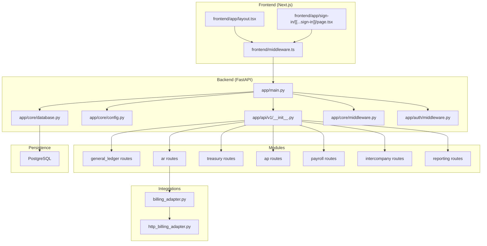
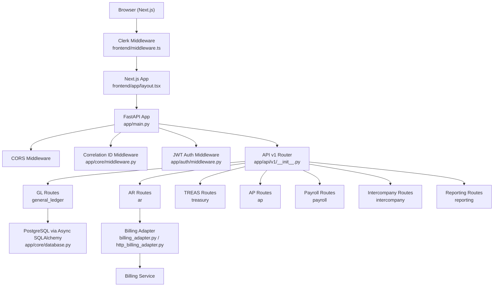
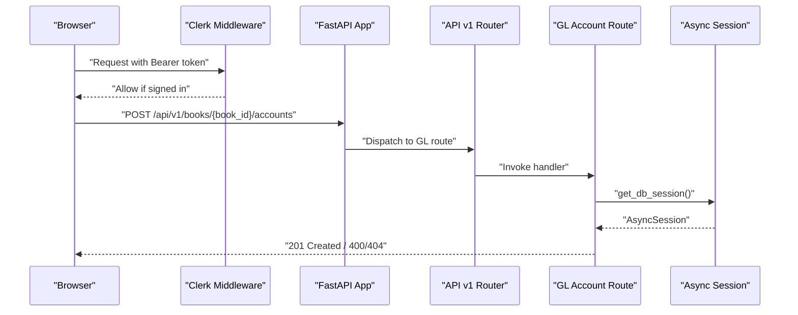
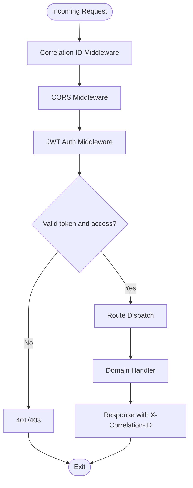
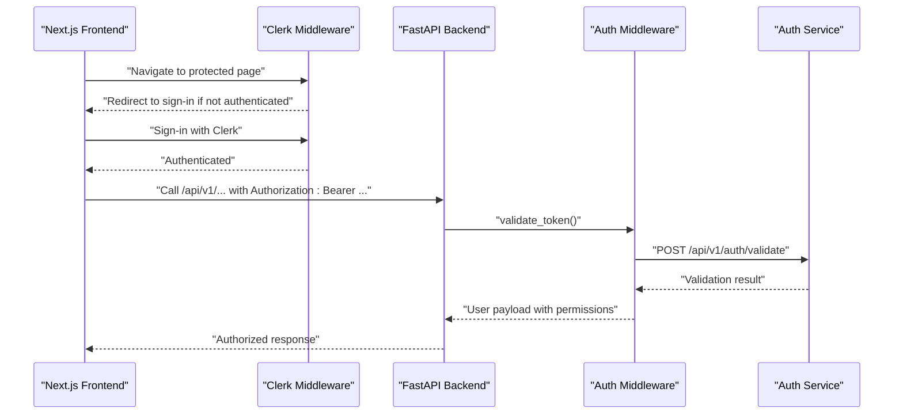
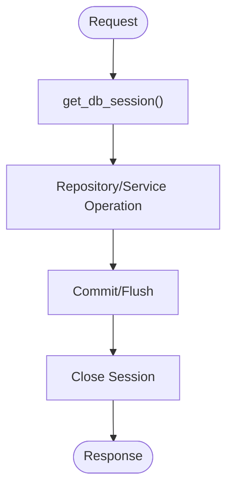
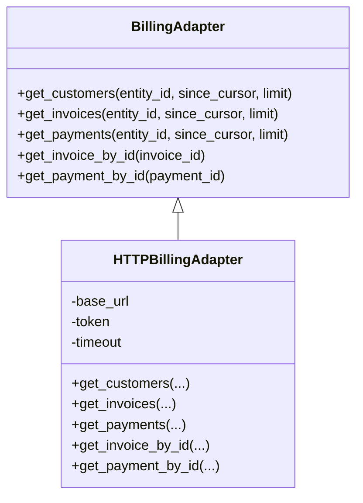
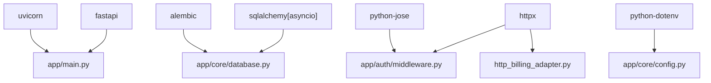
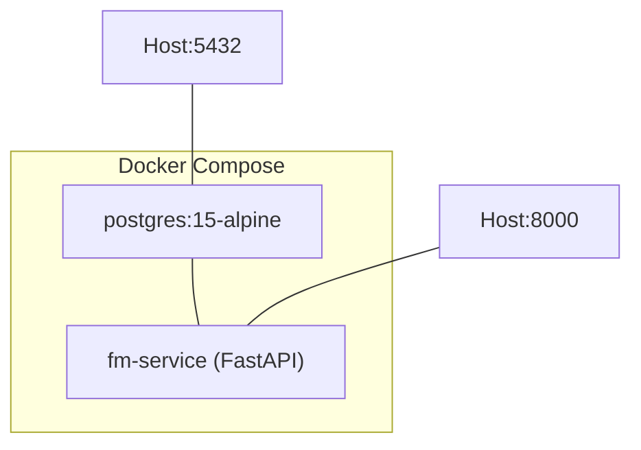

# System Architecture

<cite>
**Referenced Files in This Document**
- [app/main.py](file://app/main.py)
- [app/api/v1/__init__.py](file://app/api/v1/__init__.py)
- [app/core/config.py](file://app/core/config.py)
- [app/core/database.py](file://app/core/database.py)
- [app/core/middleware.py](file://app/core/middleware.py)
- [app/auth/middleware.py](file://app/auth/middleware.py)
- [app/modules/ar/integrations/billing_adapter.py](file://app/modules/ar/integrations/billing_adapter.py)
- [app/modules/ar/integrations/http_billing_adapter.py](file://app/modules/ar/integrations/http_billing_adapter.py)
- [app/modules/general_ledger/api/routes/coa_routes.py](file://app/modules/general_ledger/api/routes/coa_routes.py)
- [app/modules/ar/api/routes/ar_routes.py](file://app/modules/ar/api/routes/ar_routes.py)
- [frontend/middleware.ts](file://frontend/middleware.ts)
- [frontend/app/layout.tsx](file://frontend/app/layout.tsx)
- [frontend/app/sign-in/[[...sign-in]]/page.tsx](file://frontend/app/sign-in/[[...sign-in]]/page.tsx)
- [docker-compose.yml](file://docker-compose.yml)
- [requirements.txt](file://requirements.txt)
</cite>

## Table of Contents
1. [Introduction](#introduction)
2. [Project Structure](#project-structure)
3. [Core Components](#core-components)
4. [Architecture Overview](#architecture-overview)
5. [Detailed Component Analysis](#detailed-component-analysis)
6. [Dependency Analysis](#dependency-analysis)
7. [Performance Considerations](#performance-considerations)
8. [Troubleshooting Guide](#troubleshooting-guide)
9. [Conclusion](#conclusion)
10. [Appendices](#appendices)

## Introduction
This document describes the TrueVow Financial Management system’s architecture with a focus on modular design, security-first principles, and separation of concerns. The system comprises:
- Frontend built with Next.js and Clerk for authentication and routing
- Backend built with FastAPI serving a versioned REST API
- PostgreSQL database with asynchronous SQLAlchemy sessions
- Cross-module integration points, notably with the Billing module via an adapter pattern
- Strong middleware stack for observability, CORS, and authentication
- Clear API routing structure and idempotency safeguards

The architecture emphasizes:
- Security: JWT-based authentication validated centrally, role-based permissions, and strict CORS
- Scalability: async database sessions, idempotency, and modular routing
- Observability: correlation IDs, structured logs, and health endpoints
- Integration: pluggable adapters for third-party systems like Billing

## Project Structure
The repository is organized into:
- app: FastAPI backend with modular domain areas (general_ledger, treasury, ar, ap, payroll, intercompany, reporting), core infrastructure (config, database, middleware), and API versioning
- frontend: Next.js application with Clerk authentication, providers, and page components
- database: migrations and schema DDL
- docker-compose.yml and Dockerfile for local development and deployment topology

**Diagram sources**
- [app/main.py](file://app/main.py#L1-L54)
- [app/api/v1/__init__.py](file://app/api/v1/__init__.py#L1-L72)
- [app/core/config.py](file://app/core/config.py#L1-L74)
- [app/core/database.py](file://app/core/database.py#L1-L113)
- [app/core/middleware.py](file://app/core/middleware.py#L1-L35)
- [app/auth/middleware.py](file://app/auth/middleware.py#L1-L140)
- [app/modules/ar/integrations/billing_adapter.py](file://app/modules/ar/integrations/billing_adapter.py#L1-L191)
- [app/modules/ar/integrations/http_billing_adapter.py](file://app/modules/ar/integrations/http_billing_adapter.py#L1-L130)
- [frontend/middleware.ts](file://frontend/middleware.ts#L1-L10)
- [frontend/app/layout.tsx](file://frontend/app/layout.tsx#L1-L37)
- [frontend/app/sign-in/[[...sign-in]]/page.tsx](file://frontend/app/sign-in/[[...sign-in]]/page.tsx#L1-L10)

**Section sources**
- [app/main.py](file://app/main.py#L1-L54)
- [app/api/v1/__init__.py](file://app/api/v1/__init__.py#L1-L72)
- [app/core/config.py](file://app/core/config.py#L1-L74)
- [app/core/database.py](file://app/core/database.py#L1-L113)
- [app/core/middleware.py](file://app/core/middleware.py#L1-L35)
- [app/auth/middleware.py](file://app/auth/middleware.py#L1-L140)
- [frontend/middleware.ts](file://frontend/middleware.ts#L1-L10)
- [frontend/app/layout.tsx](file://frontend/app/layout.tsx#L1-L37)
- [frontend/app/sign-in/[[...sign-in]]/page.tsx](file://frontend/app/sign-in/[[...sign-in]]/page.tsx#L1-L10)

## Core Components
- FastAPI application entrypoint defines the service identity, docs endpoints, and middleware stack
- API v1 router aggregates domain-specific route groups
- Core configuration centralizes environment, database URLs, secrets, and integration endpoints
- Database layer manages async engine, session factory, and model imports
- Core middleware injects correlation IDs for tracing
- Authentication middleware validates JWTs and enforces service access and permissions
- Billing integration uses an adapter interface with HTTP and mock implementations
- Frontend uses Clerk for authentication and Next.js middleware for protected routes

**Section sources**
- [app/main.py](file://app/main.py#L1-L54)
- [app/api/v1/__init__.py](file://app/api/v1/__init__.py#L1-L72)
- [app/core/config.py](file://app/core/config.py#L1-L74)
- [app/core/database.py](file://app/core/database.py#L1-L113)
- [app/core/middleware.py](file://app/core/middleware.py#L1-L35)
- [app/auth/middleware.py](file://app/auth/middleware.py#L1-L140)
- [app/modules/ar/integrations/billing_adapter.py](file://app/modules/ar/integrations/billing_adapter.py#L1-L191)
- [app/modules/ar/integrations/http_billing_adapter.py](file://app/modules/ar/integrations/http_billing_adapter.py#L1-L130)
- [frontend/middleware.ts](file://frontend/middleware.ts#L1-L10)

## Architecture Overview
The system follows a layered, modular architecture:
- Presentation Layer: Next.js frontend with Clerk-managed authentication and protected routes
- API Gateway/Entrypoint: FastAPI app with CORS, correlation ID middleware, and router composition
- Domain Services: Feature-focused modules under app/modules (AR, GL, Treasury, AP, Payroll, Intercompany, Reporting)
- Persistence: PostgreSQL with async SQLAlchemy sessions
- Integrations: Adapter pattern for Billing and other external services

**Diagram sources**
- [frontend/middleware.ts](file://frontend/middleware.ts#L1-L10)
- [frontend/app/layout.tsx](file://frontend/app/layout.tsx#L1-L37)
- [app/main.py](file://app/main.py#L1-L54)
- [app/core/middleware.py](file://app/core/middleware.py#L1-L35)
- [app/auth/middleware.py](file://app/auth/middleware.py#L1-L140)
- [app/api/v1/__init__.py](file://app/api/v1/__init__.py#L1-L72)
- [app/core/database.py](file://app/core/database.py#L1-L113)
- [app/modules/ar/integrations/billing_adapter.py](file://app/modules/ar/integrations/billing_adapter.py#L1-L191)
- [app/modules/ar/integrations/http_billing_adapter.py](file://app/modules/ar/integrations/http_billing_adapter.py#L1-L130)

## Detailed Component Analysis

### API Routing Structure
- Versioned API: app/api/v1/__init__.py composes domain routers under /api/v1
- Domain grouping: General Ledger, Treasury, AR, AP, Payroll, Intercompany, Reporting
- Endpoint examples:
  - Chart of Accounts: create, list, update, mapping CRUD under general_ledger
  - AR posting and reporting: invoice posting, customer balances, aging reports under ar

**Diagram sources**
- [app/api/v1/__init__.py](file://app/api/v1/__init__.py#L1-L72)
- [app/modules/general_ledger/api/routes/coa_routes.py](file://app/modules/general_ledger/api/routes/coa_routes.py#L1-L123)
- [app/core/database.py](file://app/core/database.py#L106-L113)
- [frontend/middleware.ts](file://frontend/middleware.ts#L1-L10)

**Section sources**
- [app/api/v1/__init__.py](file://app/api/v1/__init__.py#L1-L72)
- [app/modules/general_ledger/api/routes/coa_routes.py](file://app/modules/general_ledger/api/routes/coa_routes.py#L1-L123)
- [app/modules/ar/api/routes/ar_routes.py](file://app/modules/ar/api/routes/ar_routes.py#L1-L178)

### Middleware Stack
- Correlation ID Middleware: Adds X-Correlation-ID to requests/responses for tracing
- CORS Middleware: Configurable origins/methods/headers
- Auth Middleware: Validates JWTs against a centralized auth service or locally if secret available; enforces service access and permissions

**Diagram sources**
- [app/core/middleware.py](file://app/core/middleware.py#L1-L35)
- [app/auth/middleware.py](file://app/auth/middleware.py#L1-L140)
- [app/main.py](file://app/main.py#L1-L54)

**Section sources**
- [app/core/middleware.py](file://app/core/middleware.py#L1-L35)
- [app/auth/middleware.py](file://app/auth/middleware.py#L1-L140)
- [app/main.py](file://app/main.py#L1-L54)

### Authentication Flow
- Frontend: Clerk Next.js middleware protects routes and redirects unauthenticated users to sign-in
- Backend: Auth middleware validates tokens and checks service entitlements; extracts user roles and permissions

**Diagram sources**
- [frontend/middleware.ts](file://frontend/middleware.ts#L1-L10)
- [frontend/app/sign-in/[[...sign-in]]/page.tsx](file://frontend/app/sign-in/[[...sign-in]]/page.tsx#L1-L10)
- [app/auth/middleware.py](file://app/auth/middleware.py#L1-L140)

**Section sources**
- [frontend/middleware.ts](file://frontend/middleware.ts#L1-L10)
- [frontend/app/layout.tsx](file://frontend/app/layout.tsx#L1-L37)
- [frontend/app/sign-in/[[...sign-in]]/page.tsx](file://frontend/app/sign-in/[[...sign-in]]/page.tsx#L1-L10)
- [app/auth/middleware.py](file://app/auth/middleware.py#L1-L140)

### Data Flow Patterns
- Async database sessions: get_db_session yields a scoped AsyncSession per request
- Model imports populate metadata for migrations and ORM operations
- Idempotency applied around sensitive operations (e.g., AR invoice posting) to prevent duplicate effects

**Diagram sources**
- [app/core/database.py](file://app/core/database.py#L106-L113)
- [app/modules/ar/api/routes/ar_routes.py](file://app/modules/ar/api/routes/ar_routes.py#L19-L75)

**Section sources**
- [app/core/database.py](file://app/core/database.py#L1-L113)
- [app/modules/ar/api/routes/ar_routes.py](file://app/modules/ar/api/routes/ar_routes.py#L1-L178)

### Integration Points with Billing Module
- Adapter abstraction: BillingAdapter defines methods for customers, invoices, payments, and lookup by ID
- HTTP implementation: HTTPBillingAdapter performs authenticated GET requests to Billing service endpoints
- Configuration: billing_service_url and billing_service_token are configured via settings

**Diagram sources**
- [app/modules/ar/integrations/billing_adapter.py](file://app/modules/ar/integrations/billing_adapter.py#L1-L191)
- [app/modules/ar/integrations/http_billing_adapter.py](file://app/modules/ar/integrations/http_billing_adapter.py#L1-L130)

**Section sources**
- [app/modules/ar/integrations/billing_adapter.py](file://app/modules/ar/integrations/billing_adapter.py#L1-L191)
- [app/modules/ar/integrations/http_billing_adapter.py](file://app/modules/ar/integrations/http_billing_adapter.py#L1-L130)
- [app/core/config.py](file://app/core/config.py#L53-L61)

### Security Isolation Mechanisms
- JWT validation with centralized auth service and local fallback
- Permission checks based on roles and explicit permissions
- CORS restricted to configured origins and headers
- Environment-aware secrets loading and validation

**Section sources**
- [app/auth/middleware.py](file://app/auth/middleware.py#L1-L140)
- [app/core/config.py](file://app/core/config.py#L37-L51)
- [app/main.py](file://app/main.py#L20-L27)

## Dependency Analysis
The backend depends on:
- FastAPI and Uvicorn for the web server
- SQLAlchemy async engine and Alembic for migrations
- httpx for outbound HTTP calls
- python-jose for JWT handling
- dotenv for environment variables

**Diagram sources**
- [requirements.txt](file://requirements.txt#L1-L53)
- [app/main.py](file://app/main.py#L1-L54)
- [app/core/database.py](file://app/core/database.py#L1-L113)
- [app/auth/middleware.py](file://app/auth/middleware.py#L1-L140)
- [app/modules/ar/integrations/http_billing_adapter.py](file://app/modules/ar/integrations/http_billing_adapter.py#L1-L130)
- [app/core/config.py](file://app/core/config.py#L1-L74)

**Section sources**
- [requirements.txt](file://requirements.txt#L1-L53)
- [app/core/config.py](file://app/core/config.py#L1-L74)

## Performance Considerations
- Asynchronous database sessions reduce blocking and improve throughput under load
- Idempotency guards avoid duplicate processing for sensitive operations
- Connection pooling parameters configurable via settings
- CORS and middleware overhead minimal; keep middleware order optimal (CID first)
- Consider pagination and filtering for list endpoints to bound payload sizes

[No sources needed since this section provides general guidance]

## Troubleshooting Guide
Common issues and diagnostics:
- Health endpoint: Verify service availability at /health
- Database connectivity: Confirm effective_database_url resolves and pool settings are appropriate
- Authentication failures: Check JWT secret configuration and auth service availability
- CORS errors: Ensure frontend origin matches configured allow_origins
- Billing integration: Validate billing_service_url and billing_service_token

**Section sources**
- [app/main.py](file://app/main.py#L33-L40)
- [app/core/config.py](file://app/core/config.py#L16-L35)
- [app/auth/middleware.py](file://app/auth/middleware.py#L30-L56)
- [app/modules/ar/integrations/http_billing_adapter.py](file://app/modules/ar/integrations/http_billing_adapter.py#L13-L16)

## Conclusion
TrueVow Financial Management employs a clean, modular architecture with strong separation of concerns. The backend leverages FastAPI and async database operations, while the frontend uses Next.js and Clerk for secure, modern UX. The adapter pattern isolates integration concerns, and robust middleware ensures observability and security. The system is designed for scalability, maintainability, and safe operations across financial domains.

[No sources needed since this section summarizes without analyzing specific files]

## Appendices

### Deployment Topology
- Local development uses docker-compose with a Postgres container and the FastAPI service
- The service exposes port 8000 and mounts the app directory for hot reload during development

**Diagram sources**
- [docker-compose.yml](file://docker-compose.yml#L1-L42)

**Section sources**
- [docker-compose.yml](file://docker-compose.yml#L1-L42)