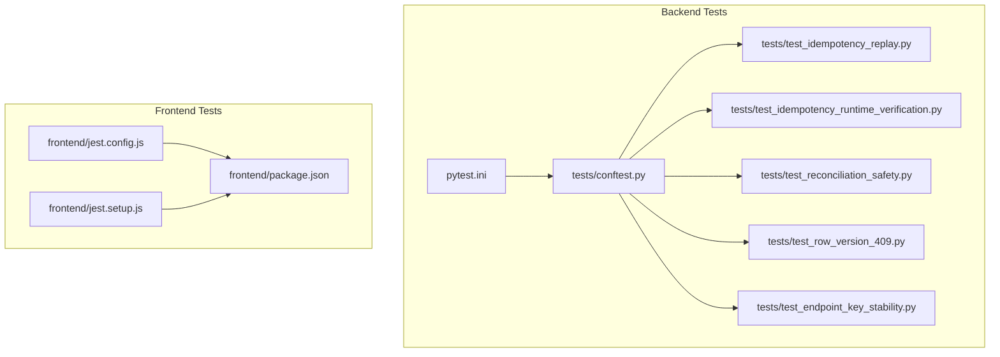
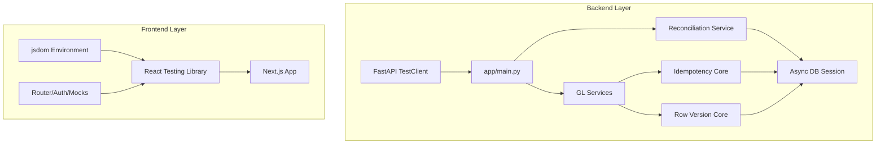
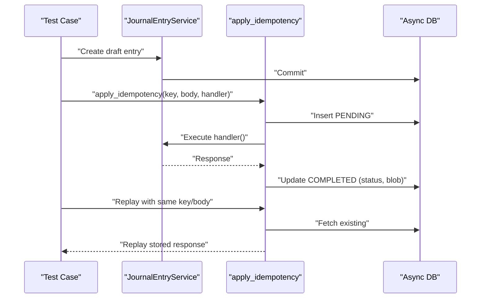
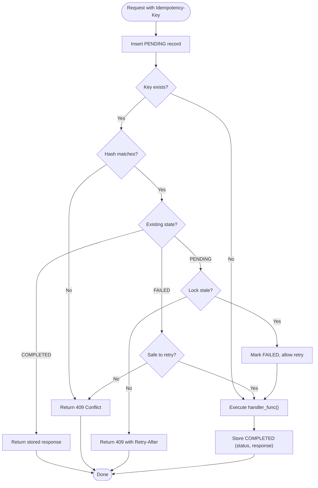
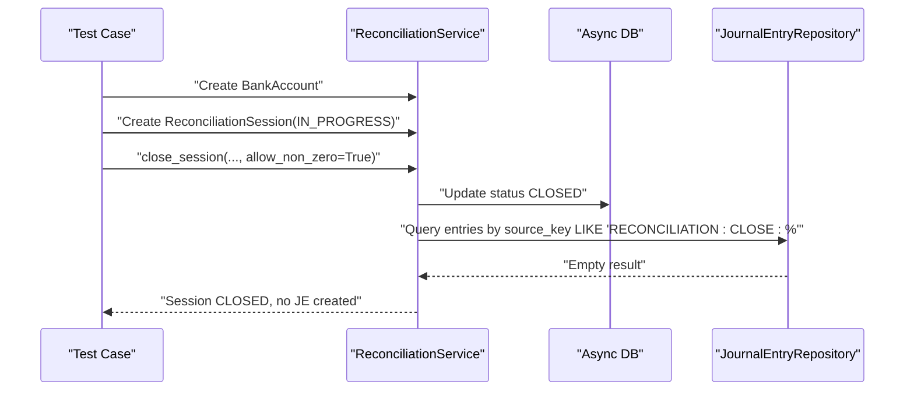
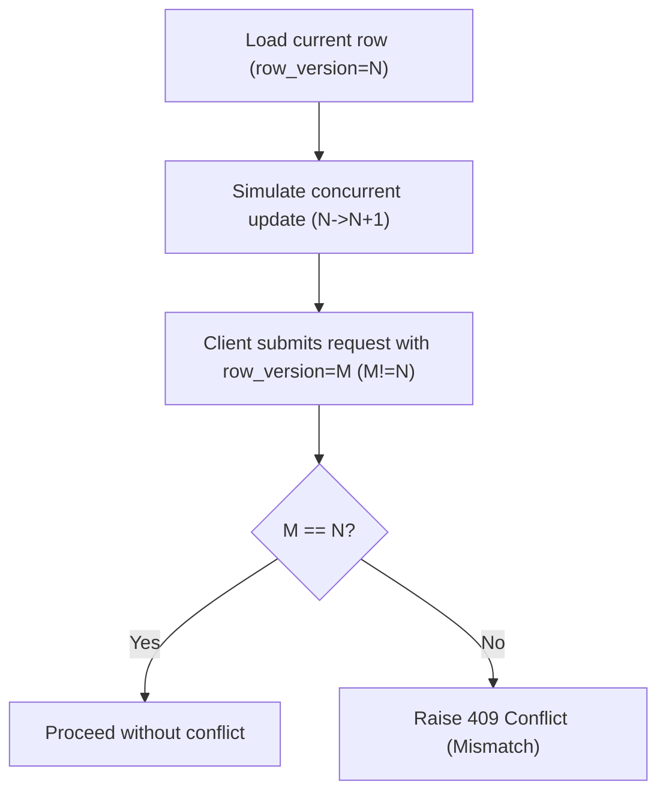
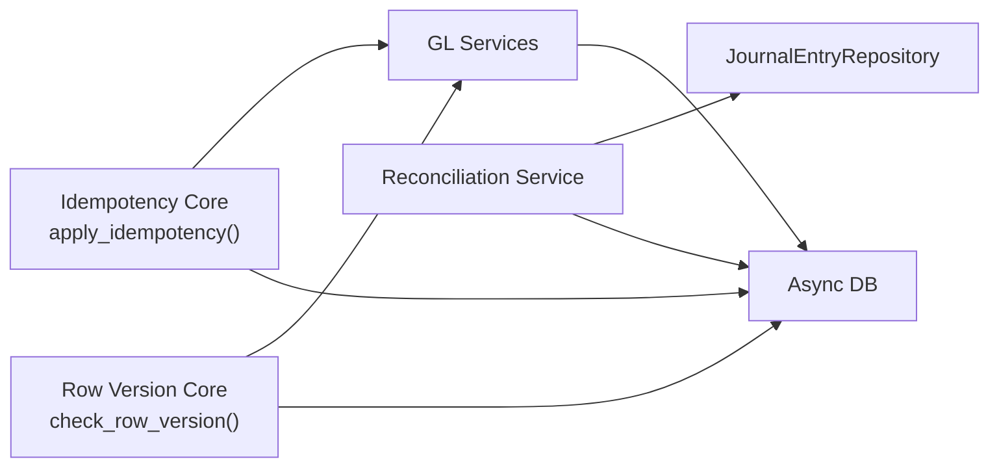

# Testing Strategy

<cite>
**Referenced Files in This Document**
- [pytest.ini](file://pytest.ini)
- [tests/conftest.py](file://tests/conftest.py)
- [tests/test_idempotency_replay.py](file://tests/test_idempotency_replay.py)
- [tests/test_idempotency_runtime_verification.py](file://tests/test_idempotency_runtime_verification.py)
- [tests/test_reconciliation_safety.py](file://tests/test_reconciliation_safety.py)
- [tests/test_row_version_409.py](file://tests/test_row_version_409.py)
- [tests/test_endpoint_key_stability.py](file://tests/test_endpoint_key_stability.py)
- [app/core/idempotency.py](file://app/core/idempotency.py)
- [app/core/row_version.py](file://app/core/row_version.py)
- [app/modules/general_ledger/services/reconciliation_service.py](file://app/modules/general_ledger/services/reconciliation_service.py)
- [frontend/jest.config.js](file://frontend/jest.config.js)
- [frontend/jest.setup.js](file://frontend/jest.setup.js)
- [frontend/package.json](file://frontend/package.json)
</cite>

## Table of Contents
1. [Introduction](#introduction)
2. [Project Structure](#project-structure)
3. [Core Components](#core-components)
4. [Architecture Overview](#architecture-overview)
5. [Detailed Component Analysis](#detailed-component-analysis)
6. [Dependency Analysis](#dependency-analysis)
7. [Performance Considerations](#performance-considerations)
8. [Troubleshooting Guide](#troubleshooting-guide)
9. [Conclusion](#conclusion)
10. [Appendices](#appendices)

## Introduction
This document defines the comprehensive testing strategy for the TrueVow Financial Management system. It covers backend testing with pytest, including test configuration, fixtures, and organization; frontend testing with Jest, React Testing Library, and setup procedures; and specialized financial controls such as idempotency verification, reconciliation safety, and row version conflict resolution. It also documents test execution procedures, continuous integration readiness, and quality assurance processes with practical guidance for writing robust tests that protect financial data integrity.

## Project Structure
The repository organizes tests into two primary areas:
- Backend tests under the root tests/ directory, driven by pytest configuration and shared fixtures.
- Frontend tests under the frontend/ directory, configured via Jest with Next.js support and DOM environment.

**Diagram sources**
- [pytest.ini](file://pytest.ini#L1-L8)
- [tests/conftest.py](file://tests/conftest.py#L1-L188)
- [tests/test_idempotency_replay.py](file://tests/test_idempotency_replay.py#L1-L378)
- [tests/test_idempotency_runtime_verification.py](file://tests/test_idempotency_runtime_verification.py#L1-L205)
- [tests/test_reconciliation_safety.py](file://tests/test_reconciliation_safety.py#L1-L126)
- [tests/test_row_version_409.py](file://tests/test_row_version_409.py#L1-L104)
- [tests/test_endpoint_key_stability.py](file://tests/test_endpoint_key_stability.py#L1-L42)
- [frontend/jest.config.js](file://frontend/jest.config.js#L1-L32)
- [frontend/jest.setup.js](file://frontend/jest.setup.js#L1-L89)
- [frontend/package.json](file://frontend/package.json#L1-L55)

**Section sources**
- [pytest.ini](file://pytest.ini#L1-L8)
- [tests/conftest.py](file://tests/conftest.py#L1-L188)
- [frontend/jest.config.js](file://frontend/jest.config.js#L1-L32)
- [frontend/jest.setup.js](file://frontend/jest.setup.js#L1-L89)
- [frontend/package.json](file://frontend/package.json#L1-L55)

## Core Components
- Backend testing framework:
  - pytest configuration sets asyncio mode, test discovery patterns, and fixture loop scope.
  - Shared fixtures in conftest.py provide an in-memory or external async database, pre-seeded financial entities, and helper factories for books, periods, GL accounts, and payroll groups.
- Frontend testing framework:
  - Jest configuration integrates with Next.js, sets up jsdom, module name mapping, and coverage collection.
  - Setup mocks Next.js router, Clerk, localStorage, and browser APIs to stabilize UI tests.

Key backend fixtures include:
- Database session lifecycle and schema initialization/drop.
- Legal entity, book, accounting period, GL accounts, and pay group factories for realistic financial scenarios.

Key frontend capabilities:
- Router mocking for navigation tests.
- Clerk user mocking for authenticated UI flows.
- DOM and layout mocks for responsive components.

**Section sources**
- [pytest.ini](file://pytest.ini#L1-L8)
- [tests/conftest.py](file://tests/conftest.py#L37-L84)
- [tests/conftest.py](file://tests/conftest.py#L87-L187)
- [frontend/jest.config.js](file://frontend/jest.config.js#L9-L28)
- [frontend/jest.setup.js](file://frontend/jest.setup.js#L4-L88)

## Architecture Overview
The testing architecture separates concerns across layers:
- Backend:
  - Unit and integration tests for financial services and models.
  - Idempotency and row version enforcement tested via direct service calls and HTTP client flows.
  - Reconciliation safety validated against journal entry generation and close semantics.
- Frontend:
  - Component and hook tests using React Testing Library with mocked routing and authentication.
  - Coverage collected across contexts, components, hooks, and lib modules.

**Diagram sources**
- [tests/test_idempotency_runtime_verification.py](file://tests/test_idempotency_runtime_verification.py#L21-L35)
- [app/core/idempotency.py](file://app/core/idempotency.py#L219-L251)
- [app/core/row_version.py](file://app/core/row_version.py#L8-L31)
- [app/modules/general_ledger/services/reconciliation_service.py](file://app/modules/general_ledger/services/reconciliation_service.py#L155-L187)
- [frontend/jest.config.js](file://frontend/jest.config.js#L1-L32)
- [frontend/jest.setup.js](file://frontend/jest.setup.js#L4-L88)

## Detailed Component Analysis

### Backend Idempotency Testing
This suite validates idempotency replay, hash mismatch protection, source key duplication prevention, and runtime behaviors like stale locks and failed retries.

**Diagram sources**
- [tests/test_idempotency_replay.py](file://tests/test_idempotency_replay.py#L18-L86)
- [app/core/idempotency.py](file://app/core/idempotency.py#L219-L251)
- [app/core/idempotency.py](file://app/core/idempotency.py#L379-L431)

Additional runtime verification tests exercise:
- Stale PENDING lock recovery after TTL.
- FAILED retry blocking for unsafe endpoints.
- Replay of stored response status codes (e.g., 204).
- 409 Conflict during active PENDING within TTL.

**Diagram sources**
- [app/core/idempotency.py](file://app/core/idempotency.py#L257-L377)
- [app/core/idempotency.py](file://app/core/idempotency.py#L379-L481)

**Section sources**
- [tests/test_idempotency_replay.py](file://tests/test_idempotency_replay.py#L1-L378)
- [tests/test_idempotency_runtime_verification.py](file://tests/test_idempotency_runtime_verification.py#L1-L205)
- [app/core/idempotency.py](file://app/core/idempotency.py#L1-L482)

### Reconciliation Safety Testing
This suite ensures that closing a reconciliation session does not automatically post journal entries and that non-zero differences are properly enforced unless explicitly allowed.

**Diagram sources**
- [tests/test_reconciliation_safety.py](file://tests/test_reconciliation_safety.py#L16-L71)
- [app/modules/general_ledger/services/reconciliation_service.py](file://app/modules/general_ledger/services/reconciliation_service.py#L155-L187)

**Section sources**
- [tests/test_reconciliation_safety.py](file://tests/test_reconciliation_safety.py#L1-L126)
- [app/modules/general_ledger/services/reconciliation_service.py](file://app/modules/general_ledger/services/reconciliation_service.py#L1-L188)

### Row Version Conflict Resolution Testing
This suite validates that concurrent modification attempts return a 409 Conflict when the provided row version does not match the current database version.

**Diagram sources**
- [tests/test_row_version_409.py](file://tests/test_row_version_409.py#L14-L64)
- [app/core/row_version.py](file://app/core/row_version.py#L8-L31)

**Section sources**
- [tests/test_row_version_409.py](file://tests/test_row_version_409.py#L1-L104)
- [app/core/row_version.py](file://app/core/row_version.py#L1-L31)

### Endpoint Key Stability Testing
This validates that endpoint normalization produces stable keys regardless of path IDs or query parameters, ensuring idempotency keys remain consistent across invocations.

**Section sources**
- [tests/test_endpoint_key_stability.py](file://tests/test_endpoint_key_stability.py#L1-L42)

### Frontend Testing with Jest and React Testing Library
Frontend tests leverage:
- Jest configuration with Next.js integration, jsdom environment, and module name mapping.
- Setup mocks for router, authentication (Clerk), localStorage, and browser APIs.
- Coverage collection across contexts, components, hooks, and lib modules.

Recommended practices:
- Use React Testing Library’s render and screen helpers for component assertions.
- Mock external dependencies (router, auth, storage) consistently in jest.setup.js.
- Prefer testing user interactions and state transitions over implementation details.

**Section sources**
- [frontend/jest.config.js](file://frontend/jest.config.js#L1-L32)
- [frontend/jest.setup.js](file://frontend/jest.setup.js#L1-L89)
- [frontend/package.json](file://frontend/package.json#L5-L13)

## Dependency Analysis
Backend idempotency and row version enforcement are foundational controls that underpin financial operation safety. The reconciliation service depends on these controls to maintain data integrity during close operations.

**Diagram sources**
- [app/core/idempotency.py](file://app/core/idempotency.py#L219-L251)
- [app/core/row_version.py](file://app/core/row_version.py#L8-L31)
- [app/modules/general_ledger/services/reconciliation_service.py](file://app/modules/general_ledger/services/reconciliation_service.py#L155-L187)

**Section sources**
- [app/core/idempotency.py](file://app/core/idempotency.py#L1-L482)
- [app/core/row_version.py](file://app/core/row_version.py#L1-L31)
- [app/modules/general_ledger/services/reconciliation_service.py](file://app/modules/general_ledger/services/reconciliation_service.py#L1-L188)

## Performance Considerations
- Backend:
  - Use in-memory SQLite for tests when aiosqlite is available; otherwise configure TEST_DATABASE_URL to PostgreSQL with asyncpg for richer fidelity.
  - Fixture scopes minimize database bootstrapping overhead; keep shared fixtures efficient and avoid redundant commits.
- Frontend:
  - Limit heavy DOM rendering in unit tests; mock components and services to focus on logic and state.
  - Use coverage thresholds to guide refactoring toward more testable architectures.

[No sources needed since this section provides general guidance]

## Troubleshooting Guide
Common issues and resolutions:
- Missing aiosqlite:
  - Symptom: Tests skip with a message requiring aiosqlite or TEST_DATABASE_URL.
  - Resolution: Install aiosqlite or set TEST_DATABASE_URL to a PostgreSQL connection string.
- Idempotency 409 on replay:
  - Cause: Different request body hash for the same key.
  - Resolution: Ensure identical request payloads or use distinct idempotency keys.
- Stale PENDING lock:
  - Behavior: 409 returned; inspect Retry-After header and endpoint TTL.
  - Resolution: Wait for TTL to expire or refactor to avoid long-running operations.
- Row version 409:
  - Cause: Client submitted stale row_version.
  - Resolution: Refresh entity, read current row_version, and resubmit.
- Reconciliation close unexpectedly fails:
  - Cause: Non-zero difference without allow_non_zero.
  - Resolution: Set allow_non_zero=True or reconcile to zero difference.

**Section sources**
- [tests/conftest.py](file://tests/conftest.py#L37-L50)
- [app/core/idempotency.py](file://app/core/idempotency.py#L297-L302)
- [app/core/idempotency.py](file://app/core/idempotency.py#L342-L355)
- [app/core/row_version.py](file://app/core/row_version.py#L24-L30)
- [tests/test_reconciliation_safety.py](file://tests/test_reconciliation_safety.py#L74-L125)

## Conclusion
The TrueVow Financial Management system employs a robust dual-layer testing strategy. Backend tests enforce idempotency, reconciliation safety, and row version conflict resolution using pytest and shared async fixtures. Frontend tests utilize Jest and React Testing Library with comprehensive mocks to validate UI behavior. Together, these practices ensure correctness, resilience, and data integrity for financial operations.

[No sources needed since this section summarizes without analyzing specific files]

## Appendices

### Test Execution Procedures
- Backend:
  - Run all backend tests: pytest
  - Run a specific test file: pytest tests/<filename>.py
  - Enable asyncio mode automatically via pytest.ini.
- Frontend:
  - Run tests: npm test (Jest)
  - Watch mode: npm run test:watch
  - Coverage: npm run test:coverage

**Section sources**
- [pytest.ini](file://pytest.ini#L1-L8)
- [frontend/package.json](file://frontend/package.json#L5-L13)

### Continuous Integration and Quality Assurance
- CI readiness:
  - Configure environment variables for JWT_SECRET_KEY or FINANCIAL_MANAGEMENT_SECRET_KEY when running in CI.
  - Provide TEST_DATABASE_URL pointing to a PostgreSQL instance for integration-style tests.
  - Use coverage thresholds and linters to gate pull requests.
- QA processes:
  - Include idempotency replay, reconciliation safety, and row version conflict tests in pre-release verification.
  - Validate endpoint key stability across releases to prevent idempotency regressions.

[No sources needed since this section provides general guidance]