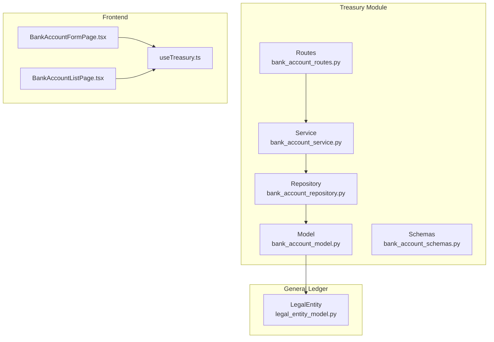
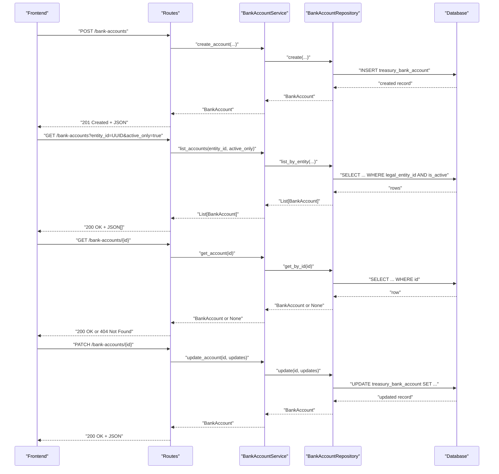
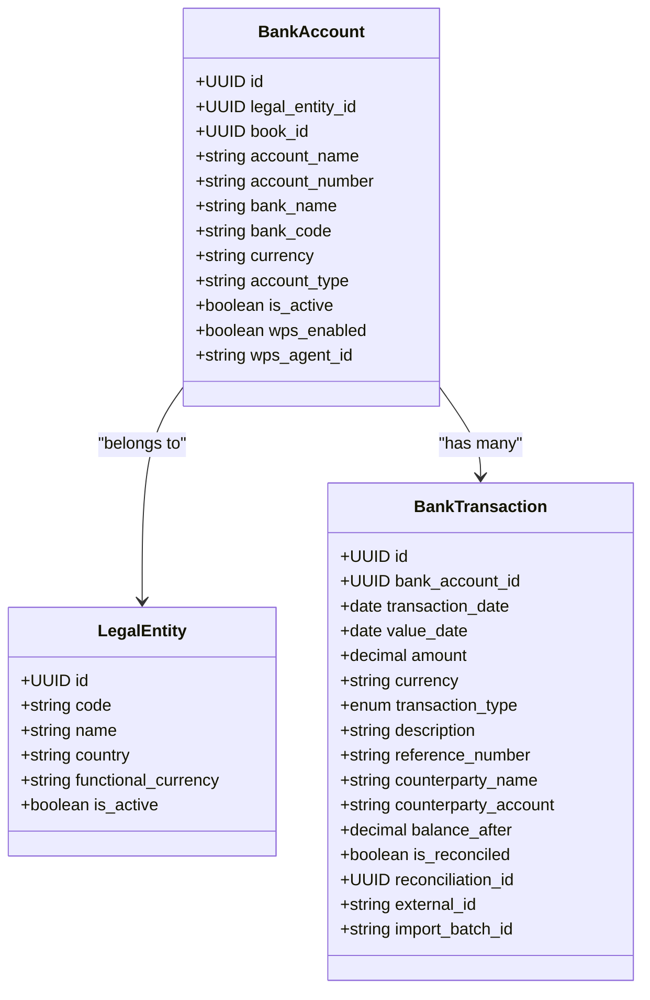
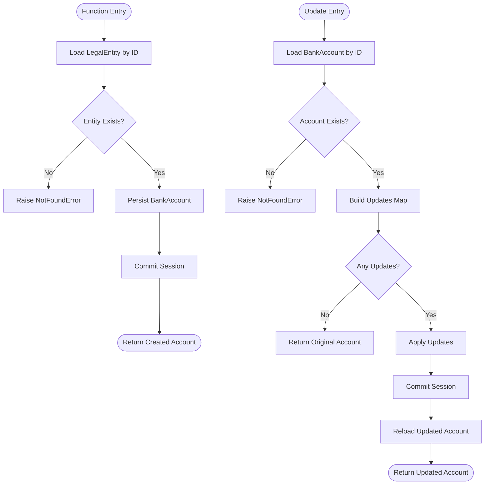
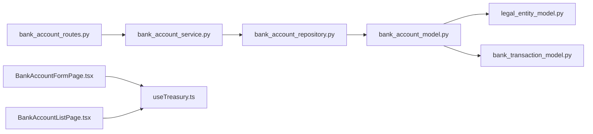

# Bank Account Management

<cite>
**Referenced Files in This Document**
- [bank_account_model.py](file://app/modules/treasury/models/bank_account_model.py)
- [bank_account_schemas.py](file://app/modules/treasury/schemas/bank_account_schemas.py)
- [bank_account_service.py](file://app/modules/treasury/services/bank_account_service.py)
- [bank_account_routes.py](file://app/modules/treasury/api/routes/bank_account_routes.py)
- [bank_account_repository.py](file://app/modules/treasury/repositories/bank_account_repository.py)
- [legal_entity_model.py](file://app/modules/general_ledger/models/legal_entity_model.py)
- [bank_transaction_model.py](file://app/modules/treasury/models/bank_transaction_model.py)
- [BankAccountFormPage.tsx](file://frontend/components/pages/treasury/BankAccountFormPage.tsx)
- [BankAccountListPage.tsx](file://frontend/components/pages/treasury/BankAccountListPage.tsx)
- [useTreasury.ts](file://frontend/hooks/useTreasury.ts)
</cite>

## Table of Contents
1. [Introduction](#introduction)
2. [Project Structure](#project-structure)
3. [Core Components](#core-components)
4. [Architecture Overview](#architecture-overview)
5. [Detailed Component Analysis](#detailed-component-analysis)
6. [Dependency Analysis](#dependency-analysis)
7. [Performance Considerations](#performance-considerations)
8. [Troubleshooting Guide](#troubleshooting-guide)
9. [Conclusion](#conclusion)
10. [Appendices](#appendices)

## Introduction
This document describes the Bank Account Management functionality, covering creation, listing, retrieval, and update operations. It explains the BankAccountService implementation, including account validation, currency handling, and the integration flag for WPS (UAE payroll system). It also documents the bank account model structure with legal entity associations, account types, and status tracking. API route specifications for POST /bank-accounts, GET /bank-accounts, GET /bank-accounts/{id}, and PATCH /bank-accounts/{id} are included, along with examples of setup workflows, multi-currency configurations, and WPS agent integrations. Activation/deactivation processes and validation rules are addressed.

## Project Structure
The Bank Account Management feature is implemented under the Treasury module and integrates with General Ledger models for legal entity context. The frontend provides forms and lists for managing bank accounts.

**Diagram sources**
- [bank_account_routes.py](file://app/modules/treasury/api/routes/bank_account_routes.py#L1-L88)
- [bank_account_service.py](file://app/modules/treasury/services/bank_account_service.py#L1-L97)
- [bank_account_repository.py](file://app/modules/treasury/repositories/bank_account_repository.py#L1-L40)
- [bank_account_model.py](file://app/modules/treasury/models/bank_account_model.py#L1-L36)
- [legal_entity_model.py](file://app/modules/general_ledger/models/legal_entity_model.py#L1-L22)
- [BankAccountFormPage.tsx](file://frontend/components/pages/treasury/BankAccountFormPage.tsx#L1-L247)
- [BankAccountListPage.tsx](file://frontend/components/pages/treasury/BankAccountListPage.tsx#L1-L151)
- [useTreasury.ts](file://frontend/hooks/useTreasury.ts#L1-L32)

**Section sources**
- [bank_account_routes.py](file://app/modules/treasury/api/routes/bank_account_routes.py#L1-L88)
- [bank_account_service.py](file://app/modules/treasury/services/bank_account_service.py#L1-L97)
- [bank_account_repository.py](file://app/modules/treasury/repositories/bank_account_repository.py#L1-L40)
- [bank_account_model.py](file://app/modules/treasury/models/bank_account_model.py#L1-L36)
- [legal_entity_model.py](file://app/modules/general_ledger/models/legal_entity_model.py#L1-L22)
- [BankAccountFormPage.tsx](file://frontend/components/pages/treasury/BankAccountFormPage.tsx#L1-L247)
- [BankAccountListPage.tsx](file://frontend/components/pages/treasury/BankAccountListPage.tsx#L1-L151)
- [useTreasury.ts](file://frontend/hooks/useTreasury.ts#L1-L32)

## Core Components
- BankAccount model: Defines the persisted attributes for bank accounts, including legal entity association, currency, account type, activity status, and WPS flags.
- BankAccountService: Orchestrates creation, retrieval, listing, and updates with validation and persistence.
- BankAccountRepository: Provides data access methods for listing by entity and currency filtering.
- BankAccount routes: Expose REST endpoints for CRUD operations with proper error handling.
- Pydantic schemas: Define request/response shapes for create, update, and response payloads.
- Frontend pages: Provide forms and lists for user interaction with bank accounts.

**Section sources**
- [bank_account_model.py](file://app/modules/treasury/models/bank_account_model.py#L9-L32)
- [bank_account_service.py](file://app/modules/treasury/services/bank_account_service.py#L11-L97)
- [bank_account_repository.py](file://app/modules/treasury/repositories/bank_account_repository.py#L10-L40)
- [bank_account_routes.py](file://app/modules/treasury/api/routes/bank_account_routes.py#L15-L88)
- [bank_account_schemas.py](file://app/modules/treasury/schemas/bank_account_schemas.py#L7-L46)
- [BankAccountFormPage.tsx](file://frontend/components/pages/treasury/BankAccountFormPage.tsx#L9-L19)
- [BankAccountListPage.tsx](file://frontend/components/pages/treasury/BankAccountListPage.tsx#L9-L151)

## Architecture Overview
The system follows a layered architecture:
- API routes accept requests and delegate to the service layer.
- The service validates inputs, checks entity existence, and persists changes via the repository.
- The repository executes SQLAlchemy queries against the BankAccount table.
- The model defines relationships to LegalEntity and BankTransaction.
- Frontend components integrate with hooks to call backend APIs.

**Diagram sources**
- [bank_account_routes.py](file://app/modules/treasury/api/routes/bank_account_routes.py#L18-L88)
- [bank_account_service.py](file://app/modules/treasury/services/bank_account_service.py#L19-L97)
- [bank_account_repository.py](file://app/modules/treasury/repositories/bank_account_repository.py#L16-L24)

## Detailed Component Analysis

### Bank Account Model
The BankAccount model encapsulates:
- Identity and association: UUID identity, foreign keys to LegalEntity and optional Book.
- Naming and identification: account_name, account_number, bank_name, bank_code.
- Currency and classification: currency (3-letter), account_type.
- Lifecycle and integration: is_active flag, WPS flags (wps_enabled, wps_agent_id).
- Relationships: to LegalEntity, BankTransaction, and ReconciliationSession.

**Diagram sources**
- [bank_account_model.py](file://app/modules/treasury/models/bank_account_model.py#L9-L32)
- [legal_entity_model.py](file://app/modules/general_ledger/models/legal_entity_model.py#L7-L22)
- [bank_transaction_model.py](file://app/modules/treasury/models/bank_transaction_model.py#L21-L52)

**Section sources**
- [bank_account_model.py](file://app/modules/treasury/models/bank_account_model.py#L9-L32)
- [legal_entity_model.py](file://app/modules/general_ledger/models/legal_entity_model.py#L7-L22)
- [bank_transaction_model.py](file://app/modules/treasury/models/bank_transaction_model.py#L21-L52)

### BankAccountService Implementation
Responsibilities:
- Creation: Validates legal entity existence, persists the account, and commits.
- Retrieval: Fetches a single account by ID.
- Listing: Lists accounts for an entity with optional active-only filter.
- Update: Applies selective updates to account_name, is_active, wps_enabled, and wps_agent_id.

Validation and integration highlights:
- Legal entity existence check before creation.
- Currency field is validated by schema; service comments note optional functional currency alignment.
- WPS fields are accepted during creation and updates.

**Diagram sources**
- [bank_account_service.py](file://app/modules/treasury/services/bank_account_service.py#L19-L97)
- [bank_account_repository.py](file://app/modules/treasury/repositories/bank_account_repository.py#L10-L24)

**Section sources**
- [bank_account_service.py](file://app/modules/treasury/services/bank_account_service.py#L11-L97)
- [bank_account_repository.py](file://app/modules/treasury/repositories/bank_account_repository.py#L16-L39)

### API Route Specifications
- POST /bank-accounts
  - Request body: BankAccountCreate schema
  - Response: BankAccountResponse, 201 Created
  - Errors: 404 Not Found (entity missing), 400 Bad Request (validation)
- GET /bank-accounts
  - Query parameters: entity_id (required), active_only (default true)
  - Response: Array of BankAccountResponse
- GET /bank-accounts/{id}
  - Path parameter: account_id (required)
  - Response: BankAccountResponse
  - Errors: 404 Not Found
- PATCH /bank-accounts/{id}
  - Path parameter: account_id (required)
  - Request body: BankAccountUpdate schema
  - Response: BankAccountResponse
  - Errors: 404 Not Found

**Section sources**
- [bank_account_routes.py](file://app/modules/treasury/api/routes/bank_account_routes.py#L18-L88)
- [bank_account_schemas.py](file://app/modules/treasury/schemas/bank_account_schemas.py#L7-L46)

### Frontend Integration
- BankAccountFormPage.tsx
  - Zod schema enforces required fields and enums for account_type.
  - Supports edit and create modes, with controlled defaults and validation feedback.
  - Integrates with useTreasury hooks for create/update mutations.
- BankAccountListPage.tsx
  - Displays accounts with status filtering and action links.
  - Uses virtualized table rendering for performance.

**Section sources**
- [BankAccountFormPage.tsx](file://frontend/components/pages/treasury/BankAccountFormPage.tsx#L9-L19)
- [BankAccountListPage.tsx](file://frontend/components/pages/treasury/BankAccountListPage.tsx#L9-L151)
- [useTreasury.ts](file://frontend/hooks/useTreasury.ts#L18-L32)

## Dependency Analysis
- Routes depend on Service.
- Service depends on Repository and LegalEntityRepository.
- Repository depends on SQLAlchemy ORM and BankAccount model.
- Model depends on LegalEntity and BankTransaction models.
- Frontend depends on hooks that call backend endpoints.

**Diagram sources**
- [bank_account_routes.py](file://app/modules/treasury/api/routes/bank_account_routes.py#L1-L88)
- [bank_account_service.py](file://app/modules/treasury/services/bank_account_service.py#L1-L97)
- [bank_account_repository.py](file://app/modules/treasury/repositories/bank_account_repository.py#L1-L40)
- [bank_account_model.py](file://app/modules/treasury/models/bank_account_model.py#L1-L36)
- [legal_entity_model.py](file://app/modules/general_ledger/models/legal_entity_model.py#L1-L22)
- [bank_transaction_model.py](file://app/modules/treasury/models/bank_transaction_model.py#L1-L52)
- [BankAccountFormPage.tsx](file://frontend/components/pages/treasury/BankAccountFormPage.tsx#L1-L247)
- [BankAccountListPage.tsx](file://frontend/components/pages/treasury/BankAccountListPage.tsx#L1-L151)
- [useTreasury.ts](file://frontend/hooks/useTreasury.ts#L1-L32)

**Section sources**
- [bank_account_routes.py](file://app/modules/treasury/api/routes/bank_account_routes.py#L1-L88)
- [bank_account_service.py](file://app/modules/treasury/services/bank_account_service.py#L1-L97)
- [bank_account_repository.py](file://app/modules/treasury/repositories/bank_account_repository.py#L1-L40)
- [bank_account_model.py](file://app/modules/treasury/models/bank_account_model.py#L1-L36)
- [legal_entity_model.py](file://app/modules/general_ledger/models/legal_entity_model.py#L1-L22)
- [bank_transaction_model.py](file://app/modules/treasury/models/bank_transaction_model.py#L1-L52)
- [BankAccountFormPage.tsx](file://frontend/components/pages/treasury/BankAccountFormPage.tsx#L1-L247)
- [BankAccountListPage.tsx](file://frontend/components/pages/treasury/BankAccountListPage.tsx#L1-L151)
- [useTreasury.ts](file://frontend/hooks/useTreasury.ts#L1-L32)

## Performance Considerations
- Indexing: BankAccount has indices on legal_entity_id and is_active, supporting efficient listing by entity and active status.
- Query ordering: Listing sorts by account_name for consistent presentation.
- Relationship loading: Transactions and reconciliations are loaded via ORM relationships; consider lazy/eager loading strategies in high-volume scenarios.
- Frontend virtualization: BankAccountListPage uses virtualized tables to render large lists efficiently.

[No sources needed since this section provides general guidance]

## Troubleshooting Guide
Common issues and resolutions:
- Not Found errors when creating/updating accounts:
  - Ensure legal_entity_id exists in LegalEntity.
  - Confirm account_id exists for retrieval and updates.
- Validation errors on creation:
  - Verify required fields and schema constraints (lengths, enumerations).
- Multi-currency accounts:
  - Entities can maintain multiple accounts in different currencies; ensure currency values conform to 3-character codes.
- WPS integration:
  - Set wps_enabled and provide wps_agent_id when applicable for UAE payroll systems.

**Section sources**
- [bank_account_service.py](file://app/modules/treasury/services/bank_account_service.py#L32-L35)
- [bank_account_schemas.py](file://app/modules/treasury/schemas/bank_account_schemas.py#L7-L26)
- [bank_account_routes.py](file://app/modules/treasury/api/routes/bank_account_routes.py#L38-L41)
- [bank_account_routes.py](file://app/modules/treasury/api/routes/bank_account_routes.py#L64-L65)
- [bank_account_routes.py](file://app/modules/treasury/api/routes/bank_account_routes.py#L86-L87)

## Conclusion
The Bank Account Management feature provides a robust, layered implementation for creating, listing, retrieving, and updating bank accounts. It supports multi-currency configurations, integrates with legal entity context, and includes WPS flags for regional payroll compliance. The API exposes straightforward endpoints with clear validation and error handling, while the frontend offers intuitive forms and lists for day-to-day operations.

[No sources needed since this section summarizes without analyzing specific files]

## Appendices

### API Endpoint Reference
- POST /bank-accounts
  - Request: BankAccountCreate
  - Response: BankAccountResponse
  - Status: 201 Created
- GET /bank-accounts
  - Query: entity_id (UUID), active_only (boolean, default true)
  - Response: Array of BankAccountResponse
  - Status: 200 OK
- GET /bank-accounts/{id}
  - Path: account_id (UUID)
  - Response: BankAccountResponse
  - Status: 200 OK or 404 Not Found
- PATCH /bank-accounts/{id}
  - Path: account_id (UUID)
  - Request: BankAccountUpdate
  - Response: BankAccountResponse
  - Status: 200 OK or 404 Not Found

**Section sources**
- [bank_account_routes.py](file://app/modules/treasury/api/routes/bank_account_routes.py#L18-L88)
- [bank_account_schemas.py](file://app/modules/treasury/schemas/bank_account_schemas.py#L7-L46)

### Example Workflows

- Bank Account Setup Workflow
  - Step 1: Select legal_entity_id and fill account details (name, bank, number, currency, type).
  - Step 2: Submit POST /bank-accounts; receive 201 with created account.
  - Step 3: Navigate to GET /bank-accounts?entity_id=UUID to list active accounts.
  - Step 4: Use GET /bank-accounts/{id} to view details and PATCH to toggle is_active.

- Multi-Currency Configuration
  - Create multiple accounts under the same legal entity with different currency values (e.g., USD, EUR, AED).
  - Use GET /bank-accounts with active_only to filter by status.

- WPS Agent Integration
  - Set wps_enabled to true and provide wps_agent_id during creation or update.
  - Use PATCH /bank-accounts/{id} to enable/disable WPS and update agent identifiers.

**Section sources**
- [bank_account_routes.py](file://app/modules/treasury/api/routes/bank_account_routes.py#L18-L88)
- [bank_account_schemas.py](file://app/modules/treasury/schemas/bank_account_schemas.py#L7-L26)
- [bank_account_service.py](file://app/modules/treasury/services/bank_account_service.py#L19-L54)
- [bank_account_service.py](file://app/modules/treasury/services/bank_account_service.py#L68-L97)