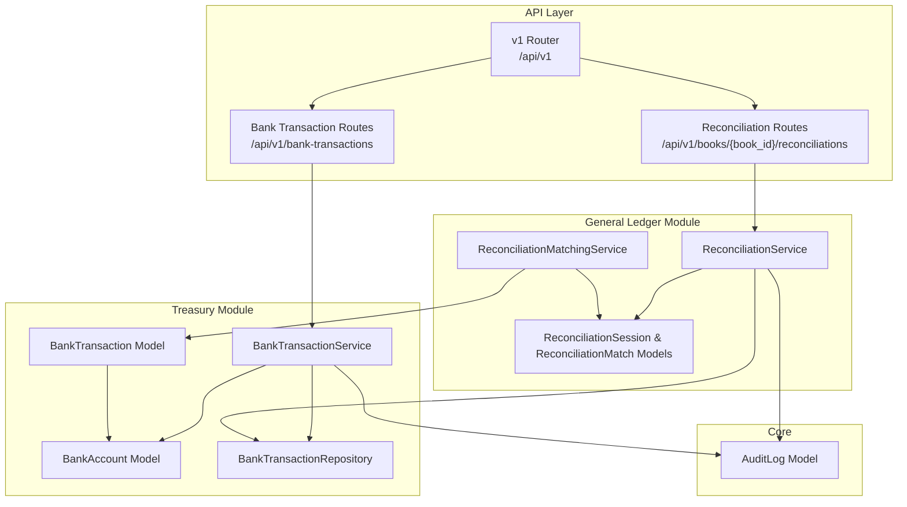
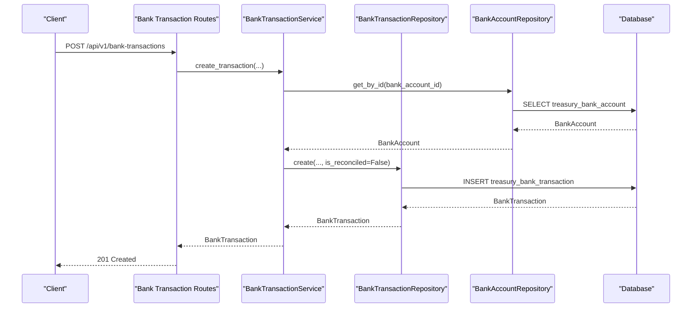
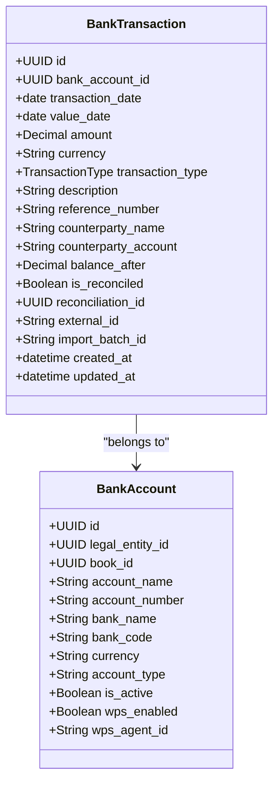
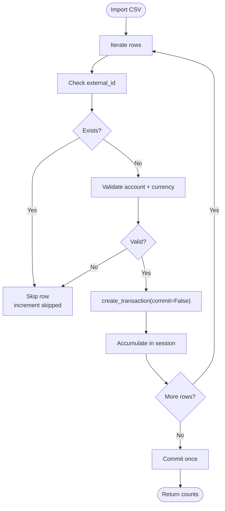
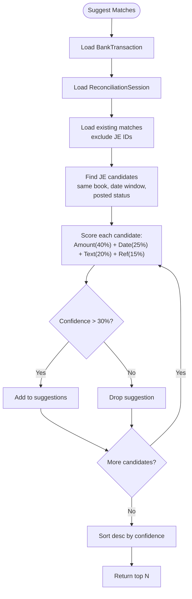
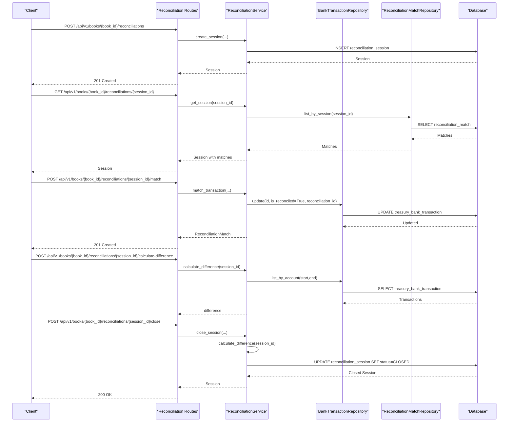
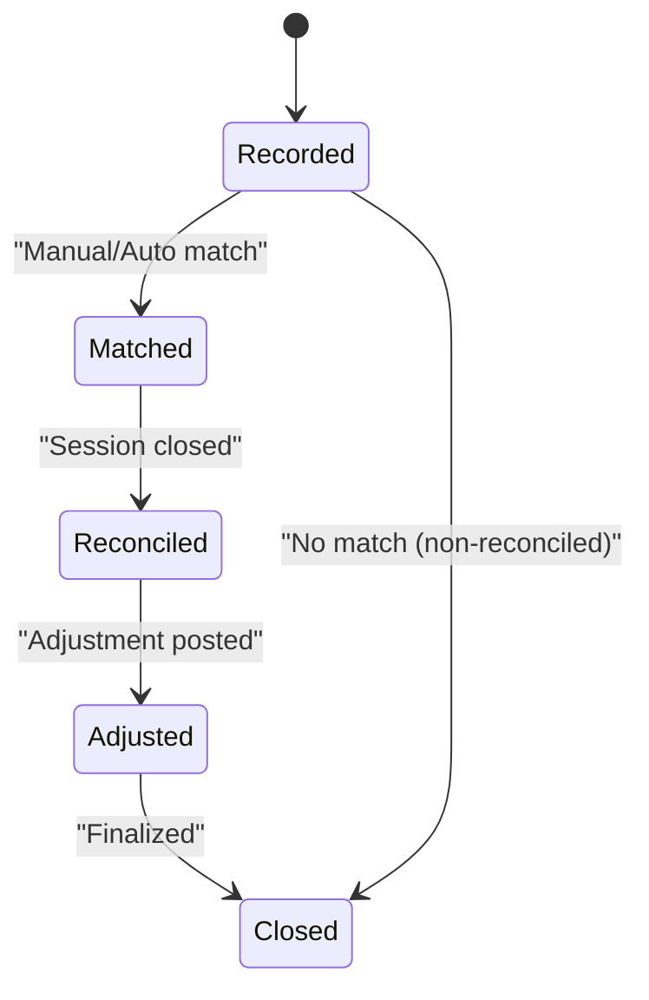
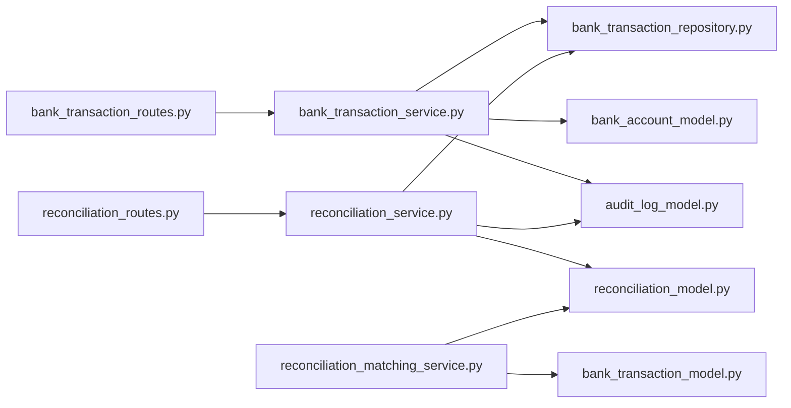

# Bank Transaction Processing

<cite>
**Referenced Files in This Document**
- [bank_transaction_model.py](file://app/modules/treasury/models/bank_transaction_model.py)
- [bank_transaction_service.py](file://app/modules/treasury/services/bank_transaction_service.py)
- [bank_transaction_routes.py](file://app/modules/treasury/api/routes/bank_transaction_routes.py)
- [bank_transaction_schemas.py](file://app/modules/treasury/schemas/bank_transaction_schemas.py)
- [bank_transaction_repository.py](file://app/modules/treasury/repositories/bank_transaction_repository.py)
- [bank_account_model.py](file://app/modules/treasury/models/bank_account_model.py)
- [reconciliation_model.py](file://app/modules/general_ledger/models/reconciliation_model.py)
- [reconciliation_service.py](file://app/modules/general_ledger/services/reconciliation_service.py)
- [reconciliation_routes.py](file://app/modules/general_ledger/api/routes/reconciliation_routes.py)
- [reconciliation_matching_service.py](file://app/modules/general_ledger/services/reconciliation_matching_service.py)
- [audit_log_model.py](file://app/modules/core/models/audit_log_model.py)
- [main.py](file://app/main.py)
- [__init__.py](file://app/api/v1/__init__.py)
</cite>

## Table of Contents
1. [Introduction](#introduction)
2. [Project Structure](#project-structure)
3. [Core Components](#core-components)
4. [Architecture Overview](#architecture-overview)
5. [Detailed Component Analysis](#detailed-component-analysis)
6. [Dependency Analysis](#dependency-analysis)
7. [Performance Considerations](#performance-considerations)
8. [Troubleshooting Guide](#troubleshooting-guide)
9. [Conclusion](#conclusion)
10. [Appendices](#appendices)

## Introduction
This document describes the Bank Transaction Processing system, covering transaction recording, categorization, and reconciliation workflows. It explains the BankTransactionService implementation, including transaction validation, matching algorithms, and status updates. It documents the transaction model structure with bank account associations, transaction types, amounts, and reconciliation states. It also specifies API routes for transaction creation, batch processing, and reconciliation operations, and provides examples of transaction import workflows, automatic matching scenarios, and manual adjustment processes. Finally, it addresses transaction lifecycle management and audit trail requirements.

## Project Structure
The Bank Transaction Processing system spans the Treasury and General Ledger modules:
- Treasury module handles bank accounts and transactions.
- General Ledger module handles reconciliation sessions, matches, and adjustments.
- API routes are organized under v1 and include both modules.

**Diagram sources**
- [__init__.py](file://app/api/v1/__init__.py#L34-L72)
- [main.py](file://app/main.py#L29-L31)
- [bank_transaction_routes.py](file://app/modules/treasury/api/routes/bank_transaction_routes.py#L21-L21)
- [reconciliation_routes.py](file://app/modules/general_ledger/api/routes/reconciliation_routes.py#L37-L37)
- [bank_transaction_service.py](file://app/modules/treasury/services/bank_transaction_service.py#L13-L19)
- [reconciliation_service.py](file://app/modules/general_ledger/services/reconciliation_service.py#L22-L31)
- [bank_transaction_model.py](file://app/modules/treasury/models/bank_transaction_model.py#L21-L42)
- [bank_account_model.py](file://app/modules/treasury/models/bank_account_model.py#L9-L28)
- [reconciliation_model.py](file://app/modules/general_ledger/models/reconciliation_model.py#L18-L39)
- [reconciliation_matching_service.py](file://app/modules/general_ledger/services/reconciliation_matching_service.py#L45-L52)
- [audit_log_model.py](file://app/modules/core/models/audit_log_model.py#L9-L31)

**Section sources**
- [__init__.py](file://app/api/v1/__init__.py#L34-L72)
- [main.py](file://app/main.py#L29-L31)

## Core Components
- BankTransaction model defines transaction attributes, relationships, and indexes.
- BankTransactionService orchestrates transaction creation, CSV import, and listing with cursor pagination.
- BankTransactionRepository provides CRUD and filtering operations.
- ReconciliationService manages reconciliation sessions, matching, difference calculation, and closing.
- ReconciliationMatchingService suggests matches between transactions and journal entries using weighted scoring.
- AuditLog captures mutation events for compliance and traceability.

**Section sources**
- [bank_transaction_model.py](file://app/modules/treasury/models/bank_transaction_model.py#L21-L52)
- [bank_transaction_service.py](file://app/modules/treasury/services/bank_transaction_service.py#L13-L171)
- [bank_transaction_repository.py](file://app/modules/treasury/repositories/bank_transaction_repository.py#L11-L97)
- [reconciliation_service.py](file://app/modules/general_ledger/services/reconciliation_service.py#L22-L188)
- [reconciliation_matching_service.py](file://app/modules/general_ledger/services/reconciliation_matching_service.py#L45-L270)
- [audit_log_model.py](file://app/modules/core/models/audit_log_model.py#L9-L43)

## Architecture Overview
The system follows layered architecture:
- API routes define endpoints and orchestrate service calls.
- Services encapsulate business logic and coordinate repositories.
- Repositories handle database operations.
- Models define data structures and relationships.
- Audit logs capture actions for compliance.

**Diagram sources**
- [bank_transaction_routes.py](file://app/modules/treasury/api/routes/bank_transaction_routes.py#L24-L53)
- [bank_transaction_service.py](file://app/modules/treasury/services/bank_transaction_service.py#L21-L78)
- [bank_transaction_repository.py](file://app/modules/treasury/repositories/bank_transaction_repository.py#L11-L16)
- [bank_account_model.py](file://app/modules/treasury/models/bank_account_model.py#L9-L28)

## Detailed Component Analysis

### Bank Transaction Model
The BankTransaction model captures statement-line details and reconciliation metadata:
- Identifiers: bank_account_id, external_id (unique), import_batch_id
- Dates: transaction_date, value_date
- Amounts: amount (positive for deposits, negative for withdrawals), balance_after, currency
- Descriptive fields: description, reference_number, counterparty_name, counterparty_account
- Status: is_reconciled, reconciliation_id
- Indexes optimize lookups by account/date, account/reconciled, and external_id

**Diagram sources**
- [bank_transaction_model.py](file://app/modules/treasury/models/bank_transaction_model.py#L21-L52)
- [bank_account_model.py](file://app/modules/treasury/models/bank_account_model.py#L9-L36)

**Section sources**
- [bank_transaction_model.py](file://app/modules/treasury/models/bank_transaction_model.py#L21-L52)

### BankTransactionService
Responsibilities:
- Validate bank account existence and currency consistency.
- Prevent duplicate external_id entries.
- Create individual transactions and batch import CSV data atomically.
- Provide listing with cursor pagination and filtered account queries.

Key behaviors:
- Atomic batch import commits once at the end.
- Skips invalid rows (validation/duplicate) and continues processing.
- Supports external_id deduplication for idempotent retries.

**Diagram sources**
- [bank_transaction_service.py](file://app/modules/treasury/services/bank_transaction_service.py#L80-L132)

**Section sources**
- [bank_transaction_service.py](file://app/modules/treasury/services/bank_transaction_service.py#L21-L171)

### Reconciliation Matching Algorithms
Automatic matching uses a weighted scoring approach:
- Exact amount match: 40%
- Date proximity: 25% (linear decay within tolerance)
- Description/text similarity: 20% (exact match or similarity threshold)
- Reference number match: 15%

Confidence thresholds and tolerances:
- Amount tolerance defaults to 1%.
- Date tolerance defaults to 7 days.
- Minimum confidence threshold is >30%.

**Diagram sources**
- [reconciliation_matching_service.py](file://app/modules/general_ledger/services/reconciliation_matching_service.py#L54-L150)

**Section sources**
- [reconciliation_matching_service.py](file://app/modules/general_ledger/services/reconciliation_matching_service.py#L45-L270)

### Reconciliation Workflow
End-to-end reconciliation process:
- Create a reconciliation session with period boundaries and statement ending balance.
- Calculate difference between statement balance and book balance (sum of transactions).
- Manually or automatically match transactions to journal entries.
- Close the session when difference is zero (or allowed non-zero).

**Diagram sources**
- [reconciliation_routes.py](file://app/modules/general_ledger/api/routes/reconciliation_routes.py#L40-L197)
- [reconciliation_service.py](file://app/modules/general_ledger/services/reconciliation_service.py#L33-L187)
- [reconciliation_model.py](file://app/modules/general_ledger/models/reconciliation_model.py#L18-L67)
- [bank_transaction_repository.py](file://app/modules/treasury/repositories/bank_transaction_repository.py#L86-L96)

**Section sources**
- [reconciliation_service.py](file://app/modules/general_ledger/services/reconciliation_service.py#L22-L188)
- [reconciliation_routes.py](file://app/modules/general_ledger/api/routes/reconciliation_routes.py#L37-L378)

### API Route Specifications

#### Bank Transaction Endpoints
- POST /api/v1/bank-transactions
  - Purpose: Create a single bank transaction.
  - Request body: BankTransactionCreate schema.
  - Response: BankTransactionResponse.
  - Validation: Account exists, currency matches, external_id uniqueness.
  - Idempotency: Not enforced at endpoint level.

- POST /api/v1/bank-transactions/import
  - Purpose: Import CSV transactions in a batch.
  - Request body: BankTransactionCSVImport (bank_account_id, transactions[], import_batch_id).
  - Response: { created, skipped, total }.
  - Behavior: Atomic batch commit; external_id deduplication; computes file hash for source_key.
  - Idempotency: Enforced via idempotency middleware and endpoint key.

- GET /api/v1/bank-transactions
  - Purpose: Paginate transactions with cursor.
  - Query params: bank_account_id, updated_after, limit, cursor.
  - Response: BankTransactionListResponse.

- GET /api/v1/bank-transactions/{transaction_id}
  - Purpose: Retrieve a transaction by ID.

- GET /api/v1/bank-transactions/accounts/{bank_account_id}/transactions
  - Purpose: Filtered list by account with date range and reconciliation status.
  - Query params: start_date, end_date, is_reconciled, limit, offset.

**Section sources**
- [bank_transaction_routes.py](file://app/modules/treasury/api/routes/bank_transaction_routes.py#L24-L183)
- [bank_transaction_schemas.py](file://app/modules/treasury/schemas/bank_transaction_schemas.py#L9-L62)

#### Reconciliation Endpoints
- POST /api/v1/books/{book_id}/reconciliations
  - Purpose: Create a reconciliation session.
  - Request body: ReconciliationSessionCreate.
  - Response: ReconciliationSessionResponse.

- GET /api/v1/books/{book_id}/reconciliations
  - Purpose: List sessions by bank account and optional status.

- GET /api/v1/books/{book_id}/reconciliations/{session_id}
  - Purpose: Retrieve session with associated matches.

- POST /api/v1/books/{book_id}/reconciliations/{session_id}/match
  - Purpose: Match a bank transaction to a journal entry (manual).
  - Request body: ReconciliationMatchCreate.
  - Response: ReconciliationMatchResponse.

- POST /api/v1/books/{book_id}/reconciliations/{session_id}/calculate-difference
  - Purpose: Compute difference between statement and book balances.

- POST /api/v1/books/{book_id}/reconciliations/{session_id}/close
  - Purpose: Close a reconciliation session.
  - Request body: ReconciliationCloseRequest.
  - Response: ReconciliationSessionResponse.
  - Idempotency: Enforced via idempotency middleware and endpoint key.

- GET /api/v1/books/{book_id}/reconciliations/{session_id}/transactions/{transaction_id}/suggestions
  - Purpose: Get automatic matching suggestions for a transaction.
  - Query params: top_n (default 5, range 1–20).
  - Response: List of MatchSuggestionResponse.

**Section sources**
- [reconciliation_routes.py](file://app/modules/general_ledger/api/routes/reconciliation_routes.py#L40-L378)
- [reconciliation_model.py](file://app/modules/general_ledger/models/reconciliation_model.py#L18-L67)

### Transaction Lifecycle and Audit Trail
Lifecycle stages:
- Recording: Transaction created with is_reconciled=False.
- Matching: Transaction marked as reconciled and linked to a reconciliation session.
- Closing: Reconciliation session closed when difference is zero (or allowed non-zero).
- Adjustment: Optional adjustment batch posting to journal entries.

Audit trail:
- AuditLog captures actor, action, object type/id, timestamps, and JSON diffs.
- Reconciliation close and adjustment posting endpoints apply idempotency and can be traced via correlation IDs.

**Diagram sources**
- [bank_transaction_model.py](file://app/modules/treasury/models/bank_transaction_model.py#L36-L37)
- [reconciliation_model.py](file://app/modules/general_ledger/models/reconciliation_model.py#L27-L30)
- [audit_log_model.py](file://app/modules/core/models/audit_log_model.py#L9-L43)

**Section sources**
- [audit_log_model.py](file://app/modules/core/models/audit_log_model.py#L9-L43)

## Dependency Analysis
- BankTransactionService depends on BankTransactionRepository and BankAccountRepository.
- ReconciliationService depends on ReconciliationSessionRepository, ReconciliationMatchRepository, BankTransactionRepository, and JournalEntryRepository.
- ReconciliationMatchingService depends on BankTransactionRepository, JournalEntryRepository, and ReconciliationMatchRepository.
- API routes depend on services and enforce idempotency for sensitive endpoints.

**Diagram sources**
- [bank_transaction_routes.py](file://app/modules/treasury/api/routes/bank_transaction_routes.py#L12-L19)
- [reconciliation_routes.py](file://app/modules/general_ledger/api/routes/reconciliation_routes.py#L9-L34)
- [bank_transaction_service.py](file://app/modules/treasury/services/bank_transaction_service.py#L7-L19)
- [reconciliation_service.py](file://app/modules/general_ledger/services/reconciliation_service.py#L7-L31)
- [reconciliation_matching_service.py](file://app/modules/general_ledger/services/reconciliation_matching_service.py#L13-L18)

**Section sources**
- [bank_transaction_service.py](file://app/modules/treasury/services/bank_transaction_service.py#L13-L20)
- [reconciliation_service.py](file://app/modules/general_ledger/services/reconciliation_service.py#L22-L31)

## Performance Considerations
- Indexes on BankTransaction:
  - Composite index on (bank_account_id, transaction_date) for efficient period scans.
  - Composite index on (bank_account_id, is_reconciled) for filtering unreconciled transactions.
  - Unique index on external_id for deduplication.
- Cursor pagination avoids OFFSET for scalable listing.
- Atomic batch import minimizes round-trips and ensures consistency.
- Matching algorithm limits candidate search to a date window and posted journal entries.

[No sources needed since this section provides general guidance]

## Troubleshooting Guide
Common issues and resolutions:
- 404 Not Found: Bank account or transaction not found during reconciliation or import.
- 400 Bad Request: Validation errors (currency mismatch, out-of-period transaction, invalid date range).
- 409 Conflict: Duplicate external_id during transaction creation or import.
- Non-zero difference on close: Ensure all relevant transactions are matched or adjust differences via adjustment batches.

Operational tips:
- Use GET /api/v1/bank-transactions with cursor pagination for large datasets.
- Use GET /api/v1/bank-transactions/accounts/{bank_account_id}/transactions with filters to isolate unreconciled items.
- Use GET /api/v1/books/{book_id}/reconciliations/{session_id}/transactions/{transaction_id}/suggestions to discover auto-matches.

**Section sources**
- [bank_transaction_routes.py](file://app/modules/treasury/api/routes/bank_transaction_routes.py#L47-L52)
- [reconciliation_routes.py](file://app/modules/general_ledger/api/routes/reconciliation_routes.py#L113-L116)
- [reconciliation_service.py](file://app/modules/general_ledger/services/reconciliation_service.py#L170-L175)

## Conclusion
The Bank Transaction Processing system provides robust transaction recording, flexible batch import, and comprehensive reconciliation workflows. The BankTransactionService enforces validations and deduplication, while the ReconciliationService and ReconciliationMatchingService automate and assist reconciliation tasks. The API exposes clear endpoints for transaction management and reconciliation, and the audit trail ensures compliance and traceability.

[No sources needed since this section summarizes without analyzing specific files]

## Appendices

### Example Workflows

#### Transaction Import Workflow
- Prepare CSV rows with external_id where available.
- Call POST /api/v1/bank-transactions/import with bank_account_id, transactions[], and import_batch_id.
- The service skips duplicates, validates currencies, and commits once at the end.
- Inspect response counts to confirm created vs. skipped.

**Section sources**
- [bank_transaction_routes.py](file://app/modules/treasury/api/routes/bank_transaction_routes.py#L55-L124)
- [bank_transaction_service.py](file://app/modules/treasury/services/bank_transaction_service.py#L80-L132)

#### Automatic Matching Scenario
- Start a reconciliation session.
- For an unmatched transaction, call GET /api/v1/books/{book_id}/reconciliations/{session_id}/transactions/{transaction_id}/suggestions.
- Review suggested journal entries with confidence scores and reasons.
- Choose the best match and POST /api/v1/books/{book_id}/reconciliations/{session_id}/match.

**Section sources**
- [reconciliation_routes.py](file://app/modules/general_ledger/api/routes/reconciliation_routes.py#L345-L378)
- [reconciliation_matching_service.py](file://app/modules/general_ledger/services/reconciliation_matching_service.py#L54-L150)
- [reconciliation_routes.py](file://app/modules/general_ledger/api/routes/reconciliation_routes.py#L96-L116)

#### Manual Adjustment Process
- After closing a reconciliation session with non-zero difference, create an adjustment batch.
- Submit for approval and approve as required.
- Post the adjustment batch to generate journal entries.

**Section sources**
- [reconciliation_routes.py](file://app/modules/general_ledger/api/routes/reconciliation_routes.py#L200-L342)