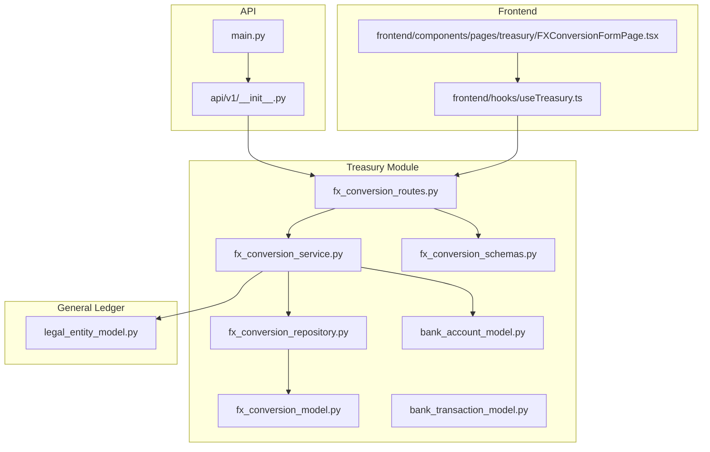
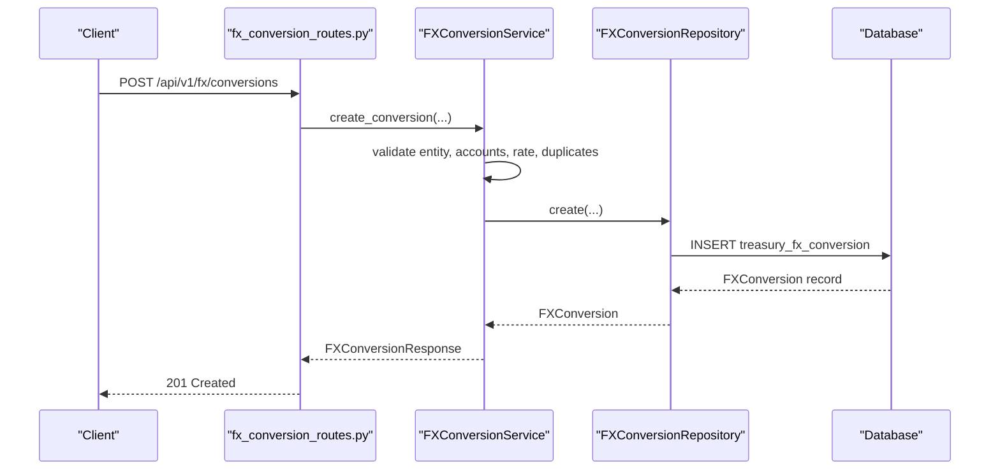
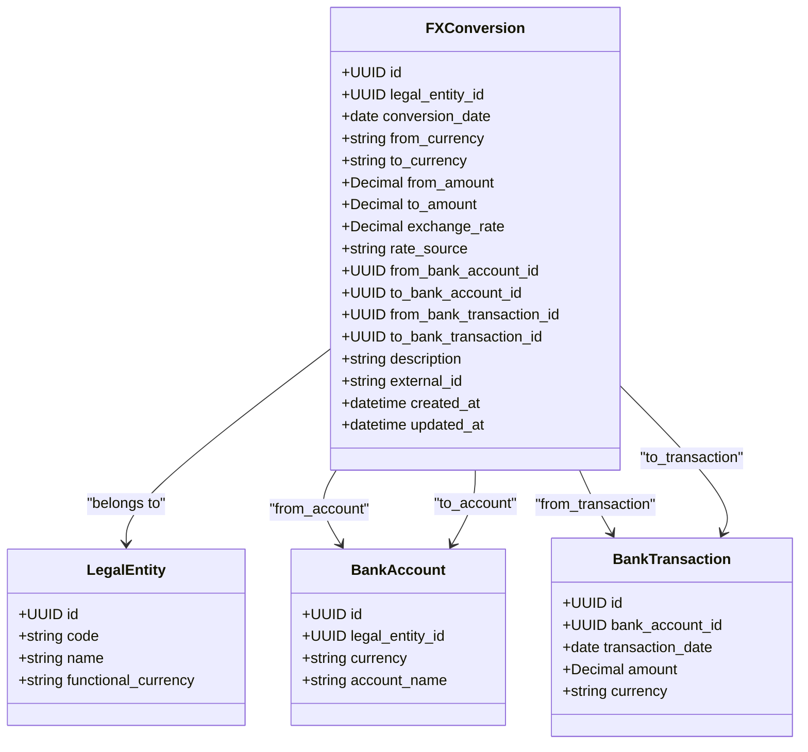
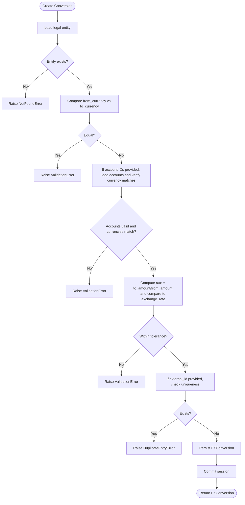
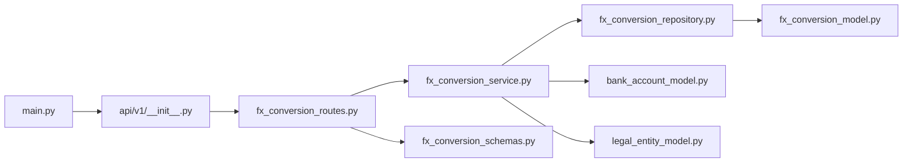

# Foreign Exchange System

<cite>
**Referenced Files in This Document**
- [app/modules/treasury/models/fx_conversion_model.py](file://app/modules/treasury/models/fx_conversion_model.py)
- [app/modules/treasury/services/fx_conversion_service.py](file://app/modules/treasury/services/fx_conversion_service.py)
- [app/modules/treasury/repositories/fx_conversion_repository.py](file://app/modules/treasury/repositories/fx_conversion_repository.py)
- [app/modules/treasury/api/routes/fx_conversion_routes.py](file://app/modules/treasury/api/routes/fx_conversion_routes.py)
- [app/modules/treasury/schemas/fx_conversion_schemas.py](file://app/modules/treasury/schemas/fx_conversion_schemas.py)
- [app/modules/treasury/models/bank_account_model.py](file://app/modules/treasury/models/bank_account_model.py)
- [app/modules/treasury/models/bank_transaction_model.py](file://app/modules/treasury/models/bank_transaction_model.py)
- [app/modules/general_ledger/models/legal_entity_model.py](file://app/modules/general_ledger/models/legal_entity_model.py)
- [app/api/v1/__init__.py](file://app/api/v1/__init__.py)
- [app/main.py](file://app/main.py)
- [frontend/hooks/useTreasury.ts](file://frontend/hooks/useTreasury.ts)
- [frontend/components/pages/treasury/FXConversionFormPage.tsx](file://frontend/components/pages/treasury/FXConversionFormPage.tsx)
</cite>

## Table of Contents
1. [Introduction](#introduction)
2. [Project Structure](#project-structure)
3. [Core Components](#core-components)
4. [Architecture Overview](#architecture-overview)
5. [Detailed Component Analysis](#detailed-component-analysis)
6. [Dependency Analysis](#dependency-analysis)
7. [Performance Considerations](#performance-considerations)
8. [Troubleshooting Guide](#troubleshooting-guide)
9. [Conclusion](#conclusion)
10. [Appendices](#appendices)

## Introduction
This document describes the Foreign Exchange System implemented in the Treasury module. It covers currency conversion processing, exchange rate management, and FX transaction recording. It explains the FXConversionService implementation, including rate sourcing, conversion calculations, and validation logic. It documents the FX conversion model structure with currency pairs, exchange rates, conversion amounts, and transaction references. It also specifies API routes for creating FX conversions, listing conversions, and retrieving individual conversions. Finally, it provides examples of currency conversion workflows, rate update procedures, multi-currency transaction processing, FX rate provider integrations, and compliance reporting considerations.

## Project Structure
The Foreign Exchange System is organized by domain into the Treasury module with clear separation of concerns:
- Models define the persistent entities and relationships (FX conversion, bank accounts, bank transactions, legal entities).
- Services encapsulate business logic for creating and querying FX conversions.
- Repositories handle data access and persistence.
- Schemas define request/response validation and serialization.
- API routes expose endpoints under the Treasury module.
- Frontend integrates with the backend via hooks and pages.

**Diagram sources**
- [app/modules/treasury/models/fx_conversion_model.py](file://app/modules/treasury/models/fx_conversion_model.py#L1-L41)
- [app/modules/treasury/services/fx_conversion_service.py](file://app/modules/treasury/services/fx_conversion_service.py#L1-L112)
- [app/modules/treasury/repositories/fx_conversion_repository.py](file://app/modules/treasury/repositories/fx_conversion_repository.py#L1-L45)
- [app/modules/treasury/schemas/fx_conversion_schemas.py](file://app/modules/treasury/schemas/fx_conversion_schemas.py#L1-L44)
- [app/modules/treasury/api/routes/fx_conversion_routes.py](file://app/modules/treasury/api/routes/fx_conversion_routes.py#L1-L81)
- [app/modules/treasury/models/bank_account_model.py](file://app/modules/treasury/models/bank_account_model.py#L1-L36)
- [app/modules/treasury/models/bank_transaction_model.py](file://app/modules/treasury/models/bank_transaction_model.py#L1-L52)
- [app/modules/general_ledger/models/legal_entity_model.py](file://app/modules/general_ledger/models/legal_entity_model.py#L1-L22)
- [app/api/v1/__init__.py](file://app/api/v1/__init__.py#L1-L72)
- [app/main.py](file://app/main.py#L1-L54)
- [frontend/hooks/useTreasury.ts](file://frontend/hooks/useTreasury.ts#L239-L272)
- [frontend/components/pages/treasury/FXConversionFormPage.tsx](file://frontend/components/pages/treasury/FXConversionFormPage.tsx#L1-L10)

**Section sources**
- [app/modules/treasury/models/fx_conversion_model.py](file://app/modules/treasury/models/fx_conversion_model.py#L1-L41)
- [app/modules/treasury/services/fx_conversion_service.py](file://app/modules/treasury/services/fx_conversion_service.py#L1-L112)
- [app/modules/treasury/repositories/fx_conversion_repository.py](file://app/modules/treasury/repositories/fx_conversion_repository.py#L1-L45)
- [app/modules/treasury/api/routes/fx_conversion_routes.py](file://app/modules/treasury/api/routes/fx_conversion_routes.py#L1-L81)
- [app/modules/treasury/schemas/fx_conversion_schemas.py](file://app/modules/treasury/schemas/fx_conversion_schemas.py#L1-L44)
- [app/modules/treasury/models/bank_account_model.py](file://app/modules/treasury/models/bank_account_model.py#L1-L36)
- [app/modules/treasury/models/bank_transaction_model.py](file://app/modules/treasury/models/bank_transaction_model.py#L1-L52)
- [app/modules/general_ledger/models/legal_entity_model.py](file://app/modules/general_ledger/models/legal_entity_model.py#L1-L22)
- [app/api/v1/__init__.py](file://app/api/v1/__init__.py#L1-L72)
- [app/main.py](file://app/main.py#L1-L54)
- [frontend/hooks/useTreasury.ts](file://frontend/hooks/useTreasury.ts#L239-L272)
- [frontend/components/pages/treasury/FXConversionFormPage.tsx](file://frontend/components/pages/treasury/FXConversionFormPage.tsx#L1-L10)

## Core Components
- FXConversion model: Defines persisted FX conversion records with currency pair, amounts, exchange rate, rate source, and optional links to bank accounts and transactions.
- FXConversionService: Implements business logic for creating conversions, validating inputs, and ensuring data integrity.
- FXConversionRepository: Provides data access methods for conversions, including lookup by external ID and listing by legal entity and date range.
- FXConversion schemas: Define request validation (creation) and response serialization.
- API routes: Expose endpoints for creating, listing, and retrieving FX conversions.
- Supporting models: BankAccount and BankTransaction provide contextual linkage for source/destination accounts and transactions; LegalEntity provides organizational context.

**Section sources**
- [app/modules/treasury/models/fx_conversion_model.py](file://app/modules/treasury/models/fx_conversion_model.py#L9-L37)
- [app/modules/treasury/services/fx_conversion_service.py](file://app/modules/treasury/services/fx_conversion_service.py#L14-L112)
- [app/modules/treasury/repositories/fx_conversion_repository.py](file://app/modules/treasury/repositories/fx_conversion_repository.py#L11-L45)
- [app/modules/treasury/schemas/fx_conversion_schemas.py](file://app/modules/treasury/schemas/fx_conversion_schemas.py#L8-L44)
- [app/modules/treasury/api/routes/fx_conversion_routes.py](file://app/modules/treasury/api/routes/fx_conversion_routes.py#L15-L81)
- [app/modules/treasury/models/bank_account_model.py](file://app/modules/treasury/models/bank_account_model.py#L9-L32)
- [app/modules/treasury/models/bank_transaction_model.py](file://app/modules/treasury/models/bank_transaction_model.py#L21-L48)
- [app/modules/general_ledger/models/legal_entity_model.py](file://app/modules/general_ledger/models/legal_entity_model.py#L7-L21)

## Architecture Overview
The system follows a layered architecture:
- Presentation: FastAPI routes under the Treasury module.
- Application: Services orchestrate business rules and coordinate repositories.
- Persistence: SQLAlchemy ORM models mapped to database tables.
- Validation: Pydantic schemas enforce request/response contracts.

**Diagram sources**
- [app/modules/treasury/api/routes/fx_conversion_routes.py](file://app/modules/treasury/api/routes/fx_conversion_routes.py#L18-L46)
- [app/modules/treasury/services/fx_conversion_service.py](file://app/modules/treasury/services/fx_conversion_service.py#L23-L90)
- [app/modules/treasury/repositories/fx_conversion_repository.py](file://app/modules/treasury/repositories/fx_conversion_repository.py#L11-L22)
- [app/api/v1/__init__.py](file://app/api/v1/__init__.py#L47-L48)
- [app/main.py](file://app/main.py#L30)

## Detailed Component Analysis

### FX Conversion Model
The FXConversion model captures realized exchange transactions with:
- Identity and metadata: legal_entity_id, conversion_date, external_id.
- Currency pair and amounts: from_currency, to_currency, from_amount, to_amount.
- Exchange rate and provenance: exchange_rate, rate_source.
- Optional associations: from_bank_account_id, to_bank_account_id, from_bank_transaction_id, to_bank_transaction_id.
- Relationships: to LegalEntity, BankAccount (for source/destination), BankTransaction (optional linkage).

**Diagram sources**
- [app/modules/treasury/models/fx_conversion_model.py](file://app/modules/treasury/models/fx_conversion_model.py#L9-L37)
- [app/modules/treasury/models/bank_account_model.py](file://app/modules/treasury/models/bank_account_model.py#L9-L28)
- [app/modules/treasury/models/bank_transaction_model.py](file://app/modules/treasury/models/bank_transaction_model.py#L21-L42)
- [app/modules/general_ledger/models/legal_entity_model.py](file://app/modules/general_ledger/models/legal_entity_model.py#L7-L18)

**Section sources**
- [app/modules/treasury/models/fx_conversion_model.py](file://app/modules/treasury/models/fx_conversion_model.py#L9-L37)

### FX Conversion Service
Responsibilities:
- Validate legal entity existence.
- Enforce currency pair constraints (from_currency must differ from to_currency).
- Validate bank account currency matching when accounts are supplied.
- Verify exchange rate consistency against computed rate (to_amount / from_amount).
- Prevent duplicate entries by external_id.
- Persist the conversion and commit the transaction.

**Diagram sources**
- [app/modules/treasury/services/fx_conversion_service.py](file://app/modules/treasury/services/fx_conversion_service.py#L23-L90)

**Section sources**
- [app/modules/treasury/services/fx_conversion_service.py](file://app/modules/treasury/services/fx_conversion_service.py#L14-L112)

### FX Conversion Repository
Capabilities:
- Retrieve conversion by external_id for de-duplication checks.
- List conversions for a legal entity with optional date filtering, pagination, and ordering by conversion_date descending.

**Section sources**
- [app/modules/treasury/repositories/fx_conversion_repository.py](file://app/modules/treasury/repositories/fx_conversion_repository.py#L11-L45)

### FX Conversion Schemas
- FXConversionCreate: Validates and enforces field constraints for creation (currency codes length, positive amounts/rates, required rate_source).
- FXConversionResponse: Serializes conversion records including metadata timestamps.

**Section sources**
- [app/modules/treasury/schemas/fx_conversion_schemas.py](file://app/modules/treasury/schemas/fx_conversion_schemas.py#L8-L44)

### API Routes for FX Conversions
Endpoints:
- POST /api/v1/fx/conversions: Create an FX conversion with validation and persistence.
- GET /api/v1/fx/conversions: List conversions for a legal entity with optional date range and pagination.
- GET /api/v1/fx/conversions/{conversion_id}: Retrieve a single conversion by ID.

Error handling:
- NotFoundError → 404 Not Found
- ValidationError → 400 Bad Request
- DuplicateEntryError → 409 Conflict

**Section sources**
- [app/modules/treasury/api/routes/fx_conversion_routes.py](file://app/modules/treasury/api/routes/fx_conversion_routes.py#L15-L81)
- [app/api/v1/__init__.py](file://app/api/v1/__init__.py#L47-L48)
- [app/main.py](file://app/main.py#L30)

### Frontend Integration
- useCreateFXConversion: Mutation hook to submit conversions with optimistic updates and cache invalidation.
- useFXConversions and useFXConversion: Queries to list and fetch conversions.
- FXConversionFormPage: Placeholder page for the FX conversion form.

**Section sources**
- [frontend/hooks/useTreasury.ts](file://frontend/hooks/useTreasury.ts#L239-L272)
- [frontend/components/pages/treasury/FXConversionFormPage.tsx](file://frontend/components/pages/treasury/FXConversionFormPage.tsx#L1-L10)

## Dependency Analysis
The Treasury FX module depends on:
- General Ledger models for legal entity context.
- Treasury models for bank accounts and transactions to enrich conversions.
- FastAPI routing and schema validation for API exposure.

**Diagram sources**
- [app/modules/treasury/api/routes/fx_conversion_routes.py](file://app/modules/treasury/api/routes/fx_conversion_routes.py#L1-L81)
- [app/modules/treasury/services/fx_conversion_service.py](file://app/modules/treasury/services/fx_conversion_service.py#L1-L112)
- [app/modules/treasury/repositories/fx_conversion_repository.py](file://app/modules/treasury/repositories/fx_conversion_repository.py#L1-L45)
- [app/modules/treasury/models/fx_conversion_model.py](file://app/modules/treasury/models/fx_conversion_model.py#L1-L41)
- [app/modules/treasury/models/bank_account_model.py](file://app/modules/treasury/models/bank_account_model.py#L1-L36)
- [app/modules/general_ledger/models/legal_entity_model.py](file://app/modules/general_ledger/models/legal_entity_model.py#L1-L22)
- [app/api/v1/__init__.py](file://app/api/v1/__init__.py#L1-L72)
- [app/main.py](file://app/main.py#L1-L54)

**Section sources**
- [app/modules/treasury/api/routes/fx_conversion_routes.py](file://app/modules/treasury/api/routes/fx_conversion_routes.py#L1-L81)
- [app/modules/treasury/services/fx_conversion_service.py](file://app/modules/treasury/services/fx_conversion_service.py#L1-L112)
- [app/modules/treasury/repositories/fx_conversion_repository.py](file://app/modules/treasury/repositories/fx_conversion_repository.py#L1-L45)
- [app/modules/treasury/models/fx_conversion_model.py](file://app/modules/treasury/models/fx_conversion_model.py#L1-L41)
- [app/modules/treasury/models/bank_account_model.py](file://app/modules/treasury/models/bank_account_model.py#L1-L36)
- [app/modules/general_ledger/models/legal_entity_model.py](file://app/modules/general_ledger/models/legal_entity_model.py#L1-L22)
- [app/api/v1/__init__.py](file://app/api/v1/__init__.py#L1-L72)
- [app/main.py](file://app/main.py#L1-L54)

## Performance Considerations
- Indexing: Conversion date and legal_entity_id are indexed on the FX conversion table to optimize listing queries.
- Pagination: Listing endpoints support limit and offset to control payload size.
- Decimal precision: Numeric fields are configured to support required precision for currency and rate storage.
- Asynchronous sessions: Repository and service operations use async SQLAlchemy to minimize latency.

[No sources needed since this section provides general guidance]

## Troubleshooting Guide
Common issues and resolutions:
- Entity not found: Ensure legal_entity_id exists before creating conversions.
- Currency mismatch: When specifying bank accounts, their currency must match the conversion’s from/to currencies.
- Exchange rate mismatch: The provided exchange_rate must align with to_amount/from_amount within a small tolerance.
- Duplicate external_id: If external_id is provided, it must be unique; otherwise, a duplicate entry error is raised.
- Not found retrieval: Attempting to fetch a non-existent conversion ID returns a 404.

**Section sources**
- [app/modules/treasury/services/fx_conversion_service.py](file://app/modules/treasury/services/fx_conversion_service.py#L39-L72)
- [app/modules/treasury/api/routes/fx_conversion_routes.py](file://app/modules/treasury/api/routes/fx_conversion_routes.py#L41-L46)
- [app/modules/treasury/api/routes/fx_conversion_routes.py](file://app/modules/treasury/api/routes/fx_conversion_routes.py#L77-L79)

## Conclusion
The Foreign Exchange System provides a robust, validated pipeline for recording realized FX conversions. It enforces business rules at the service layer, persists data through repositories, and exposes clean APIs for creation, listing, and retrieval. The model supports optional linkage to bank accounts and transactions, enabling traceability and reconciliation. The frontend hooks integrate seamlessly with the backend to support optimistic UI updates and efficient data fetching.

[No sources needed since this section summarizes without analyzing specific files]

## Appendices

### API Route Specifications
- Create FX Conversion
  - Method: POST
  - Path: /api/v1/fx/conversions
  - Request body: FXConversionCreate
  - Response: FXConversionResponse
  - Status codes: 201 Created, 400 Bad Request, 404 Not Found, 409 Conflict

- List FX Conversions
  - Method: GET
  - Path: /api/v1/fx/conversions
  - Query parameters:
    - entity_id (required): UUID of the legal entity
    - start_date (optional): date
    - end_date (optional): date
    - limit (optional): integer, default 100, min 1, max 1000
    - offset (optional): integer, default 0
  - Response: array of FXConversionResponse

- Get FX Conversion by ID
  - Method: GET
  - Path: /api/v1/fx/conversions/{conversion_id}
  - Path parameter: conversion_id (UUID)
  - Response: FXConversionResponse
  - Status codes: 200 OK, 404 Not Found

**Section sources**
- [app/modules/treasury/api/routes/fx_conversion_routes.py](file://app/modules/treasury/api/routes/fx_conversion_routes.py#L18-L81)
- [app/api/v1/__init__.py](file://app/api/v1/__init__.py#L47-L48)

### Example Workflows

- Currency Conversion Workflow
  - Prepare conversion payload with legal_entity_id, conversion_date, currency pair, amounts, exchange_rate, and rate_source.
  - Optionally include from_bank_account_id and to_bank_account_id if linking to bank accounts.
  - Submit POST /api/v1/fx/conversions.
  - On success, retrieve the created conversion via GET /api/v1/fx/conversions/{id}.

- Rate Update Procedure
  - To correct a previously recorded conversion, re-post the corrected values while maintaining the same external_id to leverage duplicate detection.
  - Alternatively, create a reversal entry and a new conversion if the system requires audit trails.

- Multi-Currency Transaction Processing
  - Record each realized conversion separately with appropriate from/to currency pair and amounts.
  - Link to source/destination bank accounts and transactions where applicable for reconciliation.

- FX Rate Provider Integrations
  - Populate rate_source with provider identifiers (e.g., api) and store provider-specific metadata externally if needed.
  - Validate incoming rates against computed rates before persisting.

- Compliance Reporting Requirements
  - Use external_id to reconcile with external systems and maintain audit trails.
  - Filter conversions by legal_entity_id and date range for reporting.
  - Include rate_source to indicate whether rates were sourced from APIs, manual entries, or bank feeds.

**Section sources**
- [app/modules/treasury/schemas/fx_conversion_schemas.py](file://app/modules/treasury/schemas/fx_conversion_schemas.py#L8-L21)
- [app/modules/treasury/services/fx_conversion_service.py](file://app/modules/treasury/services/fx_conversion_service.py#L63-L72)
- [app/modules/treasury/api/routes/fx_conversion_routes.py](file://app/modules/treasury/api/routes/fx_conversion_routes.py#L49-L67)