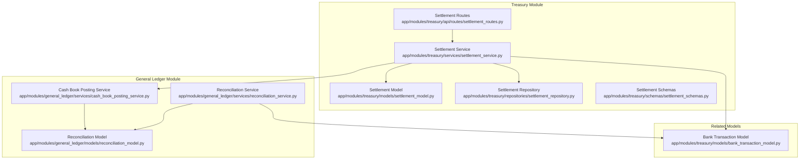
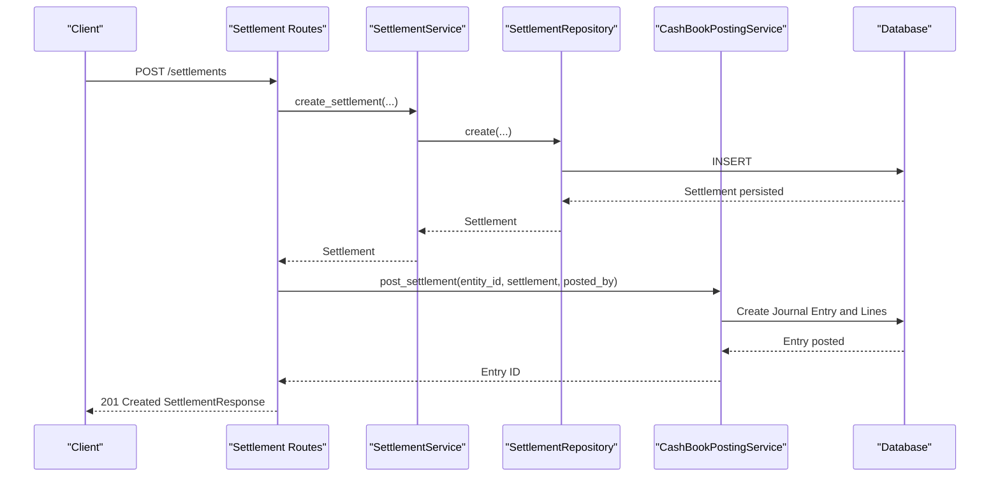
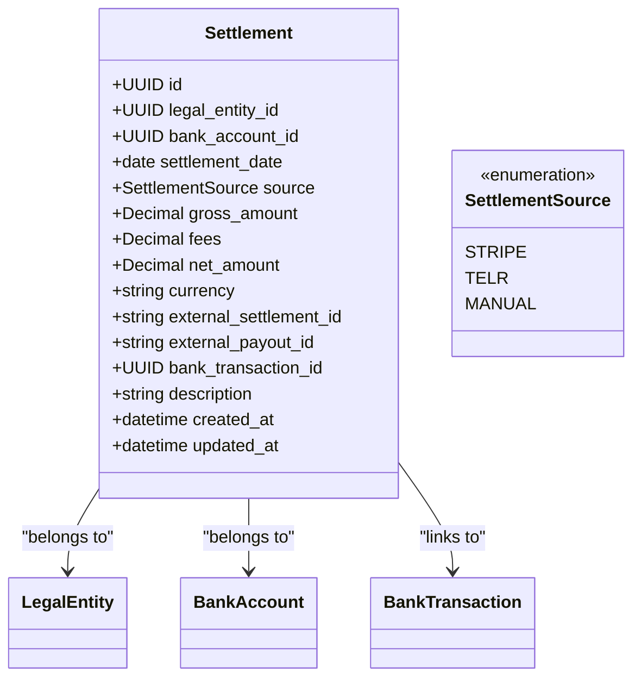
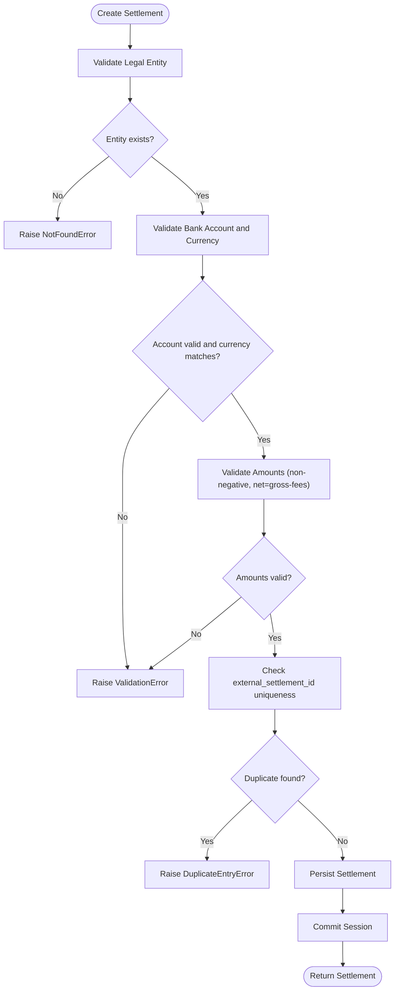
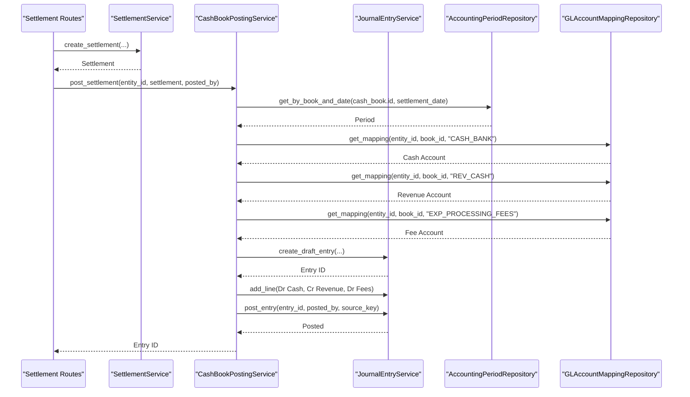
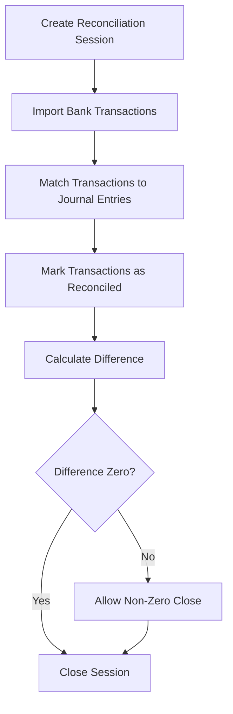
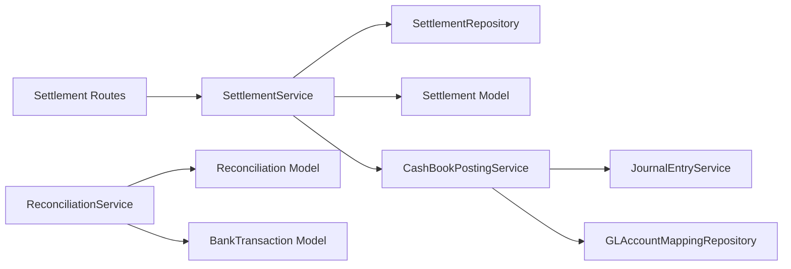

# Settlement System

<cite>
**Referenced Files in This Document**
- [settlement_model.py](file://app/modules/treasury/models/settlement_model.py)
- [settlement_service.py](file://app/modules/treasury/services/settlement_service.py)
- [settlement_routes.py](file://app/modules/treasury/api/routes/settlement_routes.py)
- [settlement_schemas.py](file://app/modules/treasury/schemas/settlement_schemas.py)
- [settlement_repository.py](file://app/modules/treasury/repositories/settlement_repository.py)
- [cash_book_posting_service.py](file://app/modules/general_ledger/services/cash_book_posting_service.py)
- [reconciliation_service.py](file://app/modules/general_ledger/services/reconciliation_service.py)
- [reconciliation_model.py](file://app/modules/general_ledger/models/reconciliation_model.py)
- [bank_transaction_model.py](file://app/modules/treasury/models/bank_transaction_model.py)
- [endpoint_keys.py](file://app/core/endpoint_keys.py)
- [004_fix_settlement_uniqueness.py](file://database/migrations/versions/004_fix_settlement_uniqueness.py)
</cite>

## Table of Contents
1. [Introduction](#introduction)
2. [Project Structure](#project-structure)
3. [Core Components](#core-components)
4. [Architecture Overview](#architecture-overview)
5. [Detailed Component Analysis](#detailed-component-analysis)
6. [Dependency Analysis](#dependency-analysis)
7. [Performance Considerations](#performance-considerations)
8. [Troubleshooting Guide](#troubleshooting-guide)
9. [Conclusion](#conclusion)
10. [Appendices](#appendices)

## Introduction
This document describes the Settlement System within the TrueVow Financial Management platform. It covers settlement processing, cash clearing, and reconciliation workflows. The system supports creation of settlements from external payment gateways (Stripe and TELR) and manual entries, validates data integrity, posts journal entries to the CASH book, and integrates with bank reconciliation.

## Project Structure
The Settlement System spans the Treasury module for persistence and APIs, and the General Ledger module for cash posting and reconciliation.

**Diagram sources**
- [settlement_model.py](file://app/modules/treasury/models/settlement_model.py#L17-L47)
- [settlement_repository.py](file://app/modules/treasury/repositories/settlement_repository.py#L11-L47)
- [settlement_service.py](file://app/modules/treasury/services/settlement_service.py#L14-L123)
- [settlement_routes.py](file://app/modules/treasury/api/routes/settlement_routes.py#L1-L232)
- [settlement_schemas.py](file://app/modules/treasury/schemas/settlement_schemas.py#L9-L57)
- [cash_book_posting_service.py](file://app/modules/general_ledger/services/cash_book_posting_service.py#L251-L331)
- [reconciliation_service.py](file://app/modules/general_ledger/services/reconciliation_service.py#L22-L187)
- [reconciliation_model.py](file://app/modules/general_ledger/models/reconciliation_model.py#L18-L67)
- [bank_transaction_model.py](file://app/modules/treasury/models/bank_transaction_model.py#L21-L51)

**Section sources**
- [settlement_model.py](file://app/modules/treasury/models/settlement_model.py#L1-L48)
- [settlement_service.py](file://app/modules/treasury/services/settlement_service.py#L1-L124)
- [settlement_routes.py](file://app/modules/treasury/api/routes/settlement_routes.py#L1-L232)
- [settlement_schemas.py](file://app/modules/treasury/schemas/settlement_schemas.py#L1-L58)
- [settlement_repository.py](file://app/modules/treasury/repositories/settlement_repository.py#L1-L48)
- [cash_book_posting_service.py](file://app/modules/general_ledger/services/cash_book_posting_service.py#L1-L332)
- [reconciliation_service.py](file://app/modules/general_ledger/services/reconciliation_service.py#L1-L188)
- [reconciliation_model.py](file://app/modules/general_ledger/models/reconciliation_model.py#L1-L68)
- [bank_transaction_model.py](file://app/modules/treasury/models/bank_transaction_model.py#L1-L52)
- [endpoint_keys.py](file://app/core/endpoint_keys.py#L32-L35)
- [004_fix_settlement_uniqueness.py](file://database/migrations/versions/004_fix_settlement_uniqueness.py#L1-L60)

## Core Components
- Settlement Model: Defines settlement records with amounts, fees, currency, and external identifiers.
- Settlement Service: Validates inputs, ensures referential integrity, and persists settlements.
- Settlement Routes: Expose REST endpoints for creating settlements and importing from gateways.
- Settlement Schemas: Pydantic models for request/response validation.
- Settlement Repository: Data access for settlements with filtering and deduplication by external ID.
- Cash Book Posting Service: Posts settlement journal entries to the CASH book and manages idempotency.
- Reconciliation Service: Manages bank reconciliation sessions and matches, enabling cash clearing verification.

**Section sources**
- [settlement_model.py](file://app/modules/treasury/models/settlement_model.py#L17-L47)
- [settlement_service.py](file://app/modules/treasury/services/settlement_service.py#L14-L123)
- [settlement_routes.py](file://app/modules/treasury/api/routes/settlement_routes.py#L22-L231)
- [settlement_schemas.py](file://app/modules/treasury/schemas/settlement_schemas.py#L9-L57)
- [settlement_repository.py](file://app/modules/treasury/repositories/settlement_repository.py#L11-L47)
- [cash_book_posting_service.py](file://app/modules/general_ledger/services/cash_book_posting_service.py#L251-L331)
- [reconciliation_service.py](file://app/modules/general_ledger/services/reconciliation_service.py#L22-L187)

## Architecture Overview
The Settlement System follows a layered architecture:
- API Layer: FastAPI routes handle requests and apply idempotency.
- Service Layer: Business logic validates and orchestrates persistence and posting.
- Persistence Layer: SQLAlchemy models and repositories manage data.
- Integration Layer: General Ledger posting and reconciliation services.

**Diagram sources**
- [settlement_routes.py](file://app/modules/treasury/api/routes/settlement_routes.py#L22-L90)
- [settlement_service.py](file://app/modules/treasury/services/settlement_service.py#L23-L81)
- [settlement_repository.py](file://app/modules/treasury/repositories/settlement_repository.py#L17-L22)
- [cash_book_posting_service.py](file://app/modules/general_ledger/services/cash_book_posting_service.py#L251-L331)

## Detailed Component Analysis

### Settlement Model
The Settlement model captures payment gateway payouts and manual cash receipts. It includes:
- Identifiers: legal entity, bank account, settlement date, source (Stripe, TELR, MANUAL).
- Amounts: gross, fees, net, currency.
- External IDs: external_settlement_id and external_payout_id for deduplication and linking.
- Relationships: links to LegalEntity, BankAccount, and BankTransaction.
- Uniqueness: composite constraint on (source, external_settlement_id) where external_settlement_id is not null.

**Diagram sources**
- [settlement_model.py](file://app/modules/treasury/models/settlement_model.py#L10-L47)

**Section sources**
- [settlement_model.py](file://app/modules/treasury/models/settlement_model.py#L17-L47)
- [004_fix_settlement_uniqueness.py](file://database/migrations/versions/004_fix_settlement_uniqueness.py#L23-L42)

### Settlement Service
Responsibilities:
- Validation: Ensures legal entity and bank account existence, currency consistency, and amount integrity.
- Deduplication: Prevents duplicate external_settlement_id entries.
- Persistence: Creates settlement records.
- Import: Normalizes manual JSON/CSV imports into standardized settlement records.

**Diagram sources**
- [settlement_service.py](file://app/modules/treasury/services/settlement_service.py#L23-L81)

**Section sources**
- [settlement_service.py](file://app/modules/treasury/services/settlement_service.py#L14-L123)

### Settlement Routes
Endpoints:
- POST /settlements: Create a settlement (supports idempotency).
- POST /settlements/stripe/import: Import Stripe settlement (manual JSON).
- POST /settlements/telr/import: Import TELR settlement (manual JSON).
- GET /settlements: List settlements with filters.
- GET /settlements/{settlement_id}: Retrieve a settlement.

Idempotency:
- Uses endpoint keys for idempotency: SETTLEMENT_CREATE, SETTLEMENT_STRIPE_IMPORT, SETTLEMENT_TELR_IMPORT.
- Applies idempotency wrapper around handlers to ensure idempotent processing.

**Section sources**
- [settlement_routes.py](file://app/modules/treasury/api/routes/settlement_routes.py#L22-L231)
- [endpoint_keys.py](file://app/core/endpoint_keys.py#L32-L35)

### Cash Clearing and Journal Posting
The CashBookPostingService posts settlement entries to the CASH book:
- Determines the CASH book and accounting period for the settlement date.
- Retrieves GL account mappings for cash, revenue, and processing fees.
- Creates a draft journal entry with:
  - Debit: Bank Cash (net amount)
  - Credit: Revenue (gross amount)
  - Debit: Processing Fees Expense (fees, if any)
- Posts the entry with idempotency support and generates a source key for reconciliation.

**Diagram sources**
- [cash_book_posting_service.py](file://app/modules/general_ledger/services/cash_book_posting_service.py#L251-L331)

**Section sources**
- [cash_book_posting_service.py](file://app/modules/general_ledger/services/cash_book_posting_service.py#L251-L331)

### Reconciliation Workflow
Settlements integrate with bank reconciliation:
- Bank transactions are imported and marked as reconciled upon matching.
- Reconciliation sessions compare statement balances to book totals.
- Matches link bank transactions to journal entries (including settlement postings).
- Sessions can be closed when differences are zero (or allowed to be non-zero).

**Diagram sources**
- [reconciliation_service.py](file://app/modules/general_ledger/services/reconciliation_service.py#L33-L187)
- [reconciliation_model.py](file://app/modules/general_ledger/models/reconciliation_model.py#L18-L67)
- [bank_transaction_model.py](file://app/modules/treasury/models/bank_transaction_model.py#L21-L51)

**Section sources**
- [reconciliation_service.py](file://app/modules/general_ledger/services/reconciliation_service.py#L22-L187)
- [reconciliation_model.py](file://app/modules/general_ledger/models/reconciliation_model.py#L18-L67)
- [bank_transaction_model.py](file://app/modules/treasury/models/bank_transaction_model.py#L21-L51)

## Dependency Analysis
- Routes depend on SettlementService and idempotency utilities.
- SettlementService depends on repositories and validation logic.
- CashBookPostingService depends on General Ledger services and mappings.
- ReconciliationService depends on Treasury and General Ledger repositories.

**Diagram sources**
- [settlement_routes.py](file://app/modules/treasury/api/routes/settlement_routes.py#L1-L232)
- [settlement_service.py](file://app/modules/treasury/services/settlement_service.py#L1-L124)
- [settlement_repository.py](file://app/modules/treasury/repositories/settlement_repository.py#L1-L48)
- [cash_book_posting_service.py](file://app/modules/general_ledger/services/cash_book_posting_service.py#L1-L332)
- [reconciliation_service.py](file://app/modules/general_ledger/services/reconciliation_service.py#L1-L188)
- [reconciliation_model.py](file://app/modules/general_ledger/models/reconciliation_model.py#L1-L68)
- [bank_transaction_model.py](file://app/modules/treasury/models/bank_transaction_model.py#L1-L52)

**Section sources**
- [settlement_routes.py](file://app/modules/treasury/api/routes/settlement_routes.py#L1-L232)
- [settlement_service.py](file://app/modules/treasury/services/settlement_service.py#L1-L124)
- [cash_book_posting_service.py](file://app/modules/general_ledger/services/cash_book_posting_service.py#L1-L332)
- [reconciliation_service.py](file://app/modules/general_ledger/services/reconciliation_service.py#L1-L188)

## Performance Considerations
- Indexes: Settlement model includes indexes on legal_entity_id, bank_account_id, settlement_date, and external_settlement_id to optimize queries.
- Filtering: Repository supports efficient filtering by entity, date range, and source.
- Idempotency: Endpoint keys and idempotency wrappers prevent duplicate processing overhead.
- Journal posting: Batched posting and minimal repository calls reduce transaction overhead.

[No sources needed since this section provides general guidance]

## Troubleshooting Guide
Common issues and resolutions:
- Not Found Errors: Ensure legal entity and bank account exist and belong to the same legal entity.
- Validation Errors: Verify amounts are non-negative and net equals gross minus fees; currency must match bank account.
- Duplicate Entry Errors: external_settlement_id must be unique per source; for manual entries, external_settlement_id is optional.
- Idempotency Failures: Ensure idempotency_key is provided and consistent for retries.
- Journal Posting Errors: Confirm CASH book exists for the legal entity and the settlement date falls within an open accounting period.

**Section sources**
- [settlement_service.py](file://app/modules/treasury/services/settlement_service.py#L38-L64)
- [settlement_routes.py](file://app/modules/treasury/api/routes/settlement_routes.py#L84-L89)
- [cash_book_posting_service.py](file://app/modules/general_ledger/services/cash_book_posting_service.py#L259-L269)

## Conclusion
The Settlement System provides robust settlement creation, validation, and cash posting capabilities. It integrates seamlessly with the General Ledger for journal entries and with bank reconciliation for cash clearing verification. The system’s idempotent endpoints, strong validation, and clear separation of concerns enable reliable settlement processing across payment gateways and manual entries.

[No sources needed since this section summarizes without analyzing specific files]

## Appendices

### API Route Specifications
- POST /settlements
  - Description: Create a settlement.
  - Body: SettlementCreate schema.
  - Response: SettlementResponse.
  - Idempotency: Enabled via SETTLEMENT_CREATE.
- POST /settlements/stripe/import
  - Description: Import Stripe settlement (manual JSON).
  - Body: SettlementImport schema.
  - Response: SettlementResponse.
  - Idempotency: Enabled via SETTLEMENT_STRIPE_IMPORT.
- POST /settlements/telr/import
  - Description: Import TELR settlement (manual JSON).
  - Body: SettlementImport schema.
  - Response: SettlementResponse.
  - Idempotency: Enabled via SETTLEMENT_TELR_IMPORT.
- GET /settlements
  - Description: List settlements for an entity.
  - Query: entity_id, start_date, end_date, source, limit, offset.
  - Response: Array of SettlementResponse.
- GET /settlements/{settlement_id}
  - Description: Retrieve a settlement by ID.
  - Response: SettlementResponse.

**Section sources**
- [settlement_routes.py](file://app/modules/treasury/api/routes/settlement_routes.py#L22-L231)
- [settlement_schemas.py](file://app/modules/treasury/schemas/settlement_schemas.py#L9-L57)
- [endpoint_keys.py](file://app/core/endpoint_keys.py#L32-L35)

### Settlement Model Fields
- legal_entity_id: UUID, foreign key to legal entity.
- bank_account_id: UUID, foreign key to bank account.
- settlement_date: Date.
- source: SettlementSource (STRIPE, TELR, MANUAL).
- gross_amount: Numeric(15,2).
- fees: Numeric(15,2).
- net_amount: Numeric(15,2).
- currency: String(3).
- external_settlement_id: String(255), unique per source.
- external_payout_id: String(255).
- bank_transaction_id: UUID, optional link to bank transaction.
- description: String(500).

**Section sources**
- [settlement_model.py](file://app/modules/treasury/models/settlement_model.py#L17-L32)

### Settlement Workflows
- Automated clearing (Stripe/TELR): Import via dedicated endpoints; system posts journal entries to CASH book; reconciliation session can match bank transactions to journal entries.
- Manual intervention: Create settlement manually; if external_settlement_id is omitted, system still posts with internal idempotency key; reconciliation proceeds similarly.

**Section sources**
- [settlement_routes.py](file://app/modules/treasury/api/routes/settlement_routes.py#L92-L195)
- [cash_book_posting_service.py](file://app/modules/general_ledger/services/cash_book_posting_service.py#L316-L328)
- [reconciliation_service.py](file://app/modules/general_ledger/services/reconciliation_service.py#L75-L128)

### Reconciliation Reporting
- Create a reconciliation session for a bank account and period.
- Import bank transactions and match them to journal entries (including settlement entries).
- Calculate difference and close the session when balanced.

**Section sources**
- [reconciliation_service.py](file://app/modules/general_ledger/services/reconciliation_service.py#L33-L187)
- [reconciliation_model.py](file://app/modules/general_ledger/models/reconciliation_model.py#L18-L67)