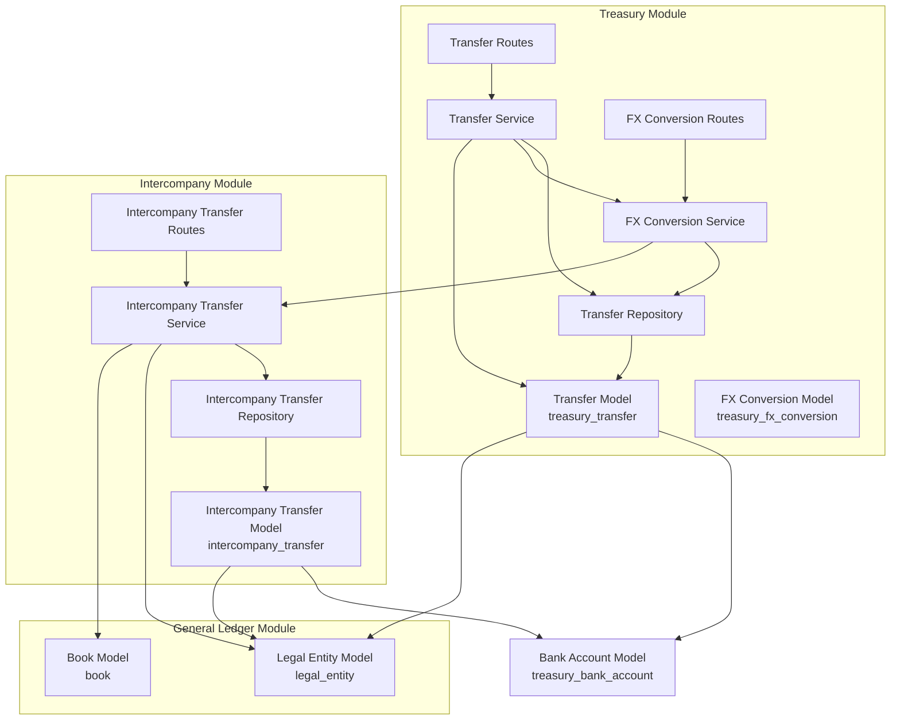
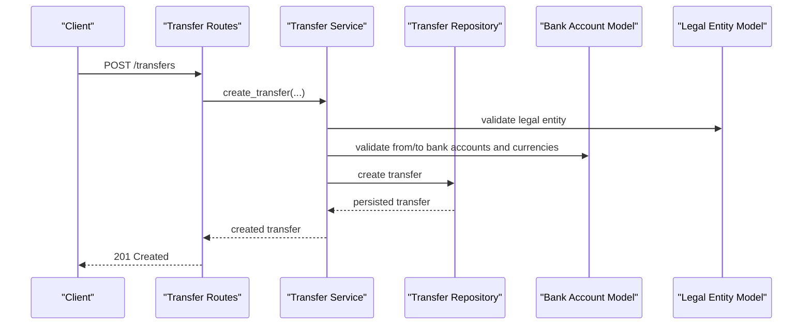
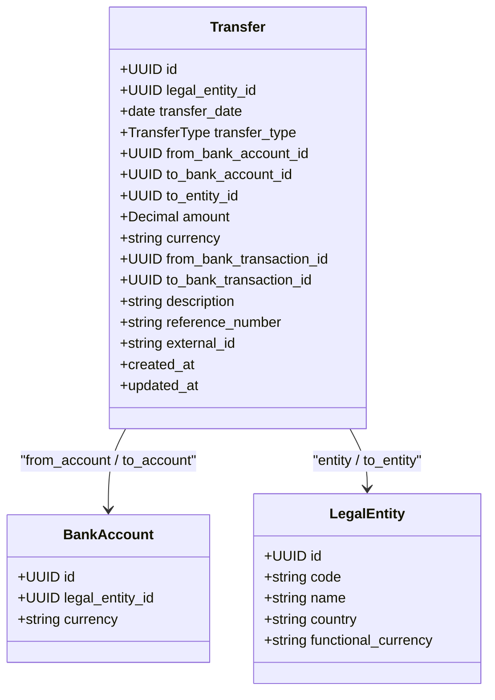
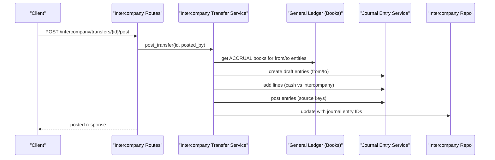
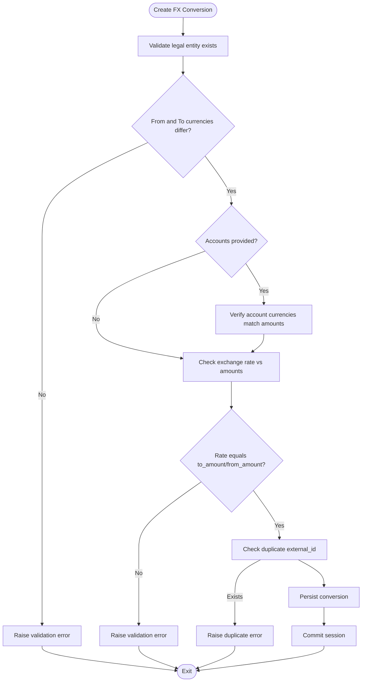
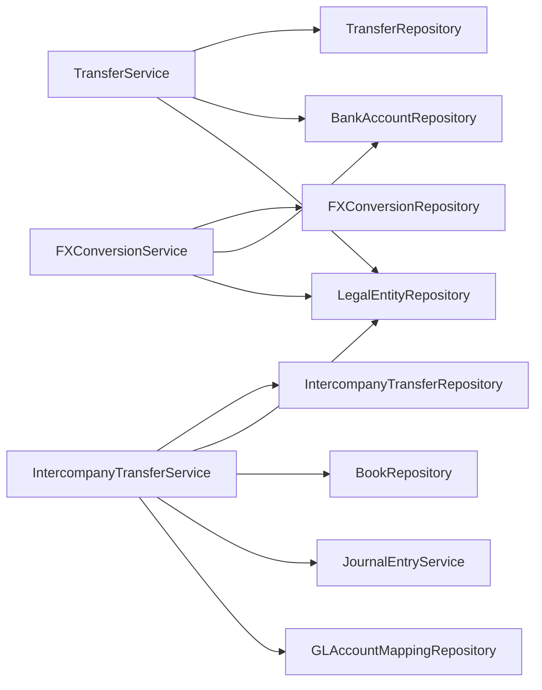

# Transfer System

<cite>
**Referenced Files in This Document**
- [transfer_model.py](file://app/modules/treasury/models/transfer_model.py)
- [transfer_service.py](file://app/modules/treasury/services/transfer_service.py)
- [transfer_routes.py](file://app/modules/treasury/api/routes/transfer_routes.py)
- [transfer_schemas.py](file://app/modules/treasury/schemas/transfer_schemas.py)
- [transfer_repository.py](file://app/modules/treasury/repositories/transfer_repository.py)
- [intercompany_transfer_model.py](file://app/modules/intercompany/models/intercompany_transfer_model.py)
- [intercompany_transfer_service.py](file://app/modules/intercompany/services/intercompany_transfer_service.py)
- [intercompany_transfer_routes.py](file://app/modules/intercompany/api/routes/intercompany_transfer_routes.py)
- [intercompany_schemas.py](file://app/modules/intercompany/schemas/intercompany_schemas.py)
- [intercompany_transfer_repository.py](file://app/modules/intercompany/repositories/intercompany_transfer_repository.py)
- [fx_conversion_model.py](file://app/modules/treasury/models/fx_conversion_model.py)
- [fx_conversion_routes.py](file://app/modules/treasury/api/routes/fx_conversion_routes.py)
- [fx_conversion_service.py](file://app/modules/treasury/services/fx_conversion_service.py)
- [bank_account_model.py](file://app/modules/treasury/models/bank_account_model.py)
- [legal_entity_model.py](file://app/modules/general_ledger/models/legal_entity_model.py)
</cite>

## Table of Contents
1. [Introduction](#introduction)
2. [Project Structure](#project-structure)
3. [Core Components](#core-components)
4. [Architecture Overview](#architecture-overview)
5. [Detailed Component Analysis](#detailed-component-analysis)
6. [Dependency Analysis](#dependency-analysis)
7. [Performance Considerations](#performance-considerations)
8. [Troubleshooting Guide](#troubleshooting-guide)
9. [Conclusion](#conclusion)
10. [Appendices](#appendices)

## Introduction
This document describes the Transfer System functionality, covering:
- Internal transfers (intra-entity)
- Intercompany transfers between legal entities
- Cross-currency transfer processing via FX conversions
It explains the TransferService implementation, including validation, routing, and posting logic; documents the transfer model structure; and specifies API routes for transfer creation, posting, and retrieval. It also provides examples of initiating transfers, multi-entity transfers, and currency conversion scenarios, along with approval and compliance considerations.

## Project Structure
The Transfer System spans three main modules:
- Treasury: handles internal/intra-entity and external transfers, plus FX conversions
- Intercompany: handles inter-entity transfers and reconciliation
- General Ledger: provides legal entity and book context used by both systems

**Diagram sources**
- [transfer_model.py](file://app/modules/treasury/models/transfer_model.py#L17-L49)
- [transfer_service.py](file://app/modules/treasury/services/transfer_service.py#L14-L113)
- [transfer_routes.py](file://app/modules/treasury/api/routes/transfer_routes.py#L1-L83)
- [fx_conversion_model.py](file://app/modules/treasury/models/fx_conversion_model.py#L9-L41)
- [fx_conversion_routes.py](file://app/modules/treasury/api/routes/fx_conversion_routes.py#L1-L81)
- [fx_conversion_service.py](file://app/modules/treasury/services/fx_conversion_service.py#L14-L112)
- [intercompany_transfer_model.py](file://app/modules/intercompany/models/intercompany_transfer_model.py#L16-L59)
- [intercompany_transfer_service.py](file://app/modules/intercompany/services/intercompany_transfer_service.py#L17-L232)
- [intercompany_transfer_routes.py](file://app/modules/intercompany/api/routes/intercompany_transfer_routes.py#L1-L179)
- [intercompany_transfer_repository.py](file://app/modules/intercompany/repositories/intercompany_transfer_repository.py#L12-L101)
- [transfer_repository.py](file://app/modules/treasury/repositories/transfer_repository.py#L11-L67)
- [bank_account_model.py](file://app/modules/treasury/models/bank_account_model.py#L9-L36)
- [legal_entity_model.py](file://app/modules/general_ledger/models/legal_entity_model.py#L7-L22)

**Section sources**
- [transfer_model.py](file://app/modules/treasury/models/transfer_model.py#L17-L49)
- [intercompany_transfer_model.py](file://app/modules/intercompany/models/intercompany_transfer_model.py#L16-L59)
- [fx_conversion_model.py](file://app/modules/treasury/models/fx_conversion_model.py#L9-L41)
- [bank_account_model.py](file://app/modules/treasury/models/bank_account_model.py#L9-L36)
- [legal_entity_model.py](file://app/modules/general_ledger/models/legal_entity_model.py#L7-L22)

## Core Components
- Transfer Model (internal and external): Defines transfer records with source/destination accounts, type, amount, currency, and optional external identifiers.
- Intercompany Transfer Model: Tracks inter-entity transfers with directional links and reconciliation flags.
- FX Conversion Model: Captures realized currency conversions with exchange rates and linked bank accounts.
- Services: Validation, creation, and posting logic for transfers and intercompany transfers; FX conversion validation and persistence.
- Repositories: Data access for filtering and listing transfers and balances.
- API Routes: Endpoints for creating, listing, retrieving transfers and intercompany transfers; posting intercompany transfers with idempotency.

Key validations enforced:
- Currency consistency between accounts and transfer
- Intercompany requires distinct entities and target entity
- Duplicate external IDs
- Exchange rate consistency for FX conversions

**Section sources**
- [transfer_model.py](file://app/modules/treasury/models/transfer_model.py#L10-L49)
- [intercompany_transfer_model.py](file://app/modules/intercompany/models/intercompany_transfer_model.py#L10-L59)
- [fx_conversion_model.py](file://app/modules/treasury/models/fx_conversion_model.py#L9-L41)
- [transfer_service.py](file://app/modules/treasury/services/transfer_service.py#L23-L89)
- [intercompany_transfer_service.py](file://app/modules/intercompany/services/intercompany_transfer_service.py#L28-L70)
- [fx_conversion_service.py](file://app/modules/treasury/services/fx_conversion_service.py#L23-L90)
- [transfer_repository.py](file://app/modules/treasury/repositories/transfer_repository.py#L17-L67)
- [intercompany_transfer_repository.py](file://app/modules/intercompany/repositories/intercompany_transfer_repository.py#L18-L101)

## Architecture Overview
The system separates concerns across modules:
- Treasury: intra-entity/external transfers and FX conversions
- Intercompany: inter-entity transfers with dual-entity journal entries and reconciliation
- General Ledger: legal entities and books used for posting and period scoping

**Diagram sources**
- [transfer_routes.py](file://app/modules/treasury/api/routes/transfer_routes.py#L19-L47)
- [transfer_service.py](file://app/modules/treasury/services/transfer_service.py#L23-L89)
- [transfer_repository.py](file://app/modules/treasury/repositories/transfer_repository.py#L17-L22)
- [bank_account_model.py](file://app/modules/treasury/models/bank_account_model.py#L9-L36)
- [legal_entity_model.py](file://app/modules/general_ledger/models/legal_entity_model.py#L7-L22)

## Detailed Component Analysis

### Transfer Model and Validation
The Transfer model supports three types:
- INTRA_ENTITY: within the same legal entity
- INTERCOMPANY: between different legal entities
- EXTERNAL: to external parties (no destination bank account)

Validation highlights:
- Currency must match source account and requested transfer currency
- Destination account currency must match transfer currency (when provided)
- Intercompany requires a target entity ID and validates entity existence
- Duplicate external IDs are prevented

**Diagram sources**
- [transfer_model.py](file://app/modules/treasury/models/transfer_model.py#L17-L49)
- [bank_account_model.py](file://app/modules/treasury/models/bank_account_model.py#L9-L36)
- [legal_entity_model.py](file://app/modules/general_ledger/models/legal_entity_model.py#L7-L22)

**Section sources**
- [transfer_model.py](file://app/modules/treasury/models/transfer_model.py#L10-L49)
- [transfer_service.py](file://app/modules/treasury/services/transfer_service.py#L38-L72)

### Intercompany Transfer Processing
Intercompany transfers are modeled separately and posted to both entities’ books with dual journal entries. The service:
- Validates distinct entities and optional bank account linkage
- Posts to ACCRUAL books for both entities on the same transfer date
- Uses GL account mappings for intercompany payable/receivable and cash accounts
- Updates the record with journal entry IDs upon successful posting

**Diagram sources**
- [intercompany_transfer_routes.py](file://app/modules/intercompany/api/routes/intercompany_transfer_routes.py#L48-L104)
- [intercompany_transfer_service.py](file://app/modules/intercompany/services/intercompany_transfer_service.py#L72-L219)
- [intercompany_transfer_model.py](file://app/modules/intercompany/models/intercompany_transfer_model.py#L16-L59)

**Section sources**
- [intercompany_transfer_model.py](file://app/modules/intercompany/models/intercompany_transfer_model.py#L16-L59)
- [intercompany_transfer_service.py](file://app/modules/intercompany/services/intercompany_transfer_service.py#L28-L70)
- [intercompany_transfer_routes.py](file://app/modules/intercompany/api/routes/intercompany_transfer_routes.py#L48-L104)

### Cross-Currency Transfer Processing (FX Conversions)
FX conversions capture realized rates and optionally link to bank accounts and transactions. The service validates:
- Different currencies
- Account currency alignment
- Exchange rate consistency against amounts
- Duplicate external IDs

**Diagram sources**
- [fx_conversion_service.py](file://app/modules/treasury/services/fx_conversion_service.py#L23-L90)
- [fx_conversion_model.py](file://app/modules/treasury/models/fx_conversion_model.py#L9-L41)

**Section sources**
- [fx_conversion_model.py](file://app/modules/treasury/models/fx_conversion_model.py#L9-L41)
- [fx_conversion_service.py](file://app/modules/treasury/services/fx_conversion_service.py#L23-L90)
- [fx_conversion_routes.py](file://app/modules/treasury/api/routes/fx_conversion_routes.py#L18-L47)

### API Route Specifications

#### Treasury Transfers
- POST /transfers
  - Request body: TransferCreate
  - Response: TransferResponse
  - Validation: entity/account existence, currency matching, intercompany target entity, duplicate external_id
- GET /transfers
  - Query params: entity_id, start_date, end_date, transfer_type, limit, offset
  - Response: List[TransferResponse]
- GET /transfers/{transfer_id}
  - Response: TransferResponse

**Section sources**
- [transfer_routes.py](file://app/modules/treasury/api/routes/transfer_routes.py#L19-L83)
- [transfer_schemas.py](file://app/modules/treasury/schemas/transfer_schemas.py#L9-L43)

#### Intercompany Transfers
- POST /intercompany/transfers
  - Request body: IntercompanyTransferCreate
  - Response: IntercompanyTransferResponse
  - Validation: entities exist, distinct entities, optional bank accounts
- POST /intercompany/transfers/{transfer_id}/post
  - Request body: IntercompanyTransferPostRequest
  - Response: JSON with transfer_id, from_entity_je_id, to_entity_je_id, status
  - Idempotency: applied using endpoint key and scope
- GET /intercompany/transfers
  - Query params: from_entity_id, to_entity_id, entity_id, start_date, end_date, limit, offset
  - Response: List[IntercompanyTransferResponse]
- GET /intercompany/transfers/{transfer_id}
  - Response: IntercompanyTransferResponse
- GET /intercompany/transfers/balance
  - Query params: from_entity_id, to_entity_id, as_of_date
  - Response: JSON with balance

**Section sources**
- [intercompany_transfer_routes.py](file://app/modules/intercompany/api/routes/intercompany_transfer_routes.py#L21-L179)
- [intercompany_schemas.py](file://app/modules/intercompany/schemas/intercompany_schemas.py#L9-L46)

#### FX Conversions
- POST /fx/conversions
  - Request body: FXConversionCreate
  - Response: FXConversionResponse
  - Validation: currencies differ, account currency alignment, exchange rate consistency, duplicate external_id
- GET /fx/conversions
  - Query params: entity_id, start_date, end_date, limit, offset
  - Response: List[FXConversionResponse]
- GET /fx/conversions/{conversion_id}
  - Response: FXConversionResponse

**Section sources**
- [fx_conversion_routes.py](file://app/modules/treasury/api/routes/fx_conversion_routes.py#L18-L81)
- [fx_conversion_model.py](file://app/modules/treasury/models/fx_conversion_model.py#L9-L41)

### Examples

#### Example 1: Intra-entity Transfer
- Initiate an intra-entity transfer within the same legal entity and bank account currency.
- Validation ensures the from account belongs to the entity and currencies match.
- No intercompany target entity is required.

**Section sources**
- [transfer_service.py](file://app/modules/treasury/services/transfer_service.py#L38-L58)
- [transfer_routes.py](file://app/modules/treasury/api/routes/transfer_routes.py#L19-L47)

#### Example 2: Intercompany Transfer (Multi-entity)
- Create an intercompany transfer between two legal entities.
- Posting posts to both entities’ ACCRUAL books with mapped GL accounts.
- Journal entries are created and posted with source keys for idempotency.

**Section sources**
- [intercompany_transfer_service.py](file://app/modules/intercompany/services/intercompany_transfer_service.py#L72-L219)
- [intercompany_transfer_routes.py](file://app/modules/intercompany/api/routes/intercompany_transfer_routes.py#L48-L104)

#### Example 3: Cross-Currency Conversion Scenario
- Realize an FX conversion with validated exchange rate and account currency alignment.
- Optionally link to bank accounts and transactions.
- Prevent duplicates via external_id.

**Section sources**
- [fx_conversion_service.py](file://app/modules/treasury/services/fx_conversion_service.py#L38-L90)
- [fx_conversion_routes.py](file://app/modules/treasury/api/routes/fx_conversion_routes.py#L18-L47)

### Approval Hierarchies and Compliance
- Intercompany posting uses idempotency and source keys scoped to the from entity’s ACCRUAL book, ensuring deterministic reprocessing.
- The posting process creates dual journal entries and updates the intercompany transfer record with journal entry IDs.
- For broader approval workflows (e.g., royalty runs), the intercompany module defines schemas for submission, approval, and rejection with row versioning for optimistic concurrency.

Note: The current transfer APIs do not expose explicit approval endpoints. Approval workflows can be layered on top of these endpoints using the idempotent posting mechanism and row-versioned entities.

**Section sources**
- [intercompany_transfer_routes.py](file://app/modules/intercompany/api/routes/intercompany_transfer_routes.py#L87-L99)
- [intercompany_schemas.py](file://app/modules/intercompany/schemas/intercompany_schemas.py#L70-L87)

## Dependency Analysis
- Treasury Transfer Service depends on:
  - BankAccountRepository and LegalEntityRepository for validation
  - TransferRepository for persistence
- Intercompany Transfer Service depends on:
  - LegalEntityRepository, BookRepository, and JournalEntryService for posting
  - GLAccountMappingRepository for account mappings
- FX Conversion Service depends on:
  - BankAccountRepository and LegalEntityRepository for validation
  - FXConversionRepository for persistence

**Diagram sources**
- [transfer_service.py](file://app/modules/treasury/services/transfer_service.py#L17-L22)
- [intercompany_transfer_service.py](file://app/modules/intercompany/services/intercompany_transfer_service.py#L20-L26)
- [fx_conversion_service.py](file://app/modules/treasury/services/fx_conversion_service.py#L17-L22)

**Section sources**
- [transfer_service.py](file://app/modules/treasury/services/transfer_service.py#L17-L22)
- [intercompany_transfer_service.py](file://app/modules/intercompany/services/intercompany_transfer_service.py#L20-L26)
- [fx_conversion_service.py](file://app/modules/treasury/services/fx_conversion_service.py#L17-L22)

## Performance Considerations
- Indexes on legal_entity_id, transfer_date, and transfer_type in the transfer models enable efficient filtering and pagination.
- Repository queries use ordering and limits to constrain result sets.
- Intercompany posting performs minimal repository calls and relies on pre-fetched books and periods to reduce overhead.
- Idempotency reduces redundant posting work and avoids duplicate journal entries.

[No sources needed since this section provides general guidance]

## Troubleshooting Guide
Common issues and resolutions:
- Not Found errors for entities or accounts
  - Ensure legal_entity_id and bank account IDs exist and belong to the correct entity.
- Validation errors for currency mismatches
  - Confirm account currencies match the requested transfer or conversion currency.
- Intercompany validation errors
  - Verify distinct from_entity_id and to_entity_id and that to_entity_id is provided for intercompany types.
- Duplicate external_id errors
  - Use unique external_id values across systems to prevent conflicts.
- FX conversion rate mismatch
  - Ensure exchange_rate equals to_amount/from_amount within tolerance.

**Section sources**
- [transfer_service.py](file://app/modules/treasury/services/transfer_service.py#L40-L72)
- [fx_conversion_service.py](file://app/modules/treasury/services/fx_conversion_service.py#L44-L66)
- [intercompany_transfer_service.py](file://app/modules/intercompany/services/intercompany_transfer_service.py#L51-L52)

## Conclusion
The Transfer System provides robust primitives for intra-entity, intercompany, and cross-currency transfers. It enforces strong validations, supports idempotent posting for intercompany transfers, and integrates FX conversions with strict rate checks. The modular design enables clear separation of concerns and extensibility for future approval workflows.

[No sources needed since this section summarizes without analyzing specific files]

## Appendices

### Data Model Definitions

#### Treasury Transfer Fields
- legal_entity_id: UUID (foreign key to legal_entity)
- transfer_date: Date
- transfer_type: Enum (INTRA_ENTITY, INTERCOMPANY, EXTERNAL)
- from_bank_account_id: UUID (foreign key to treasury_bank_account)
- to_bank_account_id: UUID (nullable)
- to_entity_id: UUID (nullable, intercompany target)
- amount: Decimal
- currency: String (3 chars)
- from_bank_transaction_id: UUID (nullable)
- to_bank_transaction_id: UUID (nullable)
- description: Text
- reference_number: String
- external_id: String (unique, nullable)

**Section sources**
- [transfer_model.py](file://app/modules/treasury/models/transfer_model.py#L17-L33)

#### Intercompany Transfer Fields
- from_entity_id: UUID (foreign key to legal_entity)
- to_entity_id: UUID (foreign key to legal_entity)
- transfer_date: Date
- amount: Decimal
- currency: String (3 chars)
- transfer_type: String (e.g., CASH)
- description: Text
- reference_number: String
- from_bank_account_id: UUID (nullable)
- to_bank_account_id: UUID (nullable)
- from_bank_transaction_id: UUID (nullable)
- to_bank_transaction_id: UUID (nullable)
- from_entity_je_id: UUID (nullable)
- to_entity_je_id: UUID (nullable)
- is_reconciled: Boolean
- reconciled_at: Date

**Section sources**
- [intercompany_transfer_model.py](file://app/modules/intercompany/models/intercompany_transfer_model.py#L16-L41)

#### FX Conversion Fields
- legal_entity_id: UUID (foreign key to legal_entity)
- conversion_date: Date
- from_currency: String (3 chars)
- to_currency: String (3 chars)
- from_amount: Decimal
- to_amount: Decimal
- exchange_rate: Decimal
- rate_source: String
- from_bank_account_id: UUID (nullable)
- to_bank_account_id: UUID (nullable)
- from_bank_transaction_id: UUID (nullable)
- to_bank_transaction_id: UUID (nullable)
- description: String
- external_id: String (unique, nullable)

**Section sources**
- [fx_conversion_model.py](file://app/modules/treasury/models/fx_conversion_model.py#L9-L26)