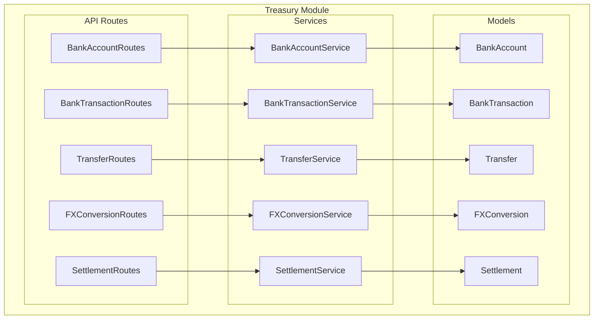
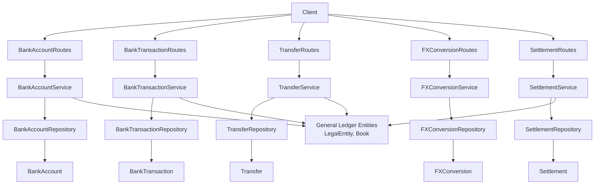
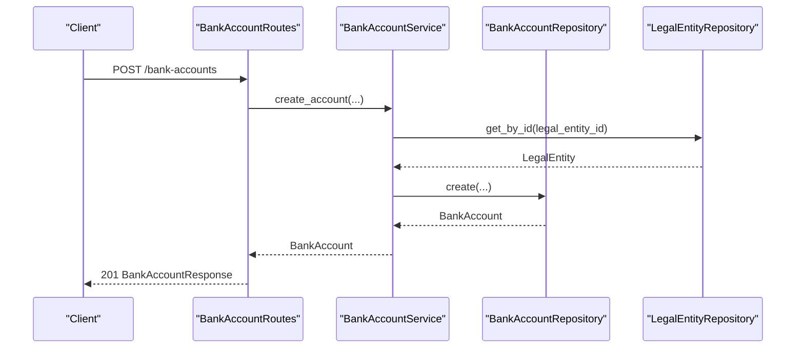
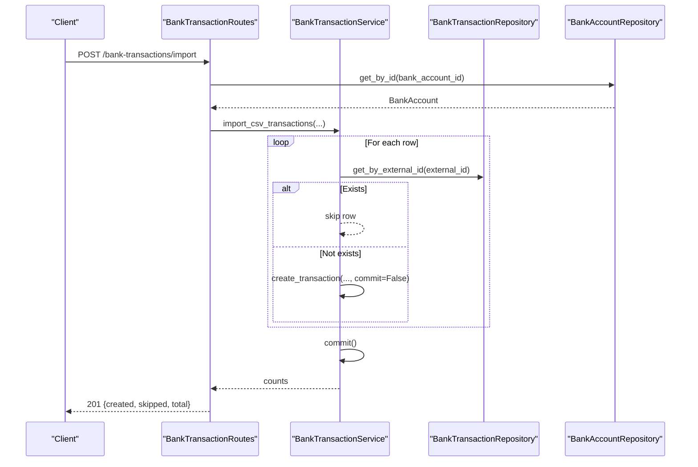
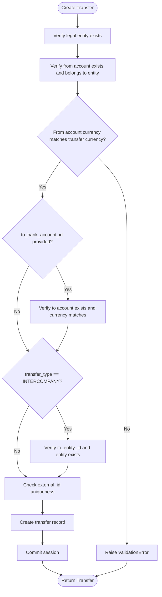
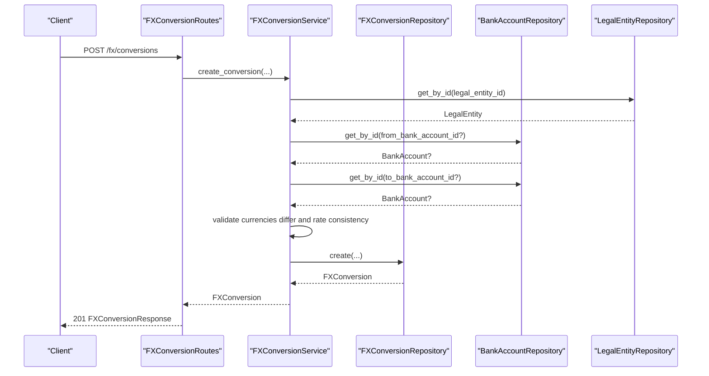
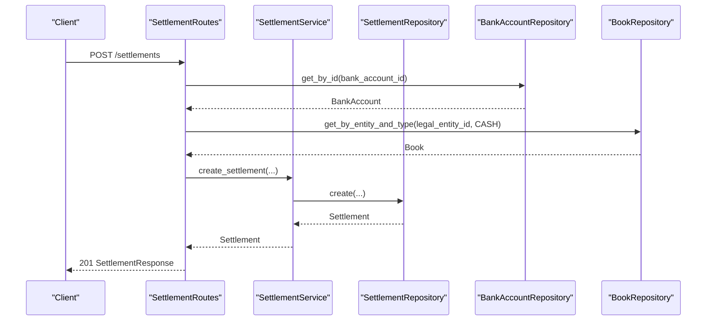
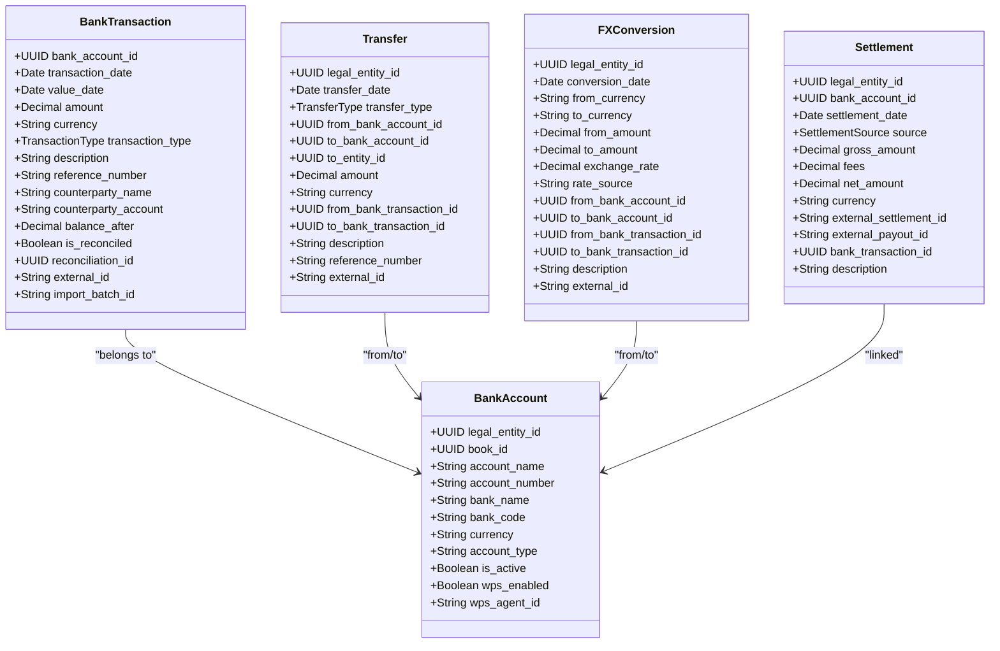

# Treasury Module

<cite>
**Referenced Files in This Document**
- [app/modules/treasury/__init__.py](file://app/modules/treasury/__init__.py)
- [app/modules/treasury/models/__init__.py](file://app/modules/treasury/models/__init__.py)
- [app/modules/treasury/models/bank_account_model.py](file://app/modules/treasury/models/bank_account_model.py)
- [app/modules/treasury/models/bank_transaction_model.py](file://app/modules/treasury/models/bank_transaction_model.py)
- [app/modules/treasury/models/settlement_model.py](file://app/modules/treasury/models/settlement_model.py)
- [app/modules/treasury/models/fx_conversion_model.py](file://app/modules/treasury/models/fx_conversion_model.py)
- [app/modules/treasury/models/transfer_model.py](file://app/modules/treasury/models/transfer_model.py)
- [app/modules/treasury/services/bank_account_service.py](file://app/modules/treasury/services/bank_account_service.py)
- [app/modules/treasury/services/bank_transaction_service.py](file://app/modules/treasury/services/bank_transaction_service.py)
- [app/modules/treasury/services/transfer_service.py](file://app/modules/treasury/services/transfer_service.py)
- [app/modules/treasury/services/fx_conversion_service.py](file://app/modules/treasury/services/fx_conversion_service.py)
- [app/modules/treasury/services/settlement_service.py](file://app/modules/treasury/services/settlement_service.py)
- [app/modules/treasury/api/routes/bank_account_routes.py](file://app/modules/treasury/api/routes/bank_account_routes.py)
- [app/modules/treasury/api/routes/bank_transaction_routes.py](file://app/modules/treasury/api/routes/bank_transaction_routes.py)
- [app/modules/treasury/api/routes/transfer_routes.py](file://app/modules/treasury/api/routes/transfer_routes.py)
- [app/modules/treasury/api/routes/fx_conversion_routes.py](file://app/modules/treasury/api/routes/fx_conversion_routes.py)
- [app/modules/treasury/api/routes/settlement_routes.py](file://app/modules/treasury/api/routes/settlement_routes.py)
</cite>

## Table of Contents
1. [Introduction](#introduction)
2. [Project Structure](#project-structure)
3. [Core Components](#core-components)
4. [Architecture Overview](#architecture-overview)
5. [Detailed Component Analysis](#detailed-component-analysis)
6. [Dependency Analysis](#dependency-analysis)
7. [Performance Considerations](#performance-considerations)
8. [Troubleshooting Guide](#troubleshooting-guide)
9. [Conclusion](#conclusion)
10. [Appendices](#appendices)

## Introduction
The Treasury module manages cash resources across legal entities and currencies. It provides capabilities for:
- Bank account management
- Bank transaction ingestion and maintenance
- Intercompany and intra-entity transfers
- Foreign exchange conversions
- Payment gateway settlements
- Cash position monitoring via integration with the General Ledger
- Reconciliation and sync operations

The module exposes REST API routes grouped by domain area and implements robust validation, idempotency for imports, and cursor-based pagination for efficient listing.

## Project Structure
The Treasury module is organized by domain layering: models (data), services (business logic), repositories (persistence), schemas (request/response), and API routes (HTTP endpoints). The module also integrates with the General Ledger for books and legal entities.

**Diagram sources**
- [app/modules/treasury/models/bank_account_model.py](file://app/modules/treasury/models/bank_account_model.py#L9-L36)
- [app/modules/treasury/models/bank_transaction_model.py](file://app/modules/treasury/models/bank_transaction_model.py#L21-L52)
- [app/modules/treasury/models/transfer_model.py](file://app/modules/treasury/models/transfer_model.py#L17-L49)
- [app/modules/treasury/models/fx_conversion_model.py](file://app/modules/treasury/models/fx_conversion_model.py#L9-L41)
- [app/modules/treasury/models/settlement_model.py](file://app/modules/treasury/models/settlement_model.py#L17-L48)
- [app/modules/treasury/services/bank_account_service.py](file://app/modules/treasury/services/bank_account_service.py#L11-L97)
- [app/modules/treasury/services/bank_transaction_service.py](file://app/modules/treasury/services/bank_transaction_service.py#L13-L171)
- [app/modules/treasury/services/transfer_service.py](file://app/modules/treasury/services/transfer_service.py#L14-L113)
- [app/modules/treasury/services/fx_conversion_service.py](file://app/modules/treasury/services/fx_conversion_service.py#L14-L112)
- [app/modules/treasury/services/settlement_service.py](file://app/modules/treasury/services/settlement_service.py#L14-L124)
- [app/modules/treasury/api/routes/bank_account_routes.py](file://app/modules/treasury/api/routes/bank_account_routes.py#L1-L88)
- [app/modules/treasury/api/routes/bank_transaction_routes.py](file://app/modules/treasury/api/routes/bank_transaction_routes.py#L1-L184)
- [app/modules/treasury/api/routes/transfer_routes.py](file://app/modules/treasury/api/routes/transfer_routes.py#L1-L83)
- [app/modules/treasury/api/routes/fx_conversion_routes.py](file://app/modules/treasury/api/routes/fx_conversion_routes.py#L1-L81)
- [app/modules/treasury/api/routes/settlement_routes.py](file://app/modules/treasury/api/routes/settlement_routes.py#L1-L232)

**Section sources**
- [app/modules/treasury/__init__.py](file://app/modules/treasury/__init__.py#L1-L2)
- [app/modules/treasury/models/__init__.py](file://app/modules/treasury/models/__init__.py#L1-L20)

## Core Components
This section documents the core models and their relationships, followed by service implementations and API routes.

- BankAccount
  - Purpose: Represents a bank account per legal entity, including currency, WPS flags, and optional association with a CASH book.
  - Key attributes: legal_entity_id, book_id, account_name, account_number, bank_name, bank_code, currency, account_type, is_active, wps_enabled, wps_agent_id.
  - Relationships: entity (LegalEntity), transactions (BankTransaction), reconciliations (ReconciliationSession).

- BankTransaction
  - Purpose: Represents a single bank statement line item.
  - Key attributes: bank_account_id, transaction_date, value_date, amount, currency, transaction_type, description, reference_number, counterparty_name, counterparty_account, balance_after, is_reconciled, reconciliation_id, external_id, import_batch_id.
  - Relationships: bank_account (BankAccount).
  - Indices: composite index on (bank_account_id, transaction_date), index on (bank_account_id, is_reconciled).

- Transfer
  - Purpose: Represents cash movement between accounts, including intercompany, intra-entity, and external transfers.
  - Key attributes: legal_entity_id, transfer_date, transfer_type, from_bank_account_id, to_bank_account_id, to_entity_id, amount, currency, from_bank_transaction_id, to_bank_transaction_id, description, reference_number, external_id.
  - Relationships: entity (LegalEntity), to_entity (LegalEntity), from_account (BankAccount), to_account (BankAccount), from_transaction (BankTransaction), to_transaction (BankTransaction).

- FXConversion
  - Purpose: Records realized foreign exchange conversions with linked accounts and transactions.
  - Key attributes: legal_entity_id, conversion_date, from_currency, to_currency, from_amount, to_amount, exchange_rate, rate_source, from_bank_account_id, to_bank_account_id, from_bank_transaction_id, to_bank_transaction_id, description, external_id.
  - Relationships: entity (LegalEntity), from_account (BankAccount), to_account (BankAccount), from_transaction (BankTransaction), to_transaction (BankTransaction).

- Settlement
  - Purpose: Captures payment gateway payouts/net activity with linkage to bank transactions.
  - Key attributes: legal_entity_id, bank_account_id, settlement_date, source (STRIPE, TELR, MANUAL), gross_amount, fees, net_amount, currency, external_settlement_id, external_payout_id, bank_transaction_id, description.
  - Relationships: entity (LegalEntity), bank_account (BankAccount), bank_transaction (BankTransaction).
  - Constraints: composite unique constraint on (source, external_settlement_id) where external_settlement_id is not null.

**Section sources**
- [app/modules/treasury/models/bank_account_model.py](file://app/modules/treasury/models/bank_account_model.py#L9-L36)
- [app/modules/treasury/models/bank_transaction_model.py](file://app/modules/treasury/models/bank_transaction_model.py#L21-L52)
- [app/modules/treasury/models/transfer_model.py](file://app/modules/treasury/models/transfer_model.py#L17-L49)
- [app/modules/treasury/models/fx_conversion_model.py](file://app/modules/treasury/models/fx_conversion_model.py#L9-L41)
- [app/modules/treasury/models/settlement_model.py](file://app/modules/treasury/models/settlement_model.py#L17-L48)

## Architecture Overview
The Treasury module follows a layered architecture:
- API routes define HTTP endpoints and handle idempotency keys for safe retries.
- Services encapsulate business logic and orchestrate validations and repository calls.
- Repositories abstract persistence operations.
- Models define the data schema and relationships.
- Integration with General Ledger provides legal entity and book context for cash operations.

**Diagram sources**
- [app/modules/treasury/api/routes/bank_account_routes.py](file://app/modules/treasury/api/routes/bank_account_routes.py#L1-L88)
- [app/modules/treasury/api/routes/bank_transaction_routes.py](file://app/modules/treasury/api/routes/bank_transaction_routes.py#L1-L184)
- [app/modules/treasury/api/routes/transfer_routes.py](file://app/modules/treasury/api/routes/transfer_routes.py#L1-L83)
- [app/modules/treasury/api/routes/fx_conversion_routes.py](file://app/modules/treasury/api/routes/fx_conversion_routes.py#L1-L81)
- [app/modules/treasury/api/routes/settlement_routes.py](file://app/modules/treasury/api/routes/settlement_routes.py#L1-L232)
- [app/modules/treasury/services/bank_account_service.py](file://app/modules/treasury/services/bank_account_service.py#L11-L97)
- [app/modules/treasury/services/bank_transaction_service.py](file://app/modules/treasury/services/bank_transaction_service.py#L13-L171)
- [app/modules/treasury/services/transfer_service.py](file://app/modules/treasury/services/transfer_service.py#L14-L113)
- [app/modules/treasury/services/fx_conversion_service.py](file://app/modules/treasury/services/fx_conversion_service.py#L14-L112)
- [app/modules/treasury/services/settlement_service.py](file://app/modules/treasury/services/settlement_service.py#L14-L124)

## Detailed Component Analysis

### Bank Account Management
- Responsibilities
  - Create/update bank accounts with validation against legal entity existence.
  - List accounts filtered by entity and activation status.
- Validation
  - Entity existence check before creation.
  - Optional currency alignment checks (per business policy).
- API Endpoints
  - POST /bank-accounts
  - GET /bank-accounts
  - GET /bank-accounts/{account_id}
  - PATCH /bank-accounts/{account_id}

**Diagram sources**
- [app/modules/treasury/api/routes/bank_account_routes.py](file://app/modules/treasury/api/routes/bank_account_routes.py#L18-L42)
- [app/modules/treasury/services/bank_account_service.py](file://app/modules/treasury/services/bank_account_service.py#L19-L54)

**Section sources**
- [app/modules/treasury/services/bank_account_service.py](file://app/modules/treasury/services/bank_account_service.py#L11-L97)
- [app/modules/treasury/api/routes/bank_account_routes.py](file://app/modules/treasury/api/routes/bank_account_routes.py#L1-L88)

### Bank Transaction Processing
- Responsibilities
  - Create individual transactions with currency and duplicate checks.
  - Import CSV transactions in an atomic batch with deduplication via external_id.
  - List with cursor pagination and filters.
- Idempotency
  - Import endpoint uses idempotency keys to ensure safe retries.
- API Endpoints
  - POST /bank-transactions
  - POST /bank-transactions/import
  - GET /bank-transactions
  - GET /bank-transactions/{transaction_id}
  - GET /bank-transactions/accounts/{bank_account_id}/transactions

**Diagram sources**
- [app/modules/treasury/api/routes/bank_transaction_routes.py](file://app/modules/treasury/api/routes/bank_transaction_routes.py#L55-L124)
- [app/modules/treasury/services/bank_transaction_service.py](file://app/modules/treasury/services/bank_transaction_service.py#L80-L132)

**Section sources**
- [app/modules/treasury/services/bank_transaction_service.py](file://app/modules/treasury/services/bank_transaction_service.py#L13-L171)
- [app/modules/treasury/api/routes/bank_transaction_routes.py](file://app/modules/treasury/api/routes/bank_transaction_routes.py#L1-L184)

### Transfer Processing
- Responsibilities
  - Validate account ownership and currency alignment.
  - Enforce intercompany transfer constraints (to_entity_id).
  - Prevent duplicates via external_id.
- Types
  - INTERCOMPANY: between entities
  - INTRA_ENTITY: within same entity
  - EXTERNAL: to external parties
- API Endpoints
  - POST /transfers
  - GET /transfers
  - GET /transfers/{transfer_id}

**Diagram sources**
- [app/modules/treasury/services/transfer_service.py](file://app/modules/treasury/services/transfer_service.py#L23-L89)

**Section sources**
- [app/modules/treasury/services/transfer_service.py](file://app/modules/treasury/services/transfer_service.py#L14-L113)
- [app/modules/treasury/api/routes/transfer_routes.py](file://app/modules/treasury/api/routes/transfer_routes.py#L1-L83)

### Foreign Exchange Conversion
- Responsibilities
  - Validate different currencies, account currency alignment, and exchange rate accuracy.
  - Prevent duplicates via external_id.
- API Endpoints
  - POST /fx/conversions
  - GET /fx/conversions
  - GET /fx/conversions/{conversion_id}

**Diagram sources**
- [app/modules/treasury/api/routes/fx_conversion_routes.py](file://app/modules/treasury/api/routes/fx_conversion_routes.py#L18-L46)
- [app/modules/treasury/services/fx_conversion_service.py](file://app/modules/treasury/services/fx_conversion_service.py#L23-L90)

**Section sources**
- [app/modules/treasury/services/fx_conversion_service.py](file://app/modules/treasury/services/fx_conversion_service.py#L14-L112)
- [app/modules/treasury/api/routes/fx_conversion_routes.py](file://app/modules/treasury/api/routes/fx_conversion_routes.py#L1-L81)

### Settlement Operations
- Responsibilities
  - Validate bank account ownership and currency.
  - Enforce amount consistency (net = gross - fees).
  - Support manual creation and imports from Stripe/TELR with idempotency.
- API Endpoints
  - POST /settlements
  - POST /settlements/stripe/import
  - POST /settlements/telr/import
  - GET /settlements
  - GET /settlements/{settlement_id}

**Diagram sources**
- [app/modules/treasury/api/routes/settlement_routes.py](file://app/modules/treasury/api/routes/settlement_routes.py#L22-L89)
- [app/modules/treasury/services/settlement_service.py](file://app/modules/treasury/services/settlement_service.py#L23-L81)

**Section sources**
- [app/modules/treasury/services/settlement_service.py](file://app/modules/treasury/services/settlement_service.py#L14-L124)
- [app/modules/treasury/api/routes/settlement_routes.py](file://app/modules/treasury/api/routes/settlement_routes.py#L1-L232)

### Cash Position Monitoring
- Mechanism
  - Bank transactions and settlements are posted to the CASH book via General Ledger integration.
  - Bank accounts link to a book_id to associate with the appropriate ledger book.
- Usage
  - Use bank transaction and settlement APIs to populate cash positions.
  - Combine with General Ledger cash book posting services for consolidated views.

**Section sources**
- [app/modules/treasury/models/bank_account_model.py](file://app/modules/treasury/models/bank_account_model.py#L13-L14)
- [app/modules/treasury/api/routes/settlement_routes.py](file://app/modules/treasury/api/routes/settlement_routes.py#L46-L51)

### Treasury Reconciliation and Sync
- Reconciliation
  - Bank transactions carry is_reconciled and reconciliation_id for linking to sessions.
  - Bank accounts maintain reconciliations relationships.
- Sync
  - Sync cursors and external IDs enable idempotent imports and incremental syncs.

**Section sources**
- [app/modules/treasury/models/bank_transaction_model.py](file://app/modules/treasury/models/bank_transaction_model.py#L36-L37)
- [app/modules/treasury/models/bank_account_model.py](file://app/modules/treasury/models/bank_account_model.py#L28-L28)
- [app/modules/treasury/models/__init__.py](file://app/modules/treasury/models/__init__.py#L6-L7)

## Dependency Analysis
The following diagram shows key dependencies among models and services:

**Diagram sources**
- [app/modules/treasury/models/bank_account_model.py](file://app/modules/treasury/models/bank_account_model.py#L9-L36)
- [app/modules/treasury/models/bank_transaction_model.py](file://app/modules/treasury/models/bank_transaction_model.py#L21-L52)
- [app/modules/treasury/models/transfer_model.py](file://app/modules/treasury/models/transfer_model.py#L17-L49)
- [app/modules/treasury/models/fx_conversion_model.py](file://app/modules/treasury/models/fx_conversion_model.py#L9-L41)
- [app/modules/treasury/models/settlement_model.py](file://app/modules/treasury/models/settlement_model.py#L17-L48)

**Section sources**
- [app/modules/treasury/models/__init__.py](file://app/modules/treasury/models/__init__.py#L1-L20)

## Performance Considerations
- Indexing
  - BankTransaction indices on (bank_account_id, transaction_date) and (bank_account_id, is_reconciled) optimize filtering and reconciliation queries.
- Pagination
  - Cursor pagination reduces overhead for large lists; use next_cursor for continuation.
- Atomic Imports
  - Batch import operations commit once after validating and creating records, minimizing transaction overhead.
- Idempotency
  - Idempotency keys prevent duplicate processing during retries, reducing wasted work and ensuring data integrity.

[No sources needed since this section provides general guidance]

## Troubleshooting Guide
- Common Validation Errors
  - Currency mismatch between account and transaction/transfer/swap.
  - Intercompany transfer missing to_entity_id.
  - Exchange rate inconsistency vs. computed ratio.
  - Amount validation (gross >= 0, fees >= 0, net = gross - fees).
- Duplicate Entry Errors
  - external_id uniqueness enforced across transactions, transfers, FX conversions, and settlements.
- Entity/Account Not Found
  - Ensure legal entity and bank account IDs exist and belong to the correct entity.
- Import Failures
  - Use idempotency keys for safe retries; CSV imports skip duplicates and commit atomically.

**Section sources**
- [app/modules/treasury/services/bank_transaction_service.py](file://app/modules/treasury/services/bank_transaction_service.py#L44-L57)
- [app/modules/treasury/services/transfer_service.py](file://app/modules/treasury/services/transfer_service.py#L43-L66)
- [app/modules/treasury/services/fx_conversion_service.py](file://app/modules/treasury/services/fx_conversion_service.py#L44-L66)
- [app/modules/treasury/services/settlement_service.py](file://app/modules/treasury/services/settlement_service.py#L52-L58)

## Conclusion
The Treasury module provides a comprehensive foundation for managing cash across entities and currencies. Its layered design ensures clear separation of concerns, while robust validation, idempotency, and indexing support reliable operations. Integration with General Ledger enables accurate cash position tracking and reconciliation workflows.

[No sources needed since this section summarizes without analyzing specific files]

## Appendices

### Treasury API Routes Summary
- Bank Accounts
  - POST /bank-accounts
  - GET /bank-accounts
  - GET /bank-accounts/{account_id}
  - PATCH /bank-accounts/{account_id}
- Bank Transactions
  - POST /bank-transactions
  - POST /bank-transactions/import
  - GET /bank-transactions
  - GET /bank-transactions/{transaction_id}
  - GET /bank-transactions/accounts/{bank_account_id}/transactions
- Transfers
  - POST /transfers
  - GET /transfers
  - GET /transfers/{transfer_id}
- FX Conversions
  - POST /fx/conversions
  - GET /fx/conversions
  - GET /fx/conversions/{conversion_id}
- Settlements
  - POST /settlements
  - POST /settlements/stripe/import
  - POST /settlements/telr/import
  - GET /settlements
  - GET /settlements/{settlement_id}

**Section sources**
- [app/modules/treasury/api/routes/bank_account_routes.py](file://app/modules/treasury/api/routes/bank_account_routes.py#L1-L88)
- [app/modules/treasury/api/routes/bank_transaction_routes.py](file://app/modules/treasury/api/routes/bank_transaction_routes.py#L1-L184)
- [app/modules/treasury/api/routes/transfer_routes.py](file://app/modules/treasury/api/routes/transfer_routes.py#L1-L83)
- [app/modules/treasury/api/routes/fx_conversion_routes.py](file://app/modules/treasury/api/routes/fx_conversion_routes.py#L1-L81)
- [app/modules/treasury/api/routes/settlement_routes.py](file://app/modules/treasury/api/routes/settlement_routes.py#L1-L232)