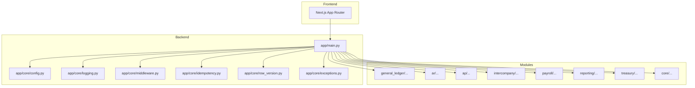
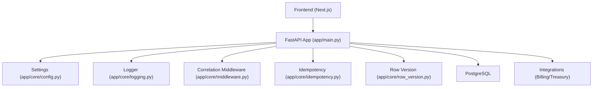
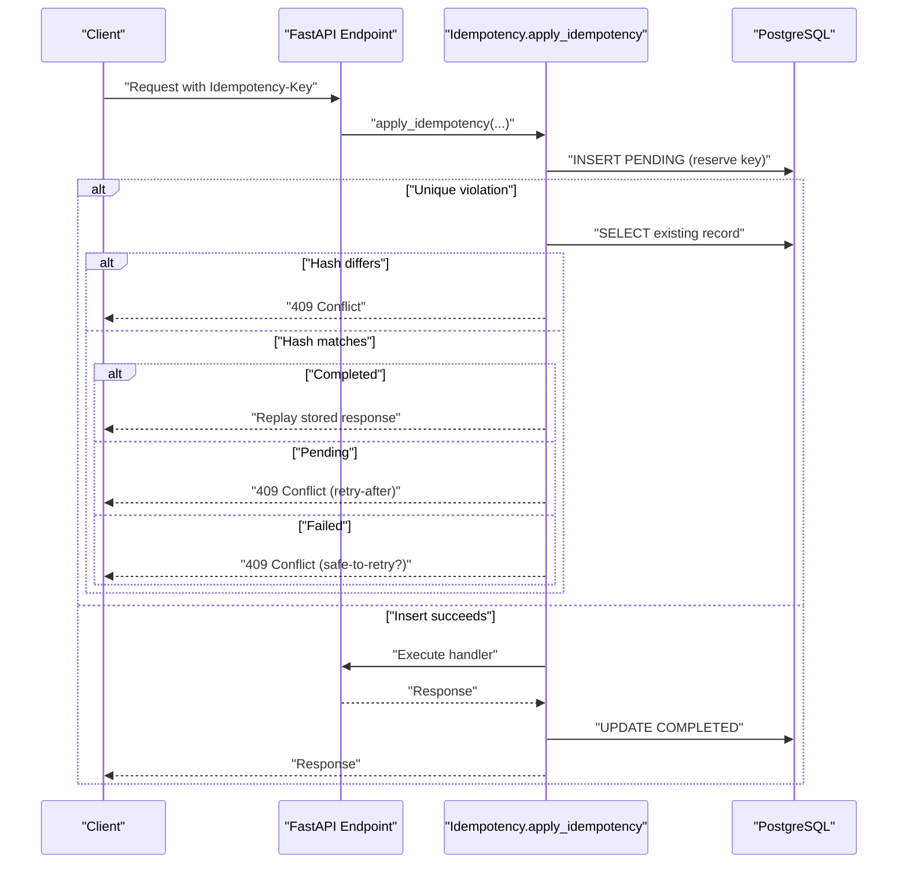
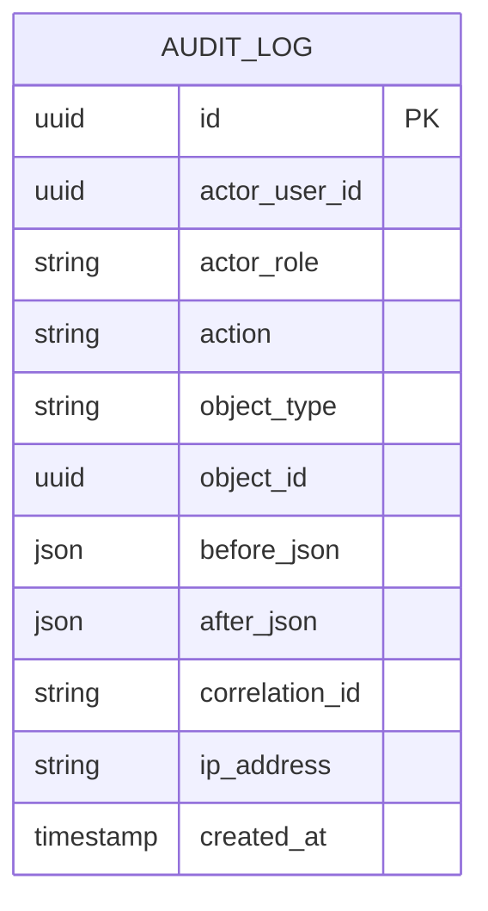
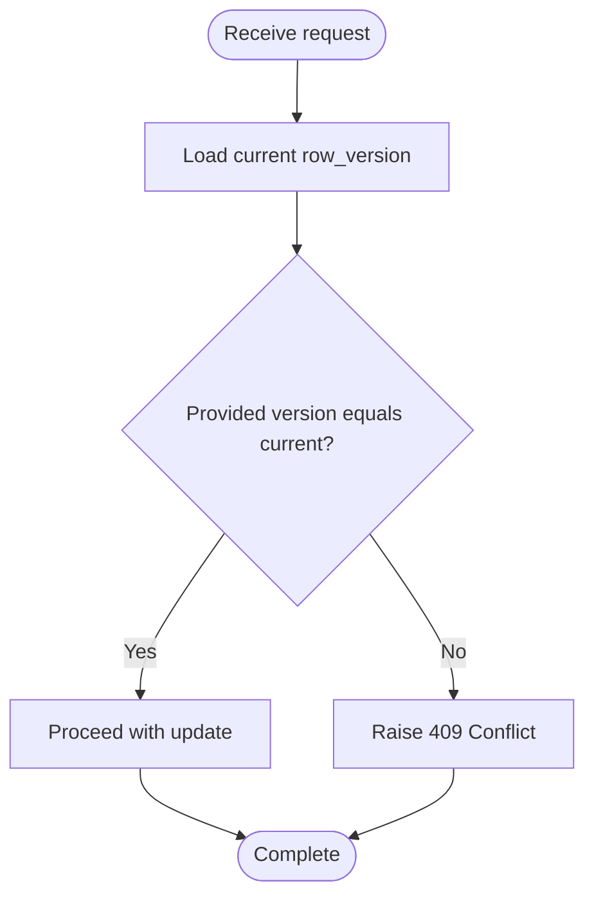
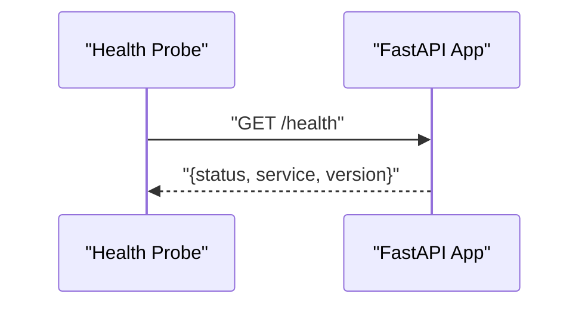
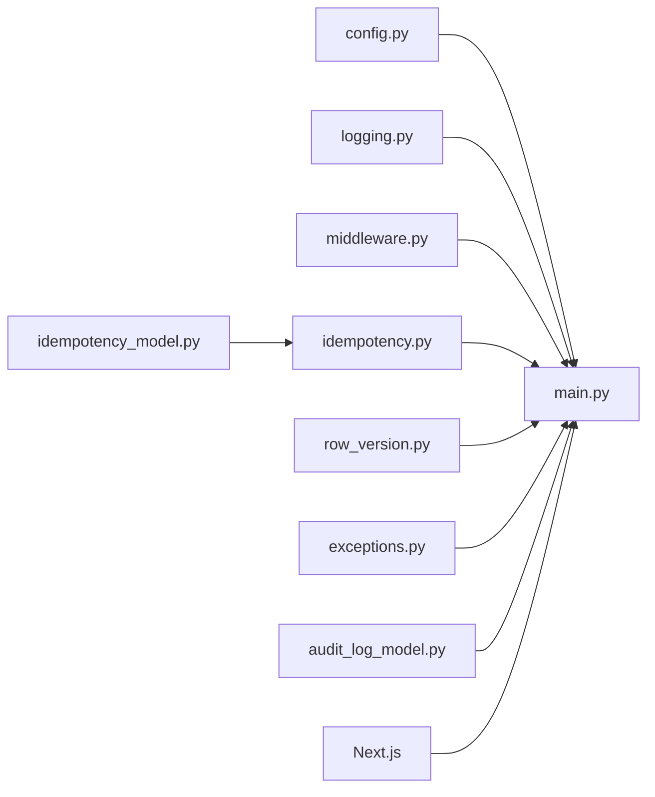

# Troubleshooting and FAQ

<cite>
**Referenced Files in This Document**
- [README.md](file://README.md)
- [IMPLEMENTATION_STATUS.md](file://IMPLEMENTATION_STATUS.md)
- [MIGRATION_STATUS.md](file://MIGRATION_STATUS.md)
- [VERIFICATION_RUNBOOK.md](file://VERIFICATION_RUNBOOK.md)
- [app/main.py](file://app/main.py)
- [app/core/config.py](file://app/core/config.py)
- [app/core/logging.py](file://app/core/logging.py)
- [app/core/middleware.py](file://app/core/middleware.py)
- [app/core/exceptions.py](file://app/core/exceptions.py)
- [app/core/idempotency.py](file://app/core/idempotency.py)
- [app/modules/core/models/idempotency_model.py](file://app/modules/core/models/idempotency_model.py)
- [app/modules/core/models/audit_log_model.py](file://app/modules/core/models/audit_log_model.py)
- [app/modules/core/models/approval_policy_model.py](file://app/modules/core/models/approval_policy_model.py)
- [app/modules/core/repositories/approval_policy_repository.py](file://app/modules/core/repositories/approval_policy_repository.py)
- [app/modules/core/services/sod_validator.py](file://app/modules/core/services/sod_validator.py)
- [app/core/row_version.py](file://app/core/row_version.py)
- [scripts/dev_backend.sh](file://scripts/dev_backend.sh)
- [scripts/dev_frontend.sh](file://scripts/dev_frontend.sh)
- [scripts/seed_database.py](file://scripts/seed_database.py)
- [scripts/verify_database.py](file://scripts/verify_database.py)
- [scripts/verify_db_schema.py](file://scripts/verify_db_schema.py)
- [tests/test_idempotency_runtime_verification.py](file://tests/test_idempotency_runtime_verification.py)
- [tests/test_row_version_409.py](file://tests/test_row_version_409.py)
- [tests/test_reconciliation_safety.py](file://tests/test_reconciliation_safety.py)
- [docker-compose.yml](file://docker-compose.yml)
- [Dockerfile](file://Dockerfile)
</cite>

## Table of Contents
1. [Introduction](#introduction)
2. [Project Structure](#project-structure)
3. [Core Components](#core-components)
4. [Architecture Overview](#architecture-overview)
5. [Detailed Component Analysis](#detailed-component-analysis)
6. [Dependency Analysis](#dependency-analysis)
7. [Performance Considerations](#performance-considerations)
8. [Troubleshooting Guide](#troubleshooting-guide)
9. [Conclusion](#conclusion)
10. [Appendices](#appendices)

## Introduction
This document provides comprehensive troubleshooting and Frequently Asked Questions for the TrueVow Financial Management system. It focuses on installation and environment setup, runtime errors, performance diagnostics, debugging techniques, logging analysis, and operational procedures. It also covers verification runbooks, implementation status tracking, migration troubleshooting, and guidance for monitoring system health and resolving module conflicts.

## Project Structure
The system is organized into:
- Backend service (FastAPI) under app/
- Modules for AR/AP, General Ledger, Intercompany, Payroll, Reporting, Treasury, and shared/core infrastructure
- Database migrations under database/migrations
- Frontend built with Next.js under frontend/
- Scripts for development, seeding, and verification under scripts/
- Tests under tests/
- Operational documentation under docs/

**Diagram sources**
- [app/main.py](file://app/main.py#L1-L54)
- [app/core/config.py](file://app/core/config.py#L1-L74)
- [app/core/logging.py](file://app/core/logging.py#L1-L34)
- [app/core/middleware.py](file://app/core/middleware.py#L1-L35)
- [app/core/idempotency.py](file://app/core/idempotency.py#L1-L482)
- [app/core/row_version.py](file://app/core/row_version.py#L1-L31)

**Section sources**
- [README.md](file://README.md#L75-L96)

## Core Components
- Configuration and environment variables: centralized settings with database URL selection, JWT secret handling, and integration endpoints.
- Logging: structured logging via loguru with fallback to stdlib logging; production file logging supported.
- Middleware: correlation ID propagation for request tracing.
- Idempotency: robust idempotency infrastructure with canonical request hashing, stateful records, and race-condition handling.
- Row versioning: conflict detection for optimistic concurrency control.
- Audit logging: comprehensive audit trail with correlation ID and JSON payloads.
- Exception hierarchy: domain-specific exceptions for consistent error handling.

**Section sources**
- [app/core/config.py](file://app/core/config.py#L1-L74)
- [app/core/logging.py](file://app/core/logging.py#L1-L34)
- [app/core/middleware.py](file://app/core/middleware.py#L1-L35)
- [app/core/idempotency.py](file://app/core/idempotency.py#L1-L482)
- [app/core/row_version.py](file://app/core/row_version.py#L1-L31)
- [app/modules/core/models/audit_log_model.py](file://app/modules/core/models/audit_log_model.py#L1-L43)
- [app/core/exceptions.py](file://app/core/exceptions.py#L1-L43)

## Architecture Overview
The backend exposes FastAPI endpoints under /api/v1, integrates with PostgreSQL via SQLAlchemy async, and supports secure operation with JWT and role-based access. The frontend is a Next.js application that consumes the backend APIs. Idempotency and audit logging are enforced across write operations.

**Diagram sources**
- [app/main.py](file://app/main.py#L1-L54)
- [app/core/config.py](file://app/core/config.py#L1-L74)
- [app/core/logging.py](file://app/core/logging.py#L1-L34)
- [app/core/middleware.py](file://app/core/middleware.py#L1-L35)
- [app/core/idempotency.py](file://app/core/idempotency.py#L1-L482)
- [app/core/row_version.py](file://app/core/row_version.py#L1-L31)

## Detailed Component Analysis

### Idempotency Service
The idempotency subsystem ensures idempotent writes by reserving keys, preventing races, and storing canonicalized responses. It supports metadata correlation for sync operations and enforces strict hash matching.

**Diagram sources**
- [app/core/idempotency.py](file://app/core/idempotency.py#L219-L482)
- [app/modules/core/models/idempotency_model.py](file://app/modules/core/models/idempotency_model.py#L1-L54)

**Section sources**
- [app/core/idempotency.py](file://app/core/idempotency.py#L1-L482)
- [app/modules/core/models/idempotency_model.py](file://app/modules/core/models/idempotency_model.py#L1-L54)

### Audit Logging
Audit logs capture actions, actors, correlation IDs, and JSON payloads for compliance and traceability.

**Diagram sources**
- [app/modules/core/models/audit_log_model.py](file://app/modules/core/models/audit_log_model.py#L1-L43)

**Section sources**
- [app/modules/core/models/audit_log_model.py](file://app/modules/core/models/audit_log_model.py#L1-L43)

### Row Versioning and Concurrency Control
Row version checks raise conflict errors when clients attempt to modify stale records.

**Diagram sources**
- [app/core/row_version.py](file://app/core/row_version.py#L1-L31)

**Section sources**
- [app/core/row_version.py](file://app/core/row_version.py#L1-L31)

### Health Checks and Startup/Shutdown Hooks
The application exposes a health endpoint and logs startup/shutdown events.

**Diagram sources**
- [app/main.py](file://app/main.py#L33-L40)

**Section sources**
- [app/main.py](file://app/main.py#L1-L54)

## Dependency Analysis
- Backend depends on configuration for database URLs and secrets, logging for observability, middleware for correlation IDs, idempotency for write safety, and row versioning for concurrency.
- Idempotency relies on the idempotency model for persistence and endpoint safety rules for retry semantics.
- Audit logging is decoupled and indexed for efficient querying.
- Frontend Next.js consumes backend endpoints and is protected by Clerk authentication.

**Diagram sources**
- [app/core/config.py](file://app/core/config.py#L1-L74)
- [app/main.py](file://app/main.py#L1-L54)
- [app/core/logging.py](file://app/core/logging.py#L1-L34)
- [app/core/middleware.py](file://app/core/middleware.py#L1-L35)
- [app/core/idempotency.py](file://app/core/idempotency.py#L1-L482)
- [app/modules/core/models/idempotency_model.py](file://app/modules/core/models/idempotency_model.py#L1-L54)
- [app/modules/core/models/audit_log_model.py](file://app/modules/core/models/audit_log_model.py#L1-L43)
- [app/core/exceptions.py](file://app/core/exceptions.py#L1-L43)
- [app/core/row_version.py](file://app/core/row_version.py#L1-L31)

**Section sources**
- [MIGRATION_STATUS.md](file://MIGRATION_STATUS.md#L70-L89)

## Performance Considerations
- Database connection pooling: tune pool size and overflow in settings for concurrent workload.
- Canonical JSON serialization: idempotency uses canonical encoding to avoid hash drift; ensure request payloads are deterministic.
- Response size limits: idempotency truncates oversized responses to prevent storage bloat.
- Logging volume: production file logging rotates daily; monitor disk usage and retention.
- Audit indexing: indexes on actor, object, action, and correlation ID improve query performance.

[No sources needed since this section provides general guidance]

## Troubleshooting Guide

### Installation and Environment Setup
Common issues and resolutions:
- Missing JWT secret or database URL:
  - Symptom: Validation errors during migrations or tests.
  - Resolution: Create .env with required variables and rerun verification steps.
  - Reference: [VERIFICATION_RUNBOOK.md](file://VERIFICATION_RUNBOOK.md#L31-L63), [IMPLEMENTATION_STATUS.md](file://IMPLEMENTATION_STATUS.md#L108-L131)
- Frontend build failures due to missing dependencies:
  - Symptom: ESLint/plugin errors or missing modules.
  - Resolution: Install frontend dependencies in the frontend directory.
  - Reference: [IMPLEMENTATION_STATUS.md](file://IMPLEMENTATION_STATUS.md#L132-L142)
- Alembic upgrade failures:
  - Symptom: Validation errors requiring JWT secret key.
  - Resolution: Set JWT_SECRET_KEY and DATABASE_URL; run upgrade head.
  - Reference: [IMPLEMENTATION_STATUS.md](file://IMPLEMENTATION_STATUS.md#L108-L119)

**Section sources**
- [VERIFICATION_RUNBOOK.md](file://VERIFICATION_RUNBOOK.md#L31-L63)
- [IMPLEMENTATION_STATUS.md](file://IMPLEMENTATION_STATUS.md#L108-L142)

### Runtime Errors and Debugging Techniques
- Health check not responding:
  - Verify startup logs and ensure the app started successfully.
  - Reference: [app/main.py](file://app/main.py#L43-L54)
- 409 Conflict on approvals or postings:
  - Indicates row version mismatch; refresh data and retry.
  - Reference: [app/core/row_version.py](file://app/core/row_version.py#L1-L31)
- Idempotency-related errors:
  - 409 Conflict with different payload hash: resend identical request body.
  - 409 Conflict indicating in-progress or failed previous attempt: follow retry guidance or wait.
  - Reference: [app/core/idempotency.py](file://app/core/idempotency.py#L154-L205)
- Domain-specific exceptions:
  - Use consistent exception handling and inspect raised exceptions for actionable details.
  - Reference: [app/core/exceptions.py](file://app/core/exceptions.py#L1-L43)

**Section sources**
- [app/main.py](file://app/main.py#L33-L54)
- [app/core/row_version.py](file://app/core/row_version.py#L1-L31)
- [app/core/idempotency.py](file://app/core/idempotency.py#L154-L205)
- [app/core/exceptions.py](file://app/core/exceptions.py#L1-L43)

### Logging Analysis
- Enable structured logging and review stdout/stderr logs; production logs rotate daily.
- Use correlation IDs to trace end-to-end requests across services.
- References:
  - [app/core/logging.py](file://app/core/logging.py#L1-L34)
  - [app/core/middleware.py](file://app/core/middleware.py#L1-L35)

**Section sources**
- [app/core/logging.py](file://app/core/logging.py#L1-L34)
- [app/core/middleware.py](file://app/core/middleware.py#L1-L35)

### Verification Runbooks and Implementation Status Tracking
- Migration chain verification:
  - Check single head and linear history; run upgrade head after setting environment.
  - Reference: [VERIFICATION_RUNBOOK.md](file://VERIFICATION_RUNBOOK.md#L68-L83)
- Backend tests:
  - Run tests after environment setup; expect pass or graceful skips.
  - Reference: [VERIFICATION_RUNBOOK.md](file://VERIFICATION_RUNBOOK.md#L86-L98)
- Frontend build:
  - Lint, typecheck, and build after installing dependencies.
  - Reference: [VERIFICATION_RUNBOOK.md](file://VERIFICATION_RUNBOOK.md#L101-L117)
- Implementation status highlights:
  - Verified migration chain, code compilation, pending environment-dependent steps.
  - Reference: [IMPLEMENTATION_STATUS.md](file://IMPLEMENTATION_STATUS.md#L78-L131)

**Section sources**
- [VERIFICATION_RUNBOOK.md](file://VERIFICATION_RUNBOOK.md#L68-L117)
- [IMPLEMENTATION_STATUS.md](file://IMPLEMENTATION_STATUS.md#L78-L131)

### Migration Troubleshooting
- Next.js migration status:
  - All pages migrated, Clerk integration configured, and App Router structure in place.
  - Reference: [MIGRATION_STATUS.md](file://MIGRATION_STATUS.md#L1-L89)
- Environment variables for Clerk:
  - Ensure publishable and secret keys plus API base URL are set in .env.local.
  - Reference: [MIGRATION_STATUS.md](file://MIGRATION_STATUS.md#L45-L52)

**Section sources**
- [MIGRATION_STATUS.md](file://MIGRATION_STATUS.md#L1-L89)

### Monitoring System Health and Bottlenecks
- Health endpoint:
  - Confirm service availability and version.
  - Reference: [app/main.py](file://app/main.py#L33-L40)
- Audit logs:
  - Query by correlation ID, actor, and action to diagnose anomalies.
  - Reference: [app/modules/core/models/audit_log_model.py](file://app/modules/core/models/audit_log_model.py#L1-L43)
- Idempotency metrics:
  - Monitor PENDING locks and stale lock transitions to detect long-running operations.
  - Reference: [app/core/idempotency.py](file://app/core/idempotency.py#L312-L356)

**Section sources**
- [app/main.py](file://app/main.py#L33-L40)
- [app/modules/core/models/audit_log_model.py](file://app/modules/core/models/audit_log_model.py#L1-L43)
- [app/core/idempotency.py](file://app/core/idempotency.py#L312-L356)

### Resolving Conflicts Between Modules
- Approval workflows:
  - Use approval policy repository to determine whether approval is required per entity and object type.
  - Reference: [app/modules/core/repositories/approval_policy_repository.py](file://app/modules/core/repositories/approval_policy_repository.py#L1-L36)
- Segregation of duties:
  - SoD validator stubs allow app to load; implement real rules as needed.
  - Reference: [app/modules/core/services/sod_validator.py](file://app/modules/core/services/sod_validator.py#L1-L78)

**Section sources**
- [app/modules/core/repositories/approval_policy_repository.py](file://app/modules/core/repositories/approval_policy_repository.py#L1-L36)
- [app/modules/core/services/sod_validator.py](file://app/modules/core/services/sod_validator.py#L1-L78)

### Development Scripts and Utilities
- Backend development:
  - Use provided shell scripts to start backend services.
  - Reference: [scripts/dev_backend.sh](file://scripts/dev_backend.sh)
- Frontend development:
  - Use provided shell scripts to start frontend services.
  - Reference: [scripts/dev_frontend.sh](file://scripts/dev_frontend.sh)
- Database verification:
  - Seed, verify, and schema verification scripts assist in local testing.
  - References: [scripts/seed_database.py](file://scripts/seed_database.py), [scripts/verify_database.py](file://scripts/verify_database.py), [scripts/verify_db_schema.py](file://scripts/verify_db_schema.py)

**Section sources**
- [scripts/dev_backend.sh](file://scripts/dev_backend.sh)
- [scripts/dev_frontend.sh](file://scripts/dev_frontend.sh)
- [scripts/seed_database.py](file://scripts/seed_database.py)
- [scripts/verify_database.py](file://scripts/verify_database.py)
- [scripts/verify_db_schema.py](file://scripts/verify_db_schema.py)

### Docker and Containerization
- Use Dockerfile and docker-compose.yml to containerize and orchestrate services.
- Reference: [Dockerfile](file://Dockerfile), [docker-compose.yml](file://docker-compose.yml)

**Section sources**
- [Dockerfile](file://Dockerfile)
- [docker-compose.yml](file://docker-compose.yml)

## Conclusion
This guide consolidates troubleshooting procedures, verification runbooks, and operational insights for the TrueVow Financial Management system. By following environment setup instructions, leveraging logging and audit trails, and applying idempotency and row-versioning safeguards, teams can resolve installation and runtime issues efficiently while maintaining system integrity and compliance.

[No sources needed since this section summarizes without analyzing specific files]

## Appendices

### Frequently Asked Questions
- Q: How do I fix “JWT secret key required” errors?
  - A: Set JWT_SECRET_KEY in .env and rerun verification commands.
  - Reference: [VERIFICATION_RUNBOOK.md](file://VERIFICATION_RUNBOOK.md#L31-L63)
- Q: Why does my frontend fail to build?
  - A: Install frontend dependencies in the frontend directory.
  - Reference: [IMPLEMENTATION_STATUS.md](file://IMPLEMENTATION_STATUS.md#L132-L142)
- Q: How do I confirm migrations applied correctly?
  - A: Run migration chain verification and upgrade head after setting environment variables.
  - Reference: [VERIFICATION_RUNBOOK.md](file://VERIFICATION_RUNBOOK.md#L68-L83)
- Q: How do I trace a request across services?
  - A: Use correlation IDs from middleware and logs; correlate with audit logs.
  - Reference: [app/core/middleware.py](file://app/core/middleware.py#L1-L35), [app/core/logging.py](file://app/core/logging.py#L1-L34)
- Q: What causes 409 Conflict errors?
  - A: Row version mismatch or idempotency key reuse with different payload; refresh and retry.
  - Reference: [app/core/row_version.py](file://app/core/row_version.py#L1-L31), [app/core/idempotency.py](file://app/core/idempotency.py#L154-L205)

**Section sources**
- [VERIFICATION_RUNBOOK.md](file://VERIFICATION_RUNBOOK.md#L31-L63)
- [IMPLEMENTATION_STATUS.md](file://IMPLEMENTATION_STATUS.md#L132-L142)
- [VERIFICATION_RUNBOOK.md](file://VERIFICATION_RUNBOOK.md#L68-L83)
- [app/core/middleware.py](file://app/core/middleware.py#L1-L35)
- [app/core/logging.py](file://app/core/logging.py#L1-L34)
- [app/core/row_version.py](file://app/core/row_version.py#L1-L31)
- [app/core/idempotency.py](file://app/core/idempotency.py#L154-L205)